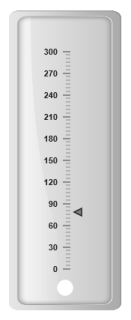
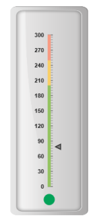
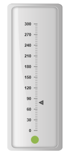
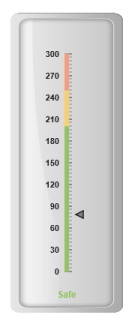
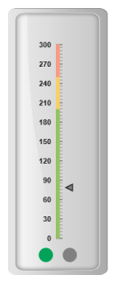

# Indicators

Indicators simply indicates the current status of the pointer. Indicators are in several formats such as in shape format, textual format and image format.

## Setting Dimension

* You can enable indicators by setting showIndicators to ‘true’ in scale collection. The height and width property for the indicators are used to specify the area allocated to the indicator for the width and height respectively. 
* You can use the position collection to position the indicators along X and Y axis. X specifies horizontal position in indicators whereas Y specifies vertical position in indicators. Indicators are of several types such as, dimensions like circle, rectangle, rounded rectangle, text and image. By using the type property it can be applied. For image type imageUrl property is used.



@(Html.EJ().LinearGauge("LinearGauge1").EnableAnimation(false).Value(78)

//Adding frame object

.Frame(frm=>frm.BackgroundImageUrl("../images/gauge/Gauge_linear_light.png"))

//Adding scale collection

.Scales(s =>

{

    s.Width(0).Maximum(300).MinorIntervalValue(5)

    .BackgroundColor("transparent").MajorIntervalValue(30)

    .Border(bor=>bor.Color("transparent").Width(0))

    .ShowIndicators(true).ShowBarPointers(false)

    .Length(310)

    .Position(pos => { pos.X(51).Y(50); })

    //Adding marker pointer collection

    .MarkerPointers(mp =>

    { mp.Length(10).MarkerDistanceFromScale(12)

    .Width(10).MarkerBackgroundColor("Grey").Add();

    })

    //Adding tick collection

    .Ticks(tic =>

    {

        tic.Type(TickType.MajorInterval).Width(2).Color("#8c8c8c")

        .DistanceFromScale(dsc => dsc.X(7).Y(0)).Add();

        tic.Type(TickType.MinorInterval).Color("#8c8c8c").Width(1)

        .Height(6).DistanceFromScale(dfs => dfs.X(7).Y(0)).Add();

    })

    //Adding indicator collection

    .Indicators(ind =>

    {

        ind.Type(IndicatorType.Circle).Height(10)

        .Width(10).Position(pos => pos.X(55).Y(100)).Add();

    })

    .Add();

}))



Execute the above code to render the following output.

## State Ranges

State ranges are used to specify the indicator behavior in the certain region. startValue and endValue are used to set the range bound for the pointer. Whenever the pointer crosses the specified region, the indicator attributes are applied for the ranges.



@(Html.EJ().LinearGauge("LinearGauge1").EnableAnimation(false).Value(78)

//Adding frame object

.Frame(frm=>frm.BackgroundImageUrl("../images/gauge/Gauge_linear_light.png"))

//Adding scale collection

.Scales(s =>

{

    s.Width(0).Maximum(300).MinorIntervalValue(5)

    .BackgroundColor("transparent").MajorIntervalValue(30)

    .Border(bor=>bor.Color("transparent").Width(0))

    .ShowIndicators(true).ShowBarPointers(false)

    .Length(310).ShowRanges(true)

    .Position(pos => { pos.X(51).Y(50); })

    //Adding marker pointer collection

    .MarkerPointers(mp =>

    { mp.Length(10).MarkerDistanceFromScale(12)

    .Width(10).MarkerBackgroundColor("Grey").Add();

    })

    //Adding ticks collection

    .Ticks(tic =>

    {

        tic.Type(TickType.MajorInterval).Width(2).Color("#8c8c8c")

        .DistanceFromScale(dsc => dsc.X(7).Y(0)).Add();

        tic.Type(TickType.MinorInterval).Color("#8c8c8c").Width(1)

        .Height(6).DistanceFromScale(dfs => dfs.X(7).Y(0)).Add();

    })

    //Adding indicator collection

    .Indicators(ind =>

    {

        ind.Height(10).Width(10).Type(IndicatorType.Circle)

        .Position(pos => pos.X(55).Y(100))

        //Adding state range collection

        .StateRanges(sr=>{

            sr.StateRangeBackgroundColor("#02A258").StateRangeStartValue(0)

            .StateRangeEndValue(200).StateRangeBorderColor("#02A258")

            .Add();

            sr.StateRangeBackgroundColor("Grey").StateRangeStartValue(200)

            .StateRangeEndValue(300).StateRangeBorderColor("Grey")

            .Add();

        }).Add();

    })

    //Adding range collection

    .Ranges(rng =>

    {

        rng.StartWidth(5).EndWidth(5).StartValue(0)

        .EndValue(200).RangeBackgroundColor("#94C361")

        .Border(bor => bor.Width(1).Color("#94C361")).Add();

        rng.StartWidth(5).EndWidth(5).StartValue(200)

        .EndValue(250).RangeBackgroundColor("#F9CF67")

        .Border(bor => bor.Width(1).Color("#F9CF67")).Add();

        rng.StartWidth(5).EndWidth(5).StartValue(250)

        .EndValue(300).RangeBackgroundColor("#F89B83")

        .Border(bor => bor.Width(1).Color("#F89B83")).Add();

    })

    .Add();

}))



Execute the above code to render the following output.

Color and Appearance

The backgroundColor and borderColor sets the appearance behavior for the indicators. You can apply this only if it lies within the state ranges. Otherwise default behavior will be applied.



@(Html.EJ().LinearGauge("LinearGauge1").EnableAnimation(false).Value(78)

//Adding frame object

.Frame(frm=>frm.BackgroundImageUrl("../images/gauge/Gauge_linear_light.png"))

//Adding scale object

.Scales(s =>

{

    s.Width(0).Maximum(300).MinorIntervalValue(5)

    .BackgroundColor("transparent").MajorIntervalValue(30)

    .Border(bor=>bor.Color("transparent").Width(0))

    .ShowIndicators(true).ShowBarPointers(false)

    .Length(310)

    .Position(pos => { pos.X(51).Y(50); })

    //Adding marker pointer collection

    .MarkerPointers(mp =>

    { mp.Length(10).MarkerDistanceFromScale(12)

    .Width(10).MarkerBackgroundColor("Grey").Add();

    })

    //Adding ticks collection

    .Ticks(tic =>

    {

        tic.Type(TickType.MajorInterval).Width(2).Color("#8c8c8c")

        .DistanceFromScale(dsc => dsc.X(7).Y(0)).Add();

        tic.Type(TickType.MinorInterval).Color("#8c8c8c").Width(1)

        .Height(6).DistanceFromScale(dfs => dfs.X(7).Y(0)).Add();

    })

    //Adding indicator collection

    .Indicators(ind =>

    {

        ind.Type(IndicatorType.Circle).Height(10)

        .Width(10).Position(pos => pos.X(55).Y(100))

        .StateRanges(sr =>

        {

            sr.StateRangeEndValue(100)

            .StateRangeStartValue(0)

            .StateRangeBackgroundColor("#91B64E")

            .StateRangeBorderColor("#91B64E").Add();

        }).Add();

    })

    .Add();

}))



Execute the above code to render the following output.

## Font options

The basic font options available for the textual type indicators in the Linear Gauge such as Size, font style and font family are achieved by the properties size, fontStyle and fontFamily.



@(Html.EJ().LinearGauge("LinearGauge1").EnableAnimation(false).Value(78)

//Adding frame object

.Frame(frm=>frm.BackgroundImageUrl("../images/gauge/Gauge_linear_light.png"))

//Adding scale collection

.Scales(s =>

{

    s.Width(0).Maximum(300).MinorIntervalValue(5)

    .BackgroundColor("transparent").MajorIntervalValue(30)

    .Border(bor=>bor.Color("transparent").Width(0))

    .ShowIndicators(true).ShowBarPointers(false)

    .Length(310).ShowRanges(true)

    .Position(pos => { pos.X(51).Y(50); })

    //Adding marker pointer collecrion

    .MarkerPointers(mp =>

    { mp.Length(10).MarkerDistanceFromScale(12)

    .Width(10).MarkerBackgroundColor("Grey").Add();

    })

    //Adding tick collection

    .Ticks(tic =>

    {

        tic.Type(TickType.MajorInterval).Width(2).Color("#8c8c8c")

        .DistanceFromScale(dsc => dsc.X(7).Y(0)).Add();

        tic.Type(TickType.MinorInterval).Color("#8c8c8c").Width(1)

        .Height(6).DistanceFromScale(dfs => dfs.X(7).Y(0)).Add();

    })

    //Adding indicator collection

    .Indicators(ind =>

    {

        ind.IndicatorFont(fnt=>

        fnt.Size("12px").FontStyle("Bold").FontFamily("Arial"))

        .Type(IndicatorType.text)

        .IndicatorTextLocation(pos => pos.X(55).Y(100))

        //Adding state range collection

        .StateRanges(sr=>{

        sr.StateRangeStartValue(0).StateRangeEndValue(200)

        .StateRangetext("Safe").StateRangetextColor("#94C361")

        .Add();

        sr.StateRangeStartValue(200).StateRangeEndValue(250)

        .StateRangetext("Caution").StateRangetextColor("#F9CF67")

        .Add();

        sr.StateRangeStartValue(250).StateRangeEndValue(300)

        .StateRangetext("Danger").StateRangetextColor("#F89B83")

        .Add();

        }).Add();

    })

    //Adding range collection

    .Ranges(rng =>

    {

        rng.StartWidth(5).EndWidth(5).StartValue(0)

        .EndValue(200).RangeBackgroundColor("#94C361")

        .Border(bor => bor.Width(1).Color("#94C361")).Add();

        rng.StartWidth(5).EndWidth(5).StartValue(200)

        .EndValue(250).RangeBackgroundColor("#F9CF67")

        .Border(bor => bor.Width(1).Color("#F9CF67")).Add();

        rng.StartWidth(5).EndWidth(5).StartValue(250)

        .EndValue(300).RangeBackgroundColor("#F89B83")

        .Border(bor => bor.Width(1).Color("#F89B83")).Add();

    })

    .Add();

}))



Execute the above code to render the following output.

## Multiple Indicator

You can set multiple indicators in a single Linear Gauge by adding an array of indicator objects. Refer the following code example for multiple indicator functionality.



@(Html.EJ().LinearGauge("LinearGauge1").EnableAnimation(false).Value(78)

//Adding frame object

.Frame(frm=>frm.BackgroundImageUrl("../images/gauge/Gauge_linear_light.png"))

//Adding scale collection

.Scales(s =>

{

    s.Width(0).Maximum(300).MinorIntervalValue(5)

    .BackgroundColor("transparent").MajorIntervalValue(30)

    .Border(bor=>bor.Color("transparent").Width(0))

    .ShowIndicators(true).ShowBarPointers(false)

    .Length(310).ShowRanges(true)

    .Position(pos => { pos.X(51).Y(50); })

    //Adding marker pointer collection

    .MarkerPointers(mp =>

    { mp.Length(10).MarkerDistanceFromScale(12)

    .Width(10).MarkerBackgroundColor("Grey").Add();

    })

    //Adding ticks collection

    .Ticks(tic =>

    {

        tic.Type(TickType.MajorInterval).Width(2).Color("#8c8c8c")

        .DistanceFromScale(dsc => dsc.X(7).Y(0)).Add();

        tic.Type(TickType.MinorInterval).Color("#8c8c8c").Width(1)

        .Height(6).DistanceFromScale(dfs => dfs.X(7).Y(0)).Add();

    })

    //Adding ranges collection

    .Ranges(rng =>

    {

        rng.StartWidth(5).EndWidth(5).StartValue(0)

        .EndValue(200).RangeBackgroundColor("#94C361")

        .Border(bor => bor.Width(1).Color("#94C361")).Add();

        rng.StartWidth(5).EndWidth(5).StartValue(200)

        .EndValue(250).RangeBackgroundColor("#F9CF67")

        .Border(bor => bor.Width(1).Color("#F9CF67")).Add();

        rng.StartWidth(5).EndWidth(5).StartValue(250)

        .EndValue(300).RangeBackgroundColor("#F89B83")

        .Border(bor => bor.Width(1).Color("#F89B83")).Add();

    })

    //Adding indicator collection

    .Indicators(ind =>

    {

        //Adding indicator 1

        ind.Height(10).Width(10)

        .Type(IndicatorType.Circle)

        .Position(pos => pos.X(35).Y(100))

        .StateRanges(sr=>{

        sr.StateRangeStartValue(0).StateRangeEndValue(200)

        .StateRangeBackgroundColor("#02A258").StateRangeBorderColor("#02A258")

        .Add();

        sr.StateRangeStartValue(200).StateRangeEndValue(300)

        .StateRangeBackgroundColor("Grey").StateRangeBorderColor("Grey")

        .Add();

        }).Add();

        //Adding indicator 2

        ind.Height(10).Width(10)

        .Type(IndicatorType.Circle)

        .Position(pos => pos.X(75).Y(100))

        .StateRanges(sr =>

        {

            sr.StateRangeStartValue(0).StateRangeEndValue(200)

            .StateRangeBackgroundColor("Grey").StateRangeBorderColor("Grey")

            .Add();

            sr.StateRangeStartValue(200).StateRangeEndValue(300)

            .StateRangeBackgroundColor("#02A258").StateRangeBorderColor("#02A258")

            .Add();

        }).Add();

    })

    .Add();

}))



Execute the above code to render the following output.

