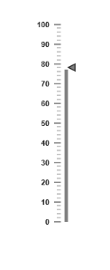

# Interaction and Animation

* Linear Gauge control contains Interaction feature. You can use this interaction feature to change the pointer values manually either by clicking or dragging the pointer over the Gauge. It dynamically changes the value of pointer when dragged. To Enable/Disable the user interaction you can use the readOnly Boolean property. The user interaction option is enabled when you set readOnly property as false. By default it holds the true value.
* Linear Gauge contains another attractive concept called Animation. The animation option enables the movement of the pointer from the minimum value to the current value. You can use animation option to change the pointer value dynamically. You can enable/ disable it using enableAnimation property. To enable animationset enableAnimation to ‘true’. 
* By default it holds the true value. You can control the speed of the pointer during animating using animationSpeed. It is a numerical value that holds the time in mille seconds. That is when setting value is 1000, it is considered as 1 second.

[CSHTML]

@(Html.EJ().LinearGauge("LinearGauge1").Width(300).Height(500).Minimum(10).Maximum(110)

.Value(78)

.EnableAnimation(true)

.AnimationSpeed(1000)

.ReadOnly(false)

//Adding scale collection

.Scales(sc => {

sc.Width(0).Border(bor => bor.Color("transparent").Width(0))

.ShowBarPointers(true)

//Adding marker pointer collection

.MarkerPointers(mp => { mp.Width(10).Length(10)

.MarkerBackgroundColor("Grey").MarkerDistanceFromScale(20).Add(); })

//Adding bar pointer collection

.BarPointers(bp =>

{

bp.Width(5).BarPointerDistanceFromScale(15)

.BarPointerBackgroundColor("Grey").Add();

})

//Adding tick collection

.Ticks(tic =>

{

tic.Type(TickType.MajorInterval).Width(2).Color("#8C8C8C")

.DistanceFromScale(ds => ds.X(7).Y(0)).Add();

tic.Type(TickType.MinorInterval).Width(1).Color("#8C8C8C")

.DistanceFromScale(ds => ds.X(7).Y(0)).Height(6).Add();

}).Add();

}))

Execute the above code to render the following output.

{:.image }

