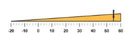
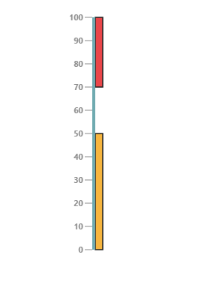
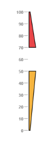
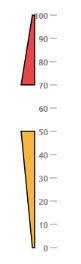
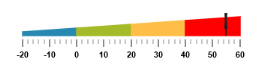

# Ranges 

Ranges are used to specify or group the scale values. You can describe the values in the pointers using ranges. 

## Adding range collection

Range collection can be directly added to the scale object. Refer the following code example to add range collection in a **Linear Gauge** control. 



@(Html.EJ().LinearGauge("LinearGauge1").EnableAnimation(false)

.Height(150).Width(600).Orientation(Orientation.Horizontal)

.LabelColor("Black").IsResponsive(true)

//Adding scale collection

.Scales(scale => {

    scale.Width(0).BackgroundColor("transparent").Border(border => border.Color("transparent").Width(0)).ShowMarkerPointers(true)

    .ShowBarPointers(false).ShowCustomLabels(true).Direction(Directions.Clockwise)

    .ShowRanges(true).Minimum(-20).Maximum(60)

    //Adding label collection

    .Labels(label => { label.DistanceFromScale(distance => distance.X(0).Y(50)).Add(); })

    //Adding tick collection

    .Ticks(tic =>

    {

        tic.Type(TickType.MajorInterval).Width(2).Color("#8c8c8c")

        .DistanceFromScale(distance => distance.X(25).Y(0)).Add();

        tic.Type(TickType.MinorInterval).Color("#8c8c8c").Width(1)

        .Height(6).DistanceFromScale(distance => distance.X(25).Y(0)).Add();

    })

    //Adding marker pointer collection

    .MarkerPointers(mp =>

    {

        mp.Width(3).Length(30).MarkerBackgroundColor("#FE5C09")

        .Type(MarkerType.Star).MarkerDistanceFromScale(20)

        .Placement(PointerPlacement.Near).Value(55).Add();

    })

    //Adding range collection

    .Ranges(range=>{

        range.StartValue(-20).EndValue(60).StartWidth(0)

        .EndWidth(20).RangeBackgroundColor("#FEBE48")

        .Placement(RangePlacement.Near).DistanceFromScale(20).Add();

    }).Add();

}))



Execute the above code to render the following output.

## Range Customization

### Appearance

The major attributes for ranges are **startValue** and **endValue**. The `startValue` defines the start position of the range and `endValue` defines the end position of the range. The `startWidth` and `endWidth` are used to specify the range width at the starting and ending position of the ranges.



@(Html.EJ().LinearGauge("LinearGauge1").Width(500)

.LabelColor("#8c8c8c")

//Adding scale collection

.Scales(scale => {

scale.Width(4).BackgroundColor("#10ADF5").ShowMarkerPointers(false)

.Border(border => border.Color("transparent").Width(0))

.ShowBarPointers(false).Length(310).ShowRanges(true)

//Adding label collection

.Labels(label => {

label.Font(font => font.Size("11px").FontStyle("Bold")

.FontFamily("Segoe UI")).Add(); })

//Adding ticks collection

.Ticks(tic =>

{

tic.Type(TickType.MajorInterval).Width(1).Color("#8c8c8c").Add();

})

//Adding range collection

.Ranges(range=>{

range.StartValue(0).EndValue(50).StartWidth(8)

.EndWidth(8).RangeBackgroundColor("#F6B53F").DistanceFromScale(5).Add();

range.StartValue(70).EndValue(100).StartWidth(8)

.EndWidth(8).RangeBackgroundColor("#E94649").DistanceFromScale(5).Add();

}).Add();

}))

  

Execute the above code to render the following output.

### Colors and Border

* You can customize the ranges to improve the appearance of the **Gauge**. The range border is modified with the object called **border**. It has two border property such as `color` and `width` which are used to customize the border color of the ranges and border width of the ranges. 
* You can set the background color to improve the look and feel of the **Linear Gauge**. For customizing the background color of the ranges, `backgroundColor` is used.You can add the gradient effects to the ranges by using `gradient` object.



@(Html.EJ().LinearGauge("LinearGauge1").Width(500)

.LabelColor("#8c8c8c")

//Adding scale collection

.Scales(scale => {

    scale.Width(4).BackgroundColor("transparent").ShowMarkerPointers(false)

    .Border(border => border.Color("transparent").Width(0))

    .ShowBarPointers(false).Length(310).ShowRanges(true)

    //Adding label collection

    .Labels(label => {

    label.Font(font => font.Size("11px").FontStyle("Bold")

    .FontFamily("Segoe UI")).Add(); })

    //Adding ticks collection

    .Ticks(tic =>

    {

        tic.Type(TickType.MajorInterval).Width(1).Color("#8c8c8c").Add();

    })

    //Adding range collection

    .Ranges(range=>{

        range.StartValue(0).EndValue(50).StartWidth(18).Border(border => border.Color("Black").Width(2))

        .EndWidth(3).RangeBackgroundColor("#F6B53F").DistanceFromScale(10).Add();

        range.StartValue(70).EndValue(100).StartWidth(18).Border(border => border.Color("Black").Width(2))

        .EndWidth(3).RangeBackgroundColor("#E94649").DistanceFromScale(10).Add();

    }).Add();

}))



Execute the above code to render the following output.

## Positioning the ranges

* You can position ranges using two properties such as **distanceFromScale** and **placement**. The `distanceFromScale` property defines the distance between the scale and range. 
* `Placement` property is used to locate the pointer with respect to scale either inside the scale or outside the scale or along the scale. It is an enumerable data type. 



@(Html.EJ().LinearGauge("LinearGauge1").Width(500)

.LabelColor("#8c8c8c")

//Adding scale collection

.Scales(scale => {

    scale.Width(4).BackgroundColor("transparent").ShowMarkerPointers(false)

    .Border(border => border.Color("transparent").Width(0))

    .ShowBarPointers(false).Length(310).ShowRanges(true)

    //Adding label collection

    .Labels(label => {

    label.Font(font => font.Size("11px").FontStyle("Bold")

    .FontFamily("Segoe UI")).Add(); })

    //Adding Ticks collection

    .Ticks(tic =>

    {

        tic.Type(TickType.MajorInterval).Width(1).Color("#8c8c8c").Add();

    })

    //Adding range collection

    .Ranges(range=>{

        range.StartValue(0).EndValue(50).StartWidth(18).Border(border=> border.Color("Black").Width(2))

        .EndWidth(3).RangeBackgroundColor("#F6B53F").DistanceFromScale(10)

        .Placement(RangePlacement.Near).DistanceFromScale(-30).Add();

        range.StartValue(70).EndValue(100).StartWidth(18).Border(border=> border.Color("Black").Width(2))

        .EndWidth(3).RangeBackgroundColor("#E94649").DistanceFromScale(10)

        .Placement(RangePlacement.Near).DistanceFromScale(-30).Add();

    }).Add();

}))



Execute the above code to render the following output.

## Multiple Ranges

You can set multiple ranges by adding an array of range objects. Refer the following code example for multiple range functionality.



@(Html.EJ().LinearGauge("LinearGauge1").EnableAnimation(false)

.Height(150).Width(600).Orientation(Orientation.Horizontal)

.LabelColor("Black").IsResponsive(true)

//Adding scale collection

.Scales(scale => {

    scale.Width(0).BackgroundColor("transparent").Border(border=> border.Color("transparent").Width(0)).ShowMarkerPointers(true)

    .ShowBarPointers(false).ShowCustomLabels(true).Direction(Directions.Clockwise)

    .ShowRanges(true).Minimum(-20).Maximum(60)

    //Adding label collection

    .Labels(label => { label.DistanceFromScale(dc => dc.X(0).Y(50)).Add(); })

    //Adding ticks collection

    .Ticks(tic =>

    {

        tic.Type(TickType.MajorInterval).Width(2).Color("#8c8c8c")

        .DistanceFromScale(distance => distance.X(-1).Y(20)).Add();

        tic.Type(TickType.MinorInterval).Color("#8c8c8c").Width(1)

        .Height(6).DistanceFromScale(distance => distance.X(-1).Y(20)).Add();

    })

    //Adding marker pointer collection

    .MarkerPointers(mp =>

    {

        mp.Width(3).Length(30).MarkerBackgroundColor("#FE5C09")

        .Type(MarkerType.Star).MarkerDistanceFromScale(20)

        .Placement(PointerPlacement.Near).Value(55).Add();

    })

    //Adding range collection

    .Ranges(range=>{

        range.StartValue(-20).EndValue(0).StartWidth(5)

        .EndWidth(10).RangeBackgroundColor("#2788B1")

        .Border(border => border.Color("#2788B1"))

        .Placement(RangePlacement.Near).DistanceFromScale(20).Add();

        range.StartValue(0).EndValue(20).StartWidth(10)

        .EndWidth(15).RangeBackgroundColor("#A5BA28")

        .Border(border => border.Color("#A5BA28"))

        .Placement(RangePlacement.Near).DistanceFromScale(20).Add();

        range.StartValue(20).EndValue(40).StartWidth(15)

        .EndWidth(20).RangeBackgroundColor("#FEBE48")

        .Border(border => border.Color("#FEBE48"))

        .Placement(RangePlacement.Near).DistanceFromScale(20).Add();

        range.StartValue(40).EndValue(60).StartWidth(20)

        .EndWidth(25).RangeBackgroundColor("Red")

        .Border(border => border.Color("Red"))

        .Placement(RangePlacement.Near).DistanceFromScale(20).Add();

    }).Add();

}))



Execute the above code to render the following output.

