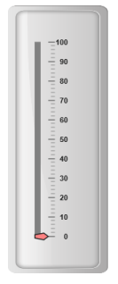
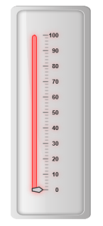
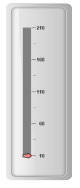
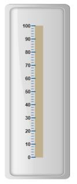
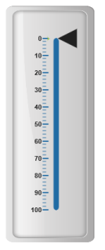
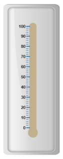
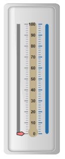

# Scales

Scales are the basic functional block of the Linear Gauge. You can improve the appearance of scales by customizing it. The functional blocks of Linear Gauge are 

* Marker Pointers
* Bar Pointer
* Labels
* Custom Labels
* Indicators
* Ticks
* Ranges

## Adding scale collection

Scale is the basic element of Linear Gauge. Scale collection is directly added to the gauge object. Refer the following code example to add scale collection in Gauge control. 



@(Html.EJ().LinearGauge("LinearGauge1")

.EnableAnimation(false)

//Adding frame object

.Frame(fr=>fr.BackgroundImageUrl("../images/gauge/Gauge_linear_light.png"))

//Adding scale collection

.Scales(scale => {

    scale.Width(8).Position(position => position.X(20).Y(50))

    .BackgroundColor("Grey")

    .Border(border => border.Color("Grey").Width(0))

    .ShowBarPointers(false).ShowMarkerPointers(true)

    //Adding label collection

    .Labels(label => { label.DistanceFromScale(distance => distance.X(50).Y(0)).Add(); })

    //Adding marker pointer collection

    .MarkerPointers(mp =>

    {

        mp.Width(20).Length(10).Type(MarkerType.Pentagon)

        .Placement(PointerPlacement.Near)

        .MarkerBackgroundColor("#FE8282")

        .MarkerDistanceFromScale(20).Add();

    })

    //Adding ticks collection

    .Ticks(tic =>

    {

        tic.Type(TickType.MajorInterval).Width(2).Color("#8C8C8C")

        .DistanceFromScale(distance => distance.X(30).Y(0)).Add();

        tic.Type(TickType.MinorInterval).Width(1).Height(6).Color("#8C8C8C")

        .DistanceFromScale(distance => distance.X(30).Y(0)).Height(6).Add();

    }).Add();

}))



Execute the above code to render the following output.

## Scale Customization

### Colors and Border

* The Scale border is modified with border object. It has two border property, color and width  are used to customize the border color of the scale and border width of the scale. Setting the background color improves the look and feel of the Linear Gauge. You can customize the background color of the scale using backgroundColor. 
* Scales are used to enable or disable various properties such as showRanges, showIndicators, showCustomLabels, showLabels, showTicks, showBarPointers and showMarkerPointers. Enable/disable is done by setting the property into two states either “true” or “false”. You can adjust the Opacity of the scale with opacity property.



@(Html.EJ().LinearGauge("LinearGauge1")

.EnableAnimation(false)

//Adding frame object

.Frame(fr=>fr.BackgroundImageUrl("../images/gauge/Gauge_linear_light.png"))

//Adding scale collection

.Scales(scale => {

    scale.Width(8).Position(position => position.X(20).Y(50))

    .BackgroundColor("#FE8282")

    .Border(border => border.Color("Red").Width(1))

    .Opacity(0.5).ShadowOffset(10).Type(ScaleType.RoundedRectangle)

    .ShowBarPointers(false).ShowMarkerPointers(true)

    //Adding label collection

    .Labels(label => { label.DistanceFromScale(distance => distance.X(50).Y(0)).Add(); })

    //Adding marker pointer collection

    .MarkerPointers(mp =>

    {

        mp.Width(20).Length(10).Type(MarkerType.Pentagon)

        .Placement(PointerPlacement.Near)

        .MarkerBackgroundColor("#C9E1E5")

        .MarkerDistanceFromScale(20).Add();

    })

    //Adding ticks collection

    .Ticks(tic =>

    {

        tic.Type(TickType.MajorInterval).Width(2).Color("#8C8C8C")

        .DistanceFromScale(distance => distance.X(30).Y(0)).Add();

        tic.Type(TickType.MinorInterval).Width(1).Height(6).Color("#8C8C8C")

        .DistanceFromScale(distance => distance.X(30).Y(0)).Height(6).Add();

    }).Add();

}))



Execute the above code to render the following output.

### Appearance 

* You can improve the appearance of Linear Gauge using various properties. You can set the interval values for the scale with major interval value and minor interval value properties and maximum and minimum value by minimum and maximum property. The width property is used to set the scale bar width. 
* You can also adjust the Opacity of the scale with opacity property. The value for opacity lies between 0 and 1.Linear Gauge contains two scale directions, clockwise and counter clockwise. It can be set with direction property.



@(Html.EJ().LinearGauge("LinearGauge1")

.EnableAnimation(false)

//Adding frame object

.Frame(fr=>fr.BackgroundImageUrl("../images/gauge/Gauge_linear_light.png"))

//Adding scale collection

.Scales(scale => {

    scale.Width(18).Minimum(10)

    .Maximum(210)

    .MinorIntervalValue(25)

    .MajorIntervalValue(50)

    .Direction(Directions.CounterClockwise)

    .Position(position => position.X(20).Y(50))

    .BackgroundColor("Grey")

    .Border(border => border.Color("Grey").Width(1))

    .ShowBarPointers(false).ShowMarkerPointers(true)

    //Adding label collection

    .Labels(label => { label.DistanceFromScale(distance => distance.X(50).Y(0)).Add(); })

    //Adding marker pointer collection

    .MarkerPointers(mp =>

    {

        mp.Width(20).Length(10).Type(MarkerType.Pentagon)

        .Placement(PointerPlacement.Near)

        .MarkerBackgroundColor("#FE8282")

        .MarkerDistanceFromScale(20).Add();

    })

    //Adding tick collection

    .Ticks(tic =>

    {

        tic.Type(TickType.MajorInterval).Width(2).Color("#8C8C8C")

        .DistanceFromScale(distance => distance.X(30).Y(0)).Add();

        tic.Type(TickType.MinorInterval).Width(1).Height(6).Color("#8C8C8C")

        .DistanceFromScale(distance => distance.X(30).Y(0)).Height(6).Add();

    }).Add();

}))



Execute the above code to render the following output.

## Scale Types

Scale Type is an element which decides the appearance of the gauge. Linear Gauge contains three scale types such as,

* Rectangle
* Rounded Rectangle
* Thermometer

### Rectangle

For rectangular scale type, the scale renders with rectangular structure. Refer the following code example.



@(Html.EJ().LinearGauge("LinearGauge1")

.EnableAnimation(false)

//Adding frame object

.Frame(fr=>fr.BackgroundImageUrl("../images/gauge/Gauge_linear_light.png"))

//Adding scale collection

.Scales(scale => {

    scale.Width(18).Length(300).Type(ScaleType.Rectangle)

        .Position(position => position.X(54).Y(50))

        .BackgroundColor("#C0B08E")

        .Border(border => border.Color("#C0B08E").Width(1))

        .ShowMarkerPointers(false)

        //Adding tick collection

        .Ticks(tic =>

        {

           tic.Type(TickType.MajorInterval).Width(2).Color("#206BA4")

              .DistanceFromScale(distance => distance.X(-27).Y(0))

              .Placement(TickPlacement.Far).Add();

           tic.Type(TickType.MinorInterval).Width(1).Height(6).Color("#206BA4")

              .DistanceFromScale(distance => distance.X(-27).Y(0)).Height(6)

              .Placement(TickPlacement.Far).Add();

        }).Add();

}))



Execute the above code to render the following output.

Rounded Rectangle

{:.caption}

For rounded rectangular scale type, the scale renders as rectangular structure but with constant radius rounded corner. Refer the following code example.



@(Html.EJ().LinearGauge("LinearGauge1")

.EnableAnimation(false)

//Adding frame object

.Frame(fr=>fr.BackgroundImageUrl("../images/gauge/Gauge_linear_light.png"))

//Adding scale collection

.Scales(scale => {

    scale.Width(8).Type(ScaleType.RoundedRectangle)

    .Direction(Directions.Clockwise)

    .Position(position => position.X(60).Y(50))

    .BackgroundColor("#206BA4")

    .Border(border => border.Color("#206BA4").Width(1))

    //Adding label collection

    .Labels(label => { label.DistanceFromScale(distance => distance.X(-20).Y(0)).Add(); })

    //Adding tick collection

    .Ticks(tic =>

    {

        tic.Type(TickType.MajorInterval).Width(2).Color("#206BA4")

        .DistanceFromScale(distance => distance.X(-27).Y(0))

        .Placement(TickPlacement.Far).Add();

        tic.Type(TickType.MinorInterval).Width(1).Height(6).Color("#206BA4")

        .DistanceFromScale(distance => distance.X(-27).Y(0)).Height(6)

        .Placement(TickPlacement.Far).Add();

    }).Add();

}))



Execute the above code to render the following output.

## Thermometer

For thermometer scale type, the scale renders as thermometer structure with rounded bottom. Refer the following code example.



@(Html.EJ().LinearGauge("LinearGauge1")

.EnableAnimation(false)

//Adding Frame object

.Frame(fr=>fr.BackgroundImageUrl("../images/gauge/Gauge_linear_light.png"))

//Adding scale collection

.Scales(scale => {

    scale.Width(18).Length(300).Type(ScaleType.Thermometer)

    .Position(position => position.X(54).Y(50))

    .BackgroundColor("#C0B08E")

    .Border(border => border.Color("#C0B08E").Width(1))

    .ShowMarkerPointers(false).ShowBarPointers(false)

    //Adding tick collection

    .Ticks(tic =>

    {

        tic.Type(TickType.MajorInterval).Width(2).Color("#206BA4")

        .DistanceFromScale(distance => distance.X(-27).Y(0))

        .Placement(TickPlacement.Far).Add();

        tic.Type(TickType.MinorInterval).Width(1).Height(6).Color("#206BA4")

        .DistanceFromScale(distance => distance.X(-27).Y(0)).Height(6)

        .Placement(TickPlacement.Far).Add();

    }).Add();

}))



Execute the above code to render the following output.

Adding multiple scales

You can set multiple scales for a single Linear Gauge control by using an array of scale objects. Each scale object is independent of each other. Refer the following code example to add multiple scale collection. 



@(Html.EJ().LinearGauge("LinearGauge1")

.EnableAnimation(false)

//Adding Frame object

.Frame(fr=>fr.BackgroundImageUrl("../images/gauge/Gauge_linear_light.png"))

//Adding Scale collection

.Scales(scale =>

//Adding Scale 1

{

    scale.Width(8)

    .Position(position => position.X(15).Y(50))

    .BackgroundColor("Grey")

    .Border(border => border.Color("Grey").Width(1))

    .ShowMarkerPointers(true).ShowBarPointers(false)

    .Labels(label => { label.DistanceFromScale(distance => distance.X(50).Y(0)).Add(); })

    //Adding marker pointer collection

    .MarkerPointers(mp => { mp.Type(MarkerType.Pentagon)

    .Placement(PointerPlacement.Near).Width(20).Length(10)

    .MarkerDistanceFromScale(20).MarkerBackgroundColor("#FE8282").Add(); })

    //Adding tick collection

    .Ticks(tic =>

    {

        tic.Type(TickType.MajorInterval).Width(2).Color("#8c8c8c")

        .DistanceFromScale(distance => distance.X(30).Y(0)).Add();

        tic.Type(TickType.MinorInterval).Width(1).Height(6).Color("#8c8c8c")

        .DistanceFromScale(distance => distance.X(30).Y(0)).Height(6).Add();

    }).Add();

    //Adding Scale 2

    scale.Width(8).Direction(Directions.Clockwise)

    .Type(ScaleType.RoundedRectangle)

    .Position(position => position.X(90).Y(50))

    .BackgroundColor("#206BA4")

    .Border(border => border.Color("#206BA4").Width(1))

    .ShowMarkerPointers(false).ShowBarPointers(false).ShowLabels(false)

    //Adding tick collection

    .Ticks(tic =>

    {

        tic.Type(TickType.MajorInterval).Width(2).Color("#206BA4")

        .DistanceFromScale(distance => distance.X(-27).Y(0))

        .Placement(TickPlacement.Far).Add();

        tic.Type(TickType.MinorInterval).Width(1).Height(6).Color("#206BA4")

        .DistanceFromScale(distance => distance.X(-27).Y(0)).Height(6)

        .Placement(TickPlacement.Far).Add();

    }).Add();

    //Adding Scale 3

    scale.Width(18).Length(300)

    .Position(position => position.X(54).Y(50))

    .Type(ScaleType.Thermometer)

    .BackgroundColor("#C0B08E")

    .Border(border => border.Color("#C0B08E").Width(1))

    .ShowMarkerPointers(false).ShowBarPointers(false)

    .ShowLabels(false).ShowTicks(false)

    .Add();

}))



Execute the above code to render the following output.

