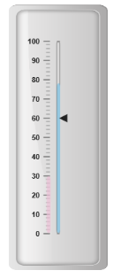
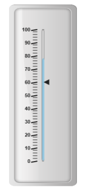
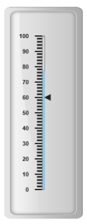
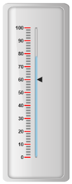

# Ticks

Ticks are used to mark some values on the scale. Based on the tick’s value you can set the labels on the required position.

Adding tick collection 

Tick collection can be directly added to the scale object. Refer the following code example to add tick collection in a **Linear Gauge** control.



@(Html.EJ().LinearGauge("LinearGauge1").EnableAnimation(false).Value(78)

//Adding frame object

.Frame(fr=>fr.InnerWidth(8).OuterWidth(10)

.BackgroundImageUrl("../Content/images/gauge/Gauge_linear_light.png"))

//Adding scale collection

.Scales(scale => {

    scale.Width(5).Border(border => border.Color("Grey").Width(1)).BackgroundColor("transparent")

    .Type(ScaleType.RoundedRectangle)

    .ShowBarPointers(true)

    //Adding bar pointer collection

    .BarPointers(bar =>

    {

        bar.Width(5).BarPointerBackgroundColor("#95C7E0").Add();

        bar.Width(6).BarPointerBackgroundColor("#EDC1D7")

        .BarPointerDistanceFromScale(-15).BarPointerValue(30)

        .BarPointerOpacity(0.7).Add();

    })

    //Adding marker pointer collection

    .MarkerPointers(mp => { mp.Width(10).Length(10).Value(60).Add(); })

    //Adding label collection

    .Labels(label => { label.DistanceFromScale(distance => distance.X(-25).Y(0)).Add(); })

    //Adding tick collection

    .Ticks(tic =>

    {

        tic.Type(TickType.MajorInterval).Width(2).Color("#8C8C8C")

        .DistanceFromScale(distance => distance.X(-10).Y(0)).Add();

        tic.Type(TickType.MinorInterval).Width(1).Color("#8C8C8C")

        .DistanceFromScale(distance => distance.X(-10).Y(0)).Height(6).Add();

    }).Add();

}))



Execute the above code to render the following output.

## Tick Customization

### Appearance

* Height and width of the ticks can be applied by using the properties `height` and `width`. You can customize ticks with the properties like angle, color, etc. `angle` attribute is used to display the labels in the specified angles and `color` attribute is used to display the labels in specified color. 
* Ticks are two types such as major and minor. The opacity of the labels can be adjusted with the property `opacity`. The opacity values lies between 0 and 1.



@(Html.EJ().LinearGauge("LinearGauge1").EnableAnimation(false).Value(78)

//Adding frame object

.Frame(fr=>fr.InnerWidth(8).OuterWidth(10)

.BackgroundImageUrl("../Content/images/gauge/Gauge_linear_light.png"))

//Adding scale object

.Scales(scale => {

    scale.Width(5).Border(border => border.Color("Grey").Width(1)).BackgroundColor("transparent")

    .Type(ScaleType.RoundedRectangle)

    .ShowBarPointers(true)

    //Adding bar pointer value

    .BarPointers(bar =>

    {

        bar.Width(5).BarPointerBackgroundColor("#95C7E0").Add();

    })

    //Adding marker pointer collection

    .MarkerPointers(mp => { mp.Width(10).Length(10).Value(60).Add(); })

    //Adding label collection

    .Labels(label => { label.DistanceFromScale(distance => distance.X(-25).Y(0)).Add(); })

    //Adding ticks collection

    .Ticks(tic =>

    {

        tic.Type(TickType.MajorInterval).Width(2).Height(14).Angle(10).Color("Black")

        .DistanceFromScale(distance =>

        distance.X(-10).Y(0)).Placement(TickPlacement.Near).Add();

        tic.Type(TickType.MinorInterval).Width(1).Height(10)

        .Opacity(0.5).Color("Black").DistanceFromScale(distance =>

        distance.X(-10).Y(0)).Placement(TickPlacement.Near).Height(6).Add();

    }).Add();

}))



Execute the above code to render the following output.

### Types

Ticks are two `types` such as **majorInterval** and **minorInterval**. Major type ticks are for major interval values and minor type ticks are for minor interval values.



@(Html.EJ().LinearGauge("LinearGauge1").EnableAnimation(false).Value(78)

//Adding frame object

.Frame(fr=>fr.InnerWidth(8).OuterWidth(10)

.BackgroundImageUrl("../Content/images/gauge/Gauge_linear_light.png"))

//Adding scale collection

.Scales(scale => {

    scale.Width(5).Border(border => border.Color("Grey").Width(1)).BackgroundColor("transparent")

    .Type(ScaleType.RoundedRectangle)

    .ShowBarPointers(true)

    //Adding bar pointer collection

    .BarPointers(bar =>

    {

        bar.Width(5).BarPointerBackgroundColor("#95C7E0").Add();

    })

    //Adding marker pointer collection

    .MarkerPointers(mp => { mp.Width(10).Length(10).Value(60).Add(); })

    //Adding label collection

    .Labels(label => { label.DistanceFromScale(distance => distance.X(-25).Y(0)).Add(); })

    //Adding ticks collection

    .Ticks(tic =>

    {

        tic.Type(TickType.MajorInterval).Width(2).Height(14).Color("Black").Add();

        tic.Type(TickType.MinorInterval).Add();

    }).Add();

}))



Execute the above code to render the following output.

### Positioning the ticks

* You can position ticks with the help of two properties such as **distanceFromScale** and **placement**. The property `distanceFromScale` defines the distance between the scale and ticks. 
* `Placement` property is used to locate the ticks with respect to scale either inside the scale or outside the scale or along the scale. It is an enumerable data type.



@(Html.EJ().LinearGauge("LinearGauge1").EnableAnimation(false).Value(78)

//Adding frame collection

.Frame(fr=>fr.InnerWidth(8).OuterWidth(10)

.BackgroundImageUrl("../Content/images/gauge/Gauge_linear_light.png"))

//Adding scale collection

.Scales(scale => {

    scale.Width(5).Border(border => border.Color("Grey").Width(1)).BackgroundColor("transparent")

    .Type(ScaleType.RoundedRectangle)

    .ShowBarPointers(true)

    //Adding bar pointer collection

    .BarPointers(bar =>

    {

        bar.Width(5).BarPointerBackgroundColor("#95C7E0").Add();

    })

    //Adding marker pointer collection

    .MarkerPointers(mp => { mp.Width(10).Length(10).Value(60).Add(); })

    //Adding label collection

    .Labels(label => { label.DistanceFromScale(distance => distance.X(-25).Y(0)).Add(); })

    //Adding ticks collection

    .Ticks(tic =>

    {

        tic.Type(TickType.MajorInterval).Width(2).Height(14).Color("Black")

        .Placement(TickPlacement.Near).Color("Red")

        .DistanceFromScale(distance=>distance.X(-10).Y(0)).Add();

        tic.Type(TickType.MinorInterval).Color("Grey").Placement(TickPlacement.Near)

        .DistanceFromScale(distance => distance.X(-10).Y(0)).Add();

    }).Add();

}))



Execute the above code to render the following output.

