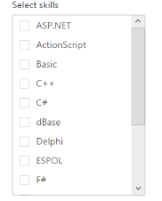

# Appearance and Styling

## Adjusting ListBox size

### Width

ListBox widget provides you support to customize the dimensions of the ListBox. By using Width property you can set the width of the ListBox. Its data type is string.

### Height

ListBox widget provides you support to customize the dimensions of the ListBox. By using Height property, you can set the height of the ListBox. Its data type is string.

Defining the ListBox size properties

The following steps explains you the configuration of Height & Width properties in ListBox.

1. Add the below code in your view page to render the ListBox with customized height and width

   ~~~ cshtml
   
	// Add the following code in View page to configure ListBox widget
	
  
		<h5 class="ctrllabel"> 
			Select a skill 
		</h5>
		@Html.EJ().ListBox("listboxsample").Width("240").Height("302").Datasource((IEnumerable<ug_listbox.controllers.skillset>)ViewBag.datasource).ListBoxFields(df 
		=> df.Text("text"))
	

   ~~~
   
   
   ~~~ csharp
   
	// Add the following code to add list items in the controller page
	public class skillset 
	{    
		public string text { get; set; }  
	}    
	public ActionResult Index() 
	{ 
		List<skillset> skill = new List<skillset>();     
		skill.Add(new skillset { text = "ASP.NET" }); 
		skill.Add(new skillset { text = "ActionScript" });     
		skill.Add(new skillset { text = "Basic" });    
		skill.Add(new skillset { text = "C++" });   
		skill.Add(new skillset { text = "C#" });    
		skill.Add(new skillset { text = "dBase" });  
		skill.Add(new skillset { text = "Delphi" });  
		skill.Add(new skillset { text = "ESPOL" });   
		skill.Add(new skillset { text = "F#" });      
		skill.Add(new skillset { text = "FoxPro" });    
		skill.Add(new skillset { text = "Java" });     
		skill.Add(new skillset { text = "J#" });     
		skill.Add(new skillset { text = "Lisp" });    
		skill.Add(new skillset { text = "Logo" });    
		skill.Add(new skillset { text = "PHP" });    
		ViewBag.datasource = skill; 
		return View();    
	}

   ~~~
   

2. Output of the above steps

### Enabling Rounded corner

ListBox widget provides you support to change the appearance of ListBox. By using showRoundedCorner you can create a rounded corner on the ListBox. Its data type is Boolean.

The following steps explains you the configuration of Rounded corner of the ListBox.

1. Add the below code in your view page to render the ListBox with rounded corners

   ~~~ cshtml
   
	// Add the following code in View page to configure ListBox widget
	
  
		<h5 class="ctrllabel"> 
			Select a skill  
		</h5> 
		@Html.EJ().ListBox("listboxsample").Width("240").Datasource((IEnumerable<ug_listbox.controllers.skillset>)ViewBag.datasource).ListBoxFields(df =>
		df.Text("text")).ShowRoundedCorner(true)
	

		
   ~~~
   
		
   ~~~ csharp
   
	// Add the following code to add list items in the controller page 
	public class skillset
	{  
		public string text { get; set; } 
	} 
	public ActionResult Index()
	{    
		List<skillset> skill = new List<skillset>();  
		skill.Add(new skillset { text = "ASP.NET" });
		skill.Add(new skillset { text = "ActionScript" });
		skill.Add(new skillset { text = "Basic" });     
		skill.Add(new skillset { text = "C++" });     
		skill.Add(new skillset { text = "C#" });     
		skill.Add(new skillset { text = "dBase" });  
		skill.Add(new skillset { text = "Delphi" }); 
		skill.Add(new skillset { text = "ESPOL" });  
		skill.Add(new skillset { text = "F#" });    
		skill.Add(new skillset { text = "FoxPro" }); 
		skill.Add(new skillset { text = "Java" });  
		skill.Add(new skillset { text = "J#" });   
		skill.Add(new skillset { text = "Lisp" }); 
		skill.Add(new skillset { text = "Logo" }); 
		skill.Add(new skillset { text = "PHP" });  
		ViewBag.datasource = skill;   
		return View(); 
		}

   ~~~
   

2. Output of the above steps.

