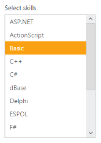
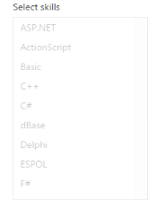

# Behavior Settings

The following are some miscellaneous properties that helps you to change the behavior of ListBox control.

## Target ID

You can append a list with ListBox by using TargetId property. Define a <ul>,< li> tag that you want to display on ListBox and then set the id of parent <ul> tag to TargetId property. And its data type is string. 

The following steps explains you the configuration of TargetID property in ListBox.

1. Add the below code in your page to render the ListBox 

   ~~~ cshtml

	// Add the following code in View page to configure ListBox widget

	

		<h5 class="ctrllabel">

			Select a font style

		</h5>

		@Html.EJ().ListBox("listboxSample").TargetID("targetList")

		<ul id="targetList">

			<li>Algerian</li>

			<li>ARIAL</li>

			<li>Bimini</li>

			<li>Courier</li>

			<li>Cursive</li>

			<li>Fantasy</li>

			<li>Georgia</li>

			<li>Impact</li>

			<li>New York</li>

			<li>Sans-Serif</li>

			<li>Scripts</li>

			<li>Times</li>

			<li>Times New Roman</li>

			<li>Verdana</li>

			<li>Western</li>

			<li>ZapfEllipt BT</li>

		</ul>

	

   ~~~
   

2. Output of the above steps.

## Select the value by index 

ListBox widget provides you support to select an item by mentioning the index of the item. The SelectedIndex property helps you to select the particular item from the list. Its date type is number. 

The following steps explains you the configuration of SelectedIndex property in ListBox.

1. Add the below code in your page to render the ListBox

   ~~~ cshtml

	

		<h5 class="ctrllabel">

			Select a skill

		</h5>    @Html.EJ().ListBox("listboxSample").Width("240").Datasource((IEnumerable<ug_listbox.controllers.SkillSet>)ViewBag.datasource).ListBoxFields(df

		=> df.Text("text")).SelectedIndex(2)

	

   ~~~
   

2.  Output of the above steps.

## Enable or Disable the ListBox Widget

This features enables you to set the enable or disable options for ListBox by setting Boolean type value to Enabled property. 

The following steps explains you the configuration of Enabled property in ListBox.

1. Add the below code in your view page to render the Disabled ListBox

   ~~~ cshtml

	// Add the following code in View page to configure ListBox widget

	

		<h5 class="ctrllabel">

			Select a skill

		</h5>    @Html.EJ().ListBox("listboxSample").Width("240").Datasource((IEnumerable<ug_listbox.controllers.SkillSet>)ViewBag.datasource).ListBoxFields(df => df.Text("text")).Enabled(false)

	

		
   ~~~
   

   ~~~ csharp

	// Add the following code to add list items in the controller page

	public class SkillSet

	{

		public string text { get; set; }

	}

	public ActionResult Index()

	{

		List<SkillSet> skill = new List<SkillSet>();

		skill.Add(new SkillSet { text = "ASP.NET" });

		skill.Add(new SkillSet { text = "ActionScript" });

		skill.Add(new SkillSet { text = "Basic" });

		skill.Add(new SkillSet { text = "C++" });

		skill.Add(new SkillSet { text = "C#" });

		skill.Add(new SkillSet { text = "dBase" });

		skill.Add(new SkillSet { text = "Delphi" });

		skill.Add(new SkillSet { text = "ESPOL" });

		skill.Add(new SkillSet { text = "F#" });

		skill.Add(new SkillSet { text = "FoxPro" });

		skill.Add(new SkillSet { text = "Java" });

		skill.Add(new SkillSet { text = "J#" });

		skill.Add(new SkillSet { text = "Lisp" });

		skill.Add(new SkillSet { text = "Logo" });

		skill.Add(new SkillSet { text = "PHP" });

		ViewBag.datasource = skill;

		return View();

	}

   ~~~
   

2. Output of the above steps.

