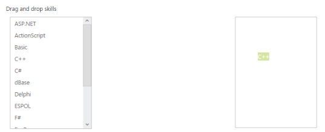

# Drag and Drop Support

ListBox widget provides the Drag and Drop support. A list item can be dragged from a ListBox control and can be dropped in any droppable element. To enable Drag and Drop support, set the AllowDragAndDrop property as true. In control, enable the AllowDragAndDrop property where you want to drop list Item.

The following steps explains you the behaviour of template support with ListBox.

1. Add the below code in your page to render the ListBox

   ~~~ cshtml

	// Add the following code in View page to configure ListBox widget 
	
 
		<h5 class="ctrllabel">
			Drag and drop skills 
		</h5>
		@Html.EJ().ListBox("listboxsample").Datasource((IEnumerable<ug_listbox.controllers.skillset>)ViewBag.datasource).ListBoxFields(df =>
		df.Text("text")) .AllowDragAndDrop(true)
	

	
 
		@Html.EJ().ListBox("dragsample").AllowDragAndDrop(true)
	

		
   ~~~
   
   
   ~~~ csharp
		
	// Add the following code to add list items in the controller page  
	public class skillset 
	{          
		public string text { get; set; }     
	}       
	public ActionResult Index()   
	{        
		List<skillset> skill = new List<skillset>();   
		skill.Add(new skillset { text = "ASP.NET" });    
		skill.Add(new skillset { text = "ActionScript" }); 
		skill.Add(new skillset { text = "Basic" });      
		skill.Add(new skillset { text = "C++" });       
		skill.Add(new skillset { text = "C#" });      
		skill.Add(new skillset { text = "dBase" });   
		skill.Add(new skillset { text = "Delphi" });      
		skill.Add(new skillset { text = "ESPOL" });     
		skill.Add(new skillset { text = "F#" });      
		skill.Add(new skillset { text = "FoxPro" });  
		skill.Add(new skillset { text = "Java" });   
		skill.Add(new skillset { text = "J#" });    
		skill.Add(new skillset { text = "Lisp" });  
		skill.Add(new skillset { text = "Logo" });   
		skill.Add(new skillset { text = "PHP" });  
		ViewBag.datasource = skill;     
		return View();  
	}

   ~~~
   

2. Add the following class in CSS. 

   ~~~ cshtml 

	

   ~~~
   

3. Output of the above steps.

