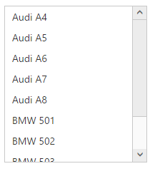
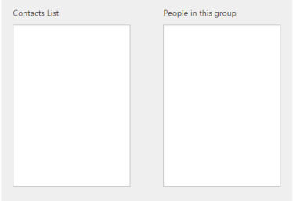
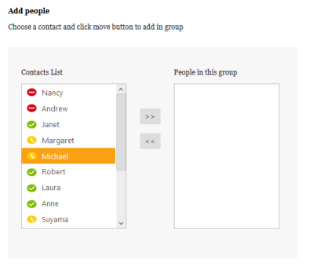
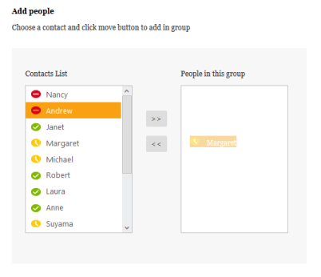
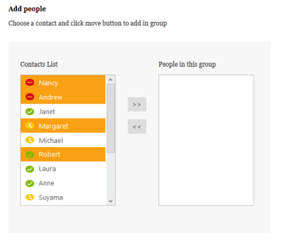
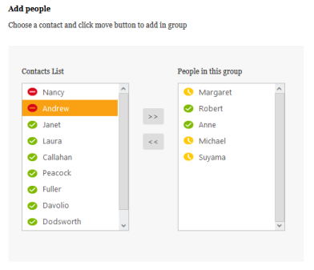

# Getting Started

This section explains briefly on how to create a ListBox control in your ASP.NET MVC application.

## Create your first ListBox in MVC

Here you can learn how to customize ListBox in Contact Selection tool. This allows you display the list of contacts, to select and move them to the next ListBox that has the selected items. The following example illustrates simulator of Group Creation tool like Skype messenger.

The following screenshot demonstrates the functionality of ListBox with Multi-Selection and Drag and Drop features.

Skype Group creation tool Simulator using ListBox
{:.caption}

In the above screenshot, you can select a list item from the first ListBox widget. After you select the item, you can move the selected item to the second ListBox widget. 

### Create a ListBox Widget

EssentialASP.NET MVCListBox control renders with built-in features.

The following steps are used to create ListBox control.  

1. You can create an MVC Project and add necessary assembly with the help of the given [MVC-Getting Started](http://help.syncfusion.com/aspnetmvc/listbox/getting-started) Documentation.
2. Please add the below code in your layout._cshtml page to add necessary script and CSS files to render the ListBox control.

   ~~~ cshtml

	<head>

	<link href="http://cdn.syncfusion.com/13.1.0.21/js/web/flat-azure/ej.web.all.min.css" rel="stylesheet" />

		<!--Scripts-->

		

		

		

		

	</head>
		
   ~~~
   

     Create a CSHTML file in View page and add the following code sample to it. 

3. Add the following code in your view page to render ListBox controls.

   ~~~ cshtml  

	

		<h5>

			<b>Add people</b></h5>

		

			Choose a contact and click move button to add in group

		

		 

		

			

				

					Contacts List

				@Html.EJ().ListBox("list1")

			

			

				

					People in this group

				@Html.EJ().ListBox("list2")

			

		

	

   ~~~
   

4. Add the following style section for the ListBox controls alignment. 

   ~~~ css

	

   ~~~
   

5. Run this code to render an empty ListBox control.

Render ListBox with <ul></ul> element
{:.caption}

### Configure ListBox with Items

To populate items inside ListBox, you have to add list items inside <ul> as <li></li> elements. The TargetID property is used to get the list items from the target. The Id of the ul that has the list items is given as the TargetID. Include the following <ul>, <li> elements in your sample.

   

    <h5>

        <b>Add people</b></h5>

    

        Choose a contact and click move button to add in group

    

     

    

        

            

                Contacts List

            @Html.EJ().ListBox("list1").TargetID("select")

            <ul id="select">

                <li>

                    

                    Nancy</li>

                <li>

                    

                    Andrew</li>

                <li>

                    

                    Janet</li>

                <li>

                    

                    Margaret</li>

                <li>

                    

                    Michael</li>

                <li>

                    

                    Robert</li>

                <li>

                    

                    Laura</li>

                <li>

                    

                    Anne</li>

                <li>

                    

                    Suyama</li>

                <li>

                    

                    Callahan</li>

                <li>

                    

                    Peacock</li>

                <li>

                    

                    Fuller</li>

                <li>

                    

                    Davolio</li>

                <li>

                    

                    Dodsworth</li>

                <li>

                    

                    Louis</li>

            </ul>

        

        

            @Html.EJ().Button("Add").Text(">>").ShowRoundedCorner(true).ClientSideEvents(e => e.Click("add"))

             

             

            @Html.EJ().Button("Remove").Text("<<").ShowRoundedCorner(true).ClientSideEvents(e => e.Click("remove"))

        

        

            

                People in this group

            @Html.EJ().ListBox("list2")

            <ul id="selectedItems">

            </ul>

        

    



Run the above code to render ListBox with list items rendered inside ListBox. ListBox with Contact list items is shown as follows.

ListBox with Contact list items
{:.caption}

### Enable Drag and Drop 

You can drag an item from a ListBox and drop it in droppable element.To drag and drop a list item across controls or within a control, you have to set the AllowDrag and AllowDrop property as “True”. 

Please refer the below code snippet:


  
@Html.EJ().ListBox("list1").TargetID("select").AllowDrag(true).AllowDrop(true)

@Html.EJ().ListBox("list2").AllowDrag(true).AllowDrop(true)



Run the above code example to render the following ListBox with Drag and drop feature. ListBox with Drag and Drop list items across control is as follows:

ListBox with Drag and Drop list items
{:.caption}

Enable Multiple Selection 

You can select multiple list items simultaneously in ListBox control, and move the multiple, selected items to the selection ListBox. To select multiple items in a ListBox, set the AllowMultiSelection property for the ListBox as “True”.


   

@Html.EJ().ListBox("list1").TargetID("select").AllowMultiSelection(true)

.AllowDragAndDrop(true)



Run the above code example to render the following ListBox with Multiple selection feature. ListBox control with Multiple Selection of list items is as follows.

ListBox  with Multiple Selection of list items
{:.caption}

### Add items to a Second ListBox

You have to move the selected list items to the second ListBox using AddItem(value) method and remove existing item in the first ListBox using RemoveItem() method.

The following code sample explains how to add an item to a second ListBox.





Run this code and you can see the output. Selected items from the first ListBox have been moved to second ListBox using AddItem() and RemoveItem() method and it is displayed in the following figure.

ListBox Selection moved to Second ListBox
{:.caption}
