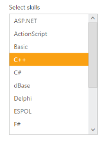

## Keyboard interaction

You can use Keyboard shortcut keys as an alternative to the mouse on using ListBox widget. ListBox Widget allows you to perform all kind of actions using keyboard shortcuts.

_Table_ _4__: Keyboard shortcut keys_

<table>
<tr>
<td>
Shortcut Key</td><td>
Description</td></tr>
<tr>
<td>
{{ '[Access key](http://en.wikipedia.org/wiki/Access_key)' | markdownify }} + j	</td><td>
Focuses into the ListBox text box</td></tr>
<tr>
<td>
Up</td><td>
Moves to previous item in the ListBox</td></tr>
<tr>
<td>
Down</td><td>
Moves to next item in the ListBox</td></tr>
<tr>
<td>
Enter</td><td>
Selects the focused item</td></tr>
<tr>
<td>
Left </td><td>
Moves to previous item in the ListBox</td></tr>
<tr>
<td>
Right </td><td>
Moves to next item in the ListBox</td></tr>
<tr>
<td>
Home</td><td>
Navigates to the starting item </td></tr>
<tr>
<td>
End</td><td>
Navigates to the end item </td></tr>
</table>
Configure keyboard interaction

The following steps explains you to enable keyboard interaction for a ListBox.

1. Add the below code in your page to render the ListBox

<table>
<tr>
<td>
[View]// Add the following code in View page to configure ListBox widget
    <h5 class="ctrllabel">        Select a skill    </h5>  @Html.EJ().ListBox("listboxsample").Datasource((IEnumerable<ug_listbox.controllers.skillset>)ViewBag.datasource).ListBoxFields(df => df.Text("text"))
</td></tr>
<tr>
<td>
 [JavaScript]// Render ListBox control</td></tr>
</table>

2. Run the sample, press Alt + J to focus in the ListBox widget that enables it and you can navigate using arrow keys.

{{ '' | markdownify }}
{:.image }

