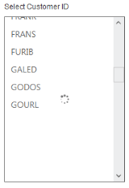

# Load-on-Demand support 

ListBox widget provides the Load-onDemand support, when binding the remote data for the ListBox. It loads partially, only a set of data from remote server loaded initially, and imports data further upon loading. To enable Load-onDemand support, set the EnableLoadOnDemand property as true. You can set ItemsCount that specifies number of items in the ListBox. You can load any number of items upon request with ItemRequest ClientSide Event.

The following steps explains you the behaviour of Load-onDemand support in ListBox.

1. Add the below code in your page to render the ListBox

   ~~~ html
      
		// Add the following code in View page to configure ListBox widget
		
		
    
			
			<h5 class="ctrllabel"> Select Customer ID</h5>    
			
			@Html.EJ().ListBox("customerList").Datasource(ds => ds.URL("http://mvc.syncfusion.com/Services/Northwnd.svc/"))
			.Query("ej.Query().from('Customers')")
			.ListBoxFields(f => f.Text("CustomerID"))
			.ItemsCount(91) .EnableLoadOnDemand(true)
			.ClientSideEvents(e => e.ItemRequest("itemRequested"))
		

		
   ~~~
   {:.prettyprint }

   ~~~ js
      
		
		
   ~~~
   {:.prettyprint }

2. Output of the above steps.

	