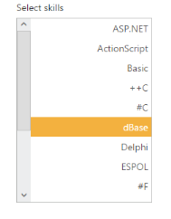

# RTL Support

This feature supports to change the left-to-right alignment of the ListBox widget to right-to-left (RTL). 

Defining the RTL property

The following steps explains you the configuration of enableRTL properties in ListBox.

1. Add the below code in your page to render the ListBox with right to left alignment

   ~~~ cshtml
   
	// Add the following code in View page to configure ListBox widget
	
 
	<h5 class="ctrllabel">
		Select a skill 
	</h5>  
	@Html.EJ().ListBox("listBoxSample").Datasource((IEnumerable<ug_listbox.controllers.skillSet>)ViewBag.datasource).ListBoxFields(df => 
	df.Text("text")).EnableRTL(true)
	

		
   ~~~
   

   ~~~ csharp
   
	// Add the following code to add list items in the controller page
	public class skillSet
	{  
		public string text { get; set; }
	}   
	public ActionResult Index()
	{    
		List<skillSet> skill = new List<skillSet>();
		skill.Add(new skillSet { text = "ASP.NET" });
		skill.Add(new skillSet { text = "ActionScript" });  
		skill.Add(new skillSet { text = "Basic" });  
		skill.Add(new skillSet { text = "C++" });   
		skill.Add(new skillSet { text = "C#" });   
		skill.Add(new skillSet { text = "dBase" }); 
		skill.Add(new skillSet { text = "Delphi" }); 
		skill.Add(new skillSet { text = "ESPOL" }); 
		skill.Add(new skillSet { text = "F#" });  
		skill.Add(new skillSet { text = "FoxPro" }); 
		skill.Add(new skillSet { text = "Java" });  
		skill.Add(new skillSet { text = "J#" });  
		skill.Add(new skillSet { text = "Lisp" });
		skill.Add(new skillSet { text = "Logo" }); 
		skill.Add(new skillSet { text = "PHP" });  
		ViewBag.datasource = skill;     
		return View();    
	}

   ~~~
   

2. Output of the above steps.

