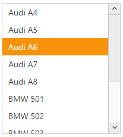
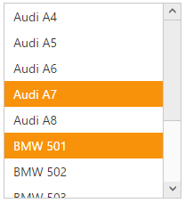

# Selection

The ListBox widget allows you to highlight the selected item. It allows multiple selection also.

## Selection on initialize	

By default, the ListBox widget allows single item selection. We can select specific item during initialization of the ListBox widget using the “SelectedIndex” property.



@{Html.EJ().ListBox("listbox")
      .TargetID("carslist")
      .SelectedIndex(2)
      .Render();}

    <ul id="carslist">
        <li>Audi A4</li>
        <li>Audi A5</li>
        <li>Audi A6</li>
        <li>Audi A7</li>
        <li>Audi A8</li>
        <li>BMW 501</li>
        <li>BMW 502</li>
        <li>BMW 503</li>
        <li>Batch</li>
        <li>BMW 507</li>
        <li>BMW 3200</li>
        <li>Cut</li>
    </ul>

 
 

## Multiple selection

Multiple selection can be enabled using “AllowMultiSelection” property. You can select multiple list items using <kbd>“Ctrl”</kbd> and <kbd>“Shift”</kbd> keys.

### See Also

[Keyboard Interaction](http://help.syncfusion.com/aspnetmvc/listbox/keyboard-interaction)



@{Html.EJ().ListBox("listbox")
      .TargetID("carslist")
      .AllowMultiSelection(true)
      .Render();}

    <ul id="carslist">
        <li>Audi A4</li>
        <li>Audi A5</li>
        <li>Audi A6</li>
        <li>Audi A7</li>
        <li>Audi A8</li>
        <li>BMW 501</li>
        <li>BMW 502</li>
        <li>BMW 503</li>
        <li>Batch</li>
        <li>BMW 507</li>
        <li>BMW 3200</li>
        <li>Cut</li>
    </ul>



## Checkbox

The ListBox widget allows selection through checkbox. It can be enabled using `ShowCheckbox` property.
The specified items can be checked on initialize through `CheckedIndices` property.



@{List<int> indexList = new List<int>();
indexList.Add(1);
indexList.Add(2);
}

@{Html.EJ().ListBox("listbox")
      .TargetID("carslist")
      .ShowCheckbox(true)
      .CheckedIndices(indexList)
      .Render();}

    <ul id="carslist">
        <li>Audi A4</li>
        <li>Audi A5</li>
        <li>Audi A6</li>
        <li>Audi A7</li>
        <li>Audi A8</li>
        <li>BMW 501</li>
        <li>BMW 502</li>
        <li>BMW 503</li>
        <li>Batch</li>
        <li>BMW 507</li>
        <li>BMW 3200</li>
        <li>Cut</li>
    </ul>



