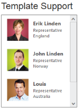

## Template Support

ListBox widget provides the template support, when binding the data for the ListBox. For this behaviour, set the common syntax /element in template property. You can add any HTML mark-up element inside the ListBox using this property.

The following steps explains you the behaviour of template support with ListBox.

1. Add the below code in your view page to render the ListBox

{  | markdownify }
{:.image }
_Note: Images for this sample are available in ‘installed location/images/Employee’_ 

<table>
<tr>
<td>
[View]  // Add the following code in View page to configure ListBox widget  &lt;div class="control"&gt;    &lt;div class="ctrllabel"&gt;        Template support    &lt;/div&gt;    @Html.EJ().ListBox("listboxsample").Datasource((IEnumerable<employeespecialists>)ViewBag.datasource).Height("238").Template("&lt;img class='eimg' src='../../Content/images/Employees/${eimg}.png' alt='employee' height='50px' width='50px'/&gt;&lt;div class='ename'&gt; ${text} &lt;/div&gt;&lt;div class='desig'&gt; ${desig} &lt;/div&gt;&lt;div class='cont'&gt; ${country} &lt;/div&gt;")&lt;/div&gt;</td></tr>
<tr>
<td>
[CS]  // Add the following code to add list items in the controller page        public class EmployeeSpecialists        {            public string text { get; set; }            public string eimg { get; set; }            public string desig { get; set; }            public string country { get; set; }        }        public ActionResult Index()        {            List<EmployeeSpecialists> empl = new List<EmployeeSpecialists>();            empl.Add(new EmployeeSpecialists { text = "Erik Linden", eimg = "3", desig = "Representative", country = "England" });            empl.Add(new EmployeeSpecialists { text = "John Linden", eimg = "6", desig = "Representative", country = "Norway" });            empl.Add(new EmployeeSpecialists { text = "Louis", eimg = "7", desig = "Representative", country = "Australia" });            empl.Add(new EmployeeSpecialists { text = "Lawrence", eimg = "8", desig = "Representative", country = "India" });            ViewBag.datasource = empl;            return View();        }</td></tr>
</table>

2. Customize the template in CSS. 

[CSS]  

&lt;style&gt;

    .eimg {

        margin: 0;

        padding: 3px 10px 3px 3px;

        border: 0 none;

        width: 60px;

        height: 60px;

        float: left;

    }

    .ename {

        font-weight: bold;

        padding: 6px 3px 1px 3px;

    }

    .desig, .cont {

        font-size: smaller;

        padding: 3px 3px -1px 0px;

    }

    #selectexperts li {

        width: 200px;

        height: 70px;

        padding: 5px;

    }

&lt;/style&gt;

3. Output of the above steps.

{  | markdownify }
{:.image }

