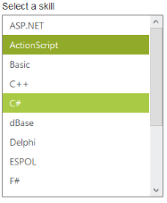
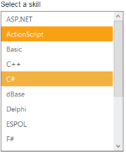
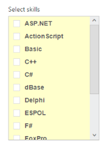

# Theme

ListBox control’s style and appearance can be controlled based on CSS classes. In order to apply styles to the ListBox control, you can refer to two files namely, ej.widgets.core.min.css and ej.theme.min.css. When you refer to the file ej.widgets.all.min.css, it is not necessary to include the files ej.widgets.core.min.css and ej.theme.min.css in your project, as ej.widgets.all.min.css is the combination of these two. 

By default, there are 12 themes support available for ListBox control namely,

* default-theme
* flat-azure-dark
* fat-lime
* flat-lime-dark
* flat-saffron
* flat-saffron-dark
* gradient-azure
* gradient-azure-dark
* gradient-lime
* gradient-lime-dark
* gradient-saffron
* gradient-saffron-dark

The following screenshot illustrates the ListBox with Flat-lime and Flat-Saffron built-in themes.

## Custom class with ListBox 

CSS class can be used to customize the ListBox control appearance. Define a CSS class as per your requirement and assign the class name to CssClass property. The data type of CssClass property is string. 

### Configuring the Custom CSS property

The following steps explains you the configuration of CssClass properties in ListBox.

1. Add the below code in your view page to render the ListBox with custom CSS class.

   ~~~ cshtml
		
	// Add the following code in View page to configure ListBox widget
	

		<h5 class="ctrllabel">
			Select a skill  
		</h5> 
		@Html.EJ().ListBox("listBoxSample").Datasource((IEnumerable<ug_listbox.controllers.SkillSet>)
		ViewBag.datasource).ListBoxFields(df => df.Text("text")) .CssClass("custom-class")
	

   ~~~
   
   
   ~~~ csharp
		
	// Add the following code to add list items in the controller page
	public class SkillSet
	{ 
		public string text { get; set; }
	} 
	public ActionResult Index()
	{           
		List<SkillSet> skill = new List<SkillSet>();
		skill.Add(new SkillSet { text = "ASP.NET" }); 
		skill.Add(new SkillSet { text = "ActionScript" });
		skill.Add(new SkillSet { text = "Basic" });    
		skill.Add(new SkillSet { text = "C++" });  
		skill.Add(new SkillSet { text = "C#" });  
		skill.Add(new SkillSet { text = "dBase" }); 
		skill.Add(new SkillSet { text = "Delphi" }); 
		skill.Add(new SkillSet { text = "ESPOL" }); 
		skill.Add(new SkillSet { text = "F#" });   
		skill.Add(new SkillSet { text = "FoxPro" }); 
		skill.Add(new SkillSet { text = "Java" });  
		skill.Add(new SkillSet { text = "J#" });   
		skill.Add(new SkillSet { text = "Lisp" }); 
		skill.Add(new SkillSet { text = "Logo" }); 
		skill.Add(new SkillSet { text = "PHP" });   
		ViewBag.datasource = skill;   
		return View();     
	}

   ~~~
   

2. Configure the CSS styles to apply on ListBox.

   ~~~ css

	
   ~~~
   

3. Output of the above steps.

