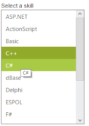

# Tooltip Support

The following steps explains you the configuration of Tooltip properties in ListBox.

1. Add the below code in your page to render the ListBox with tooltip

   ~~~ cshtml
   
	// Add the following code in View page to configure ListBox widget
	

		<h5 class="ctrllabel">
			Select a skill 
		</h5> 
		@Html.EJ().ListBox("listBoxSample").Datasource((IEnumerable<skillSet>)ViewBag.datasource).ListBoxFields(df =>
		df.Text("text").TooltipText("tooltip"))
	

   ~~~
   
   
   ~~~ csharp
   
	// Add the following code to add list items in the controller page
	public class skillSet    
	{      
		public string text { get; set; }
		public string tooltip { get; set; }  
	}       
	public ActionResult Index() 
	{
		List<skillSet> skill = new List<skillSet>(); 
		skill.Add(new skillSet { text = "ASP.NET", tooltip = "ASP.NET" }); 
		skill.Add(new skillSet { text = "ActionScript", tooltip = "ActionScript"});  
		skill.Add(new skillSet { text = "Basic", tooltip = "Basic" });  
		skill.Add(new skillSet { text = "C++", tooltip = "C++" });  
		skill.Add(new skillSet { text = "C#", tooltip = "C#" });  
		skill.Add(new skillSet { text = "dBase", tooltip = "dBase" }); 
		skill.Add(new skillSet { text = "Delphi", tooltip = "Delphi" }); 
		skill.Add(new skillSet { text = "ESPOL", tooltip = "ESPOL" });  
		skill.Add(new skillSet { text = "F#", tooltip = "F#" });     
		skill.Add(new skillSet { text = "FoxPro", tooltip = "FoxPro" });  
		skill.Add(new skillSet { text = "Java", tooltip = "Java" });     
		skill.Add(new skillSet { text = "J#", tooltip = "J#" });      
		skill.Add(new skillSet { text = "Lisp", tooltip = "Lisp" });
		skill.Add(new skillSet { text = "Logo", tooltip = "Logo" }); 
		skill.Add(new skillSet { text = "PHP", tooltip = "PHP" });   
		ViewBag.datasource = skill;          
		return View();
	}
		
   ~~~
   

2. Output of the above steps.

