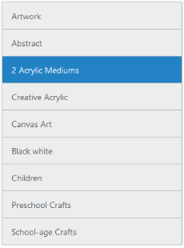

## 1.8 Dimensions

To customize the ListView dimensions, Width and Height properties are used.

Refer to the following code examples.



@Html.EJMobile().ListView("lb").Height(600).Width(300).Items(items =>

{

    items.Add().Text("ArtWork");

    items.Add().Text("Abstract");

    items.Add().Text("2 Acrylic Mediums");

    items.Add().Text("Creative Acrylic");

    items.Add().Text("Canvas Art");

    items.Add().Text("Black white");

    items.Add().Text("Children");

    items.Add().Text("Preschool Crafts");

    items.Add().Text("School-age Crafts");

})



Screenshot:

{  | markdownify }
{:.image }

_Height_

