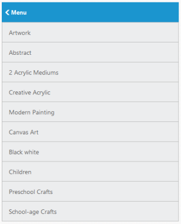

# Customize Header

In Listview, you can enable the built-in Header support. To show or hide the Header in ListView, use the ShowHeader property. By default, ListView is rendered with the Header. You can set the title for the Header by using the HeaderTitle property.

In some cases, for the purpose of navigation, you may want to show the Back button in ListView Header. To achieve this, ShowHeaderBackButton property is used. By default, ListView is not rendered with the header back button in parent page. To customize the text shown in ListViewHeaderBack button, the property HeaderBackButtonText is used. 

Refer the following code example.



@Html.EJ().ListView("lb").Width(400).ShowHeader(true).ShowHeaderBackButton(true).HeaderBackButtonText("Menu").Items(items => 
{    

	items.Add().Text("ArtWork");	

	items.Add().Text("Abstract");

	items.Add().Text("2 Acrylic Mediums");

	items.Add().Text("Creative Acrylic");

	items.Add().Text("Modern Painting");

	items.Add().Text("Canvas Art");

	items.Add().Text("Black white");

	items.Add().Text("Children");

	items.Add().Text("Preschool Crafts");

	items.Add().Text("School-age Crafts");

})



### Screenshot:

Customize Header
{:.caption}
