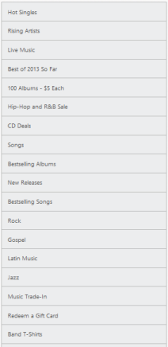
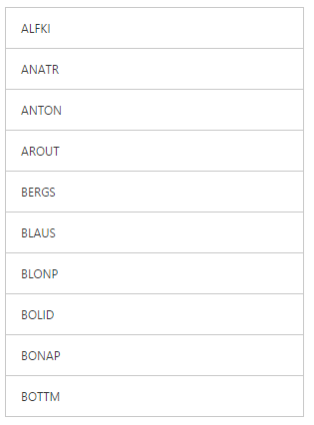
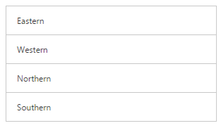
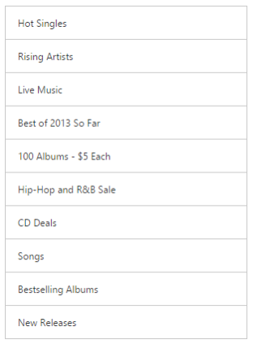
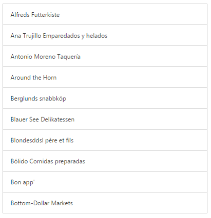
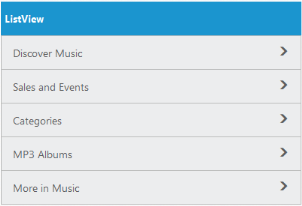
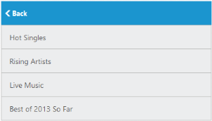

# Data Binding

## Local Data Binding

Essential Studio WebJS ListView provides support for Data Binding. Data Binding provides a simple and consistent way for applications to present and interact with data. Elements can be bounded to data from a variety of data sources. In local data binding, the data source is written inside the program. Then it is handled by the ListView control. DataSource is used to get the data source that holds the list items.

Please refer the following code examples.

For MVC Wrapper example, you need to create model file for data-binding. Add the following model code to a CS file and save it as ListLocalData.cs.



public class ListLocalData

{

	public string text { get; set; }

}  

public static class ListLocalDataModal

{

	public static List<ListLocalData> listSource = new List<ListLocalData>();      

	public static List<ListLocalData> setListSource()

	{

		listSource.Add(new ListLocalData { text = "Hot Singles"});

		listSource.Add(new ListLocalData { text = "Rising Artists"});

		listSource.Add(new ListLocalData { text = "Live Music"});

		listSource.Add(new ListLocalData { text = "Best of 2013 So Far"});

		listSource.Add(new ListLocalData { text = "100 Albums - $5 Each"});

		listSource.Add(new ListLocalData { text = "Hip-Hop and R&B Sale"});

		listSource.Add(new ListLocalData { text = "CD Deals"});

		listSource.Add(new ListLocalData { text = "Songs"});

		listSource.Add(new ListLocalData { text = "Bestselling Albums"});

		listSource.Add(new ListLocalData { text = "New Releases"});

		listSource.Add(new ListLocalData { text = "Bestselling Songs"});

		listSource.Add(new ListLocalData { text = "Rock"});

		listSource.Add(new ListLocalData { text = "Gospel" });

		listSource.Add(new ListLocalData { text = "Jazz"});

		listSource.Add(new ListLocalData { text = "Music Trade-In"});

		listSource.Add(new ListLocalData { text = "Redeem a Gift Card"});

		listSource.Add(new ListLocalData { text = "Band T-Shirts"});

		listSource.Add(new ListLocalData { text = "Mobile MVC"});

		return listSource;

	}

	public static void clearSource()

	{

		listSource.Clear();

	}       

}



You have to modify the controller as the model is added to the sample. You can modify the controller as follows.



public ActionResult LocalDataBinding()

{

	ListLocalDataModal.clearSource();

	return View(ListLocalDataModal.setListSource());

}



You can use the following code example to give you the exact output.



@model List<ListLocalData>

@{

    @Html.EJ().ListView("localListView").Width(400).DataSource(Model)

}



### Screenshot:

Local Data Binding
{:.caption}

## Remote Data Binding 

**Essential Studio Web MVC ListView** provides support for **Remote Data Binding**.

### OData

OData is a standardized protocol for creating and consuming data. You can provide the [OData service](http://www.odata.org/) URL directly to the Datasource URL property.



    @(Html.EJ().ListView("ListView1").DataSource("http://js.syncfusion.com/ejservices/Wcf/Northwind.svc/").Query("ej.Query().from('Customers').take(10)").FieldSettings(fs => fs.Text("CustomerID")))



Run the code to get the following output

### OData Version 4

For OData Version 4 support ODataV4Adaptor should be used. By using URL property of Datasource, you can bind OData Version 4 Service link and specify Adaptor value as enum AdaptorType.ODataV4Adaptor.

For further details about OData service please refer [the link](http://www.odata.org/).



@(Html.EJ().ListView("ListView1").DataSource("http://js.syncfusion.com/ejservices/Wcf/Northwind.svc/").Query("ej.Query().from('Customers').take(10)").Width(300).FieldSettings(fs => fs.Text("CustomerID")))



Run the code to get the following output.

### URL Adaptor

URL Adaptor of **DataManager** can be used when you are required to use remote service to retrieve data. It interacts with server-side for all **DataManager** Queries and **CRUD** operations.

Now, in the following code example the data is retrieved from **Controller**.



 @(Html.EJ().ListView("ListView").DataSource(ds => ds.URL(Url.Action("DataSource", "ListView")).Adaptor(AdaptorType.UrlAdaptor)).Query("ej.Query()").FieldSettings(fs => fs.Text("caption")))





**Controller:**
public partial class ListviewController : Controller
    {

        public JsonResult DataSource()
        {

            IEnumerable Data = setListSource();
            return Json(Data, JsonRequestBehavior.AllowGet);
        }

        public static List<ListLocalData> setListSource()
        {
            List<ListLocalData> listSource = new List<ListLocalData>();

            listSource.Add(new ListLocalData { caption = "Hot Singles" });

            listSource.Add(new ListLocalData { caption = "Rising Artists" });

            listSource.Add(new ListLocalData { caption = "Live Music" });

            listSource.Add(new ListLocalData { caption = "Best of 2013 So Far" });

            listSource.Add(new ListLocalData { caption = "100 Albums - $5 Each" });

            listSource.Add(new ListLocalData { caption = "Hip-Hop and R&B Sale" });

            listSource.Add(new ListLocalData { caption = "CD Deals" });

            listSource.Add(new ListLocalData { caption = "Songs" });

            listSource.Add(new ListLocalData { caption = "Bestselling Albums" });

            listSource.Add(new ListLocalData { caption = "New Releases" });

            return listSource;

        }



Run the code to get the following output

### WebAPI

**WebApi** Adaptor, extended from **ODataAdaptor**, of **DataManager** is used for retrieving data from WebApi service.[ASP.NET Web API](https://msdn.microsoft.com/en-us/library/hh833994%28v=vs.108%29.aspx) is a Framework for building HTTP services. You can retrieve data from ASP.NET Web API by using [DataManager](https://help.syncfusion.com/js/datamanager/getting-started). Using WebApiAdaptor, you can bind WebApi service’s data to ListView. The data from WebApi service must be returned as an object that has its value as data source and property “caption” with its value as dataSource’s total records count.



@(Html.EJ().ListView("ListView").DataSource(ds => ds.URL(Url.Action("http://js.syncfusion.com/ejservices/Wcf/Northwind.svc/")).Adaptor(AdaptorType.WebApiAdaptor)).Query("ej.Query().from('Customers').take(10)").FieldSettings(fs => fs.Text("CompanyName")))



Run the code to get the following output.

## FieldSettings

The FieldSettings property is used to map the DataSource field with the list item fields. In addition to the list [item specific properties](http://help.syncfusion.com/aspnetmvc/listview/data-binding), the following fields are available while mapping.

_FieldSettings_

<table>
<tr>
<th>
Properties</th><th>
Definition</th></tr>
<tr>
<td>
ParentPrimaryKey</td><td>
In DB, you can relate any child item to some other item. Set here is ‘PrimaryKey’ for the parent item. Here ‘ParentPrimaryKey’ defines the ‘PrimaryKey’ of some parent item to identify its parent.</td></tr>
<tr>
<td>
Attributes</td><td>
In DB, you can define your desired class name or styles for the list item through the ‘Attributes’ field.</td></tr>
</table>
Please refer the following code examples.



@model List<FieldSettingsData>

@{

    @Html.EJ().ListView("localListView").Width(400).ShowHeader(true).HeaderTitle("Music World").DataBinding(true).DataSource(Model).FieldSettings(f =>

{

    f.Text("texts").PrimaryKey("primaryKeys").ParentPrimaryKey("parentPrimaryKeyss").ChildHeaderTitle("Title").ChildHeaderBackButtonText("BackIconText");

});

}



### Screenshots:

Field Settings
{:.caption}

When you click on the parent item, it navigates to its corresponding child list item as follows.

Field Settings
{:.caption}
