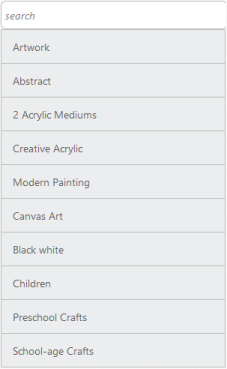

# Filtering

Filtering is one of the key features of ListView control. The Filtering option is added into the ListView control when the EnableFiltering property is set to “true”. This enables a simple interface to filter items from a large collection of ListView items.

Refer the following code examples.

 

@Html.EJ().ListView("lb").Width(300).EnableFiltering(true).Items(items => {    

    items.Add().Text("ArtWork");

    items.Add().Text("Abstract");

    items.Add().Text("2 Acrylic Mediums");

    items.Add().Text("Creative Acrylic");

    items.Add().Text("Modern Painting");

    items.Add().Text("Canvas Art");

    items.Add().Text("Black white");

    items.Add().Text("Children");

    items.Add().Text("Preschool Crafts");

    items.Add().Text("School-age Crafts");

})



### Screenshot:

Enable Filtering
{:.caption}

Enable Filtering
{:.caption}
