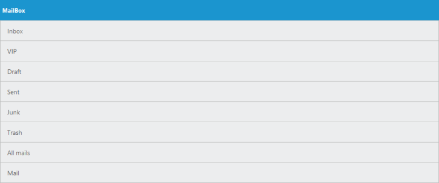
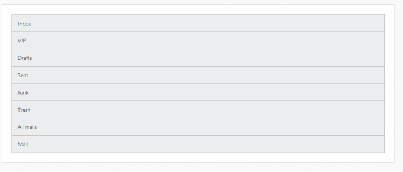

# Getting Started

This section explains briefly on how to create a ListView control in your application.

## Create your first ListView in MVC

The Essential StudioListView widget builds an interactive list view interface. This control allows you to select an item from a list-like interface and provides the infrastructure to display a set of data items in different layouts or views. Lists display data, data navigation, result lists, and data entry.    

List view Control
{:.caption}

The following steps guide you to add a ListView control in a MVC application.

## Create a simple ListView

1. You can create a MVC Project and add necessary Dll’s and Scripts with the help of the given [MVC-Getting Started](http://help.syncfusion.com/aspnetmvc/listview/getting-started) Documentation.
2. You need to add the class in the Models. Define the Class with key and text field. Then create a List of that class and add the data.

    

        public class ListData
        {
            public string texts { get; set; }
        }
        public static class ListDataModal
        {
            public static List<ListData> listTempSource = new List<ListData>();
            public static List<ListData> setListDataSource()
            {
                listTempSource.Add(new ListData { texts = "Inbox" });
                listTempSource.Add(new ListData { texts = "VIP" });
                listTempSource.Add(new ListData { texts = "Drafts" });
                listTempSource.Add(new ListData { texts = "Sent" });
                listTempSource.Add(new ListData { texts = "Junk" });
                listTempSource.Add(new ListData { texts = "Trash" });
                listTempSource.Add(new ListData { texts = "All mails" });
                listTempSource.Add(new ListData { texts = "Mail" });
                return listTempSource;
            }        
        }

    

In the controller page, you need to pass the model class to the corresponding view.

    

            public ActionResult Index()
            {
            
            return View(ListDataModal.setListDataSource());               
            }

    

In the View page, add ListView helper and map the Local data list to corresponding DataSource and ListviewFields. You need to refer the model class at the top of the page.

    

        @model List<ApplicationName.Models.ListData>

        @{
        @Html.EJ().ListView("Listview").ShowHeader(false).Height(206).Width(400).DataSource(Model).FieldSettings(f => { f.Text("texts"); });
        }

    

Run the above code to render the following output.

## Add header

You can add a header for ListView using ShowHeader property. Refer to the following code example.



    <!—Add Listview control with header -->

    @model List<ApplicationName.Models.ListData>

	@{
    @Html.EJ().ListView("Listview").ShowHeader(true).HeaderTitle("Mailbox").Height(206).Width(400).DataSource(Model).FieldSettings(f => { f.Text("texts"); });
    }
   


Run the above code to render the following output.

