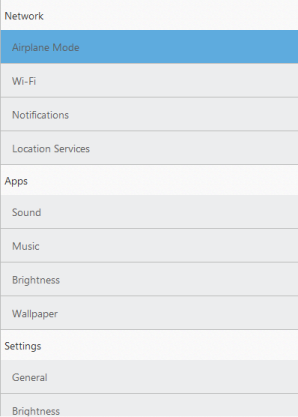
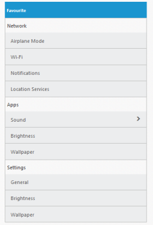

# Grouped List

## First Level Group List

The ListView widget can make as grouped list by setting the “EnableGroupList” property as “True”. This groups the set of items listed under ul. You can identify the grouped items with the header title specified respectively.

Refer the following code example.

 

@Html.EJ().ListView("firstlevelgrouplist").Width(400).EnableGroupList(true).Groups(gp =>

{

	gp.Add().Title("Network").Items(items =>

{

	items.Add().Text("Airplane_Mode");

	items.Add().Text("Wi-Fi");

	items.Add().Text("Notifications");

	items.Add().Text("Location_Services");

});

	gp.Add().Title("Apps").Items(items =>

{

	items.Add().Text("Sound");

	items.Add().Text("Brightness");

	items.Add().Text("Wallpaper");

});

	gp.Add().Title("Settings").Items(items =>

{

	items.Add().Text("General");

	items.Add().Text("Brightness");

	items.Add().Text("Wallpaper");

});

})



First Level Group List
{:.caption}

## Nested Child Group List

While selecting a list item that is grouped, you can also render another set of list items. This is achieved by defining the desired child item list within the list containing ”PrimaryKeyValue”. This PrimaryKeyValue property relates the parent child for identifying its appropriate child when clicking on the parent list item.

Refer the following code examples.



@Html.EJ().ListView("grouplistsamp").Width(400).ShowHeader(true).HeaderTitle("Favorites").EnableGroupList(true).Groups(gp =>

{

		gp.Add().Title("Network").Items(items =>

	{

		items.Add().Text("Airplane_Mode");

		items.Add().Text("Wi-Fi");

		items.Add().Text("Notifications");

		items.Add().Text("Location_Services");

	});

		gp.Add().Title("Apps").Items(items =>

	{

		items.Add().Text("Sound").PrimaryKey(1).Children(child =>

			{

				child.Add().Text("Ring Tone");

				child.Add().Text("Message Tone");

				child.Add().Text("Notification Tone");

			});

		items.Add().Text("Brightness");

		items.Add().Text("Wallpaper");

	});

		gp.Add().Title("Settings").Items(items =>

	{

		items.Add().Text("General");

		items.Add().Text("Brightness");

		items.Add().Text("Wallpaper");

	});

})



Nested Child Group List
{:.caption}
