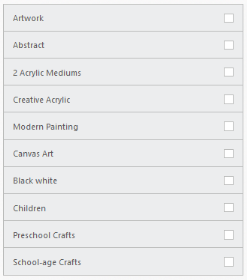
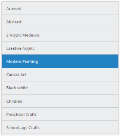

# Selection

## MultiSelection

ListView has a checklist feature that is used to select multiple list items at the same time in the ListView. For this, set EnableCheckMark to “true”.

Refer the following code examples.



@Html.EJ().ListView("lb").EnableCheckMark(true).Width(400).Items(items => 
{    

	items.Add().Text("ArtWork");

	items.Add().Text("Abstract");

	items.Add().Text("2 Acrylic Mediums");

	items.Add().Text("Creative Acrylic");

	items.Add().Text("Modern Painting");

	items.Add().Text("Canvas Art");

	items.Add().Text("Black white");

	items.Add().Text("Children");

	items.Add().Text("Preschool Crafts");

	items.Add().Text("School-age Crafts");

})



### Screenshot:

Enable Check Mark
{:.caption}

## PreventSelection

When selecting a specific list item, it is highlighted with an active color. PreventSelection property is used to prevent this behavior by setting it to “true”. 

N> When the click or select action is completed, the highlight is undone automatically even when the property is set to “false”.

Refer the following code examples.



@Html.EJ().ListView("lb").Width(400).PreventSelection(true).Items(items => 
{    

    items.Add().Text("ArtWork");

    items.Add().Text("Abstract");

    items.Add().Text("2 Acrylic Mediums");

    items.Add().Text("Creative Acrylic");

    items.Add().Text("Modern Painting");

    items.Add().Text("Canvas Art");

    items.Add().Text("Black white");

    items.Add().Text("Children");

    items.Add().Text("Preschool Crafts");

    items.Add().Text("School-age Crafts");

})



## PersistSelection

PersistSelection property is used to highlight the selected item in the ListView control even after touch end happens. By default, the active state is removed once the touch end happens.

Refer the following code examples.



@Html.EJ().ListView("lb").PersistSelection(true).Width(400).Items(items => 
{    

    items.Add().Text("ArtWork");

    items.Add().Text("Abstract");

    items.Add().Text("2 Acrylic Mediums");

    items.Add().Text("Creative Acrylic");

    items.Add().Text("Modern Painting");

    items.Add().Text("Canvas Art");

    items.Add().Text("Black white");

    items.Add().Text("Children");

    items.Add().Text("Preschool Crafts");

    items.Add().Text("School-age Crafts");

})



### Screenshot:

Persist Selection
{:.caption}
