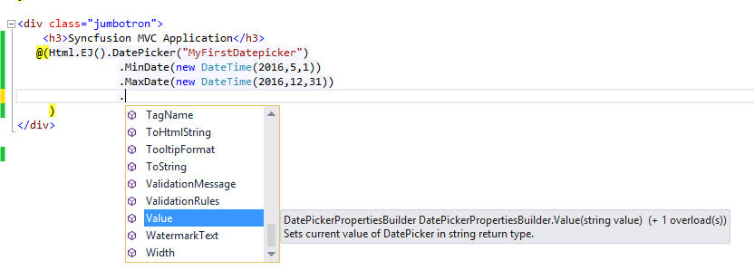

# Localization

Localization is the process of customizing an application for given language and region.

Find the steps to configure the Syncfusion Components to particular language from below

1. Specify the target culture in **web.config** file under <kbd> <system.web> </kbd> root

   ~~~ xml
   
	<system.web>
	    <globalization uiCulture="fr-FR" culture="fr-FR" enableClientBasedCulture="true"/>
	</system.web>

   ~~~

2. Load the globalize culture file from **i18n** folder dynamically using below codes 

   ~~~ cshtml
   
	@Scripts.Render("~/Scripts/ej/i18n/ej.culture." + System.Globalization.CultureInfo.CurrentCulture.Name.ToString() + ".min.js")

   ~~~
   
   
3. Download and refer the Syncfusion UI component localized text from [ej-global](https://github.com/syncfusion/ej-global/tree/master/localetexts) repository.

   
   
   
4. Load the Localized text file from **localetexts** folder as like previous step   

   ~~~ cshtml
   
	@Scripts.Render("~/Scripts/ej/localetexts/ej.localetexts." + System.Globalization.CultureInfo.CurrentCulture.Name.ToString() + ".js")

   ~~~	

5. Set the culture to Syncfusion UI components using **Locale** helper method as shown in below
  
  
   ~~~ cshtml
  
	@(Html.EJ().DatePicker("MyFirstDatepicker")
		.MinDate(new DateTime(2016, 5, 1))
		.MaxDate(new DateTime(2016, 12, 31))
		.Locale(System.Threading.Thread.CurrentThread.CurrentCulture.Name) // Specify the UI culture
		.ClientSideEvents(events =>
		events.Change("datepicker_change") // To handle datepicker change event
		.Select("datepicker_select") // To handle datepicker select event
		)
    )
   ~~~
   
6. Compile and execute the application. You can able to see the below output in the browser
