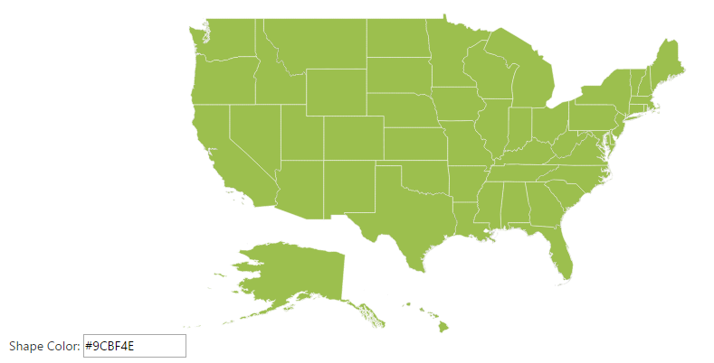

# AngularJS Support

AngularJS is a JavaScript framework added to a HTML page with a &lt;script&gt; tag. It extends HTML attributes with directives and binds data to HTML with expressions. AngularJS directives allow you to specify custom and reusable HTML tags that moderate the behavior of certain elements. Angularbinding uses directives to plug its action into the page. Directives, all prefaced with ng-, are placed in HTML attributes. To know more about Angular binding refer to: <http://docs.syncfusion.com/aspnetmvc/maps/angularjs-support>

Apply the plugin and property assigning the Map element through the directive that starts with the letter “e-“.  The following code illustrates how to bind data to the Map component through Angular support.



//References to be added for angular support.

    

//Initializes Map

   
           

	   

		   

			   

			   

		   

	   
       

	   

			Shape Color:  <input type="text" id="Text11" ng-model="nfill" style="width: 110px">

	   
 
	   
   

angular.module('SyncApp', ['ejangular'])

.controller('MapController', function ($scope) 
{          

   $scope.nenablezoom = true,          

   $scope.nshapedata = usMap;

   $scope.nfill = "#9CBF4E";

   $scope.nstrokethickness = "0.5";

   $scope.nstroke = "white";      

});



Angular Support Map
{:.caption}

