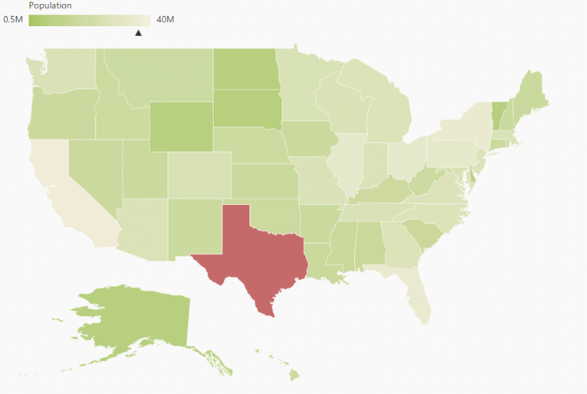
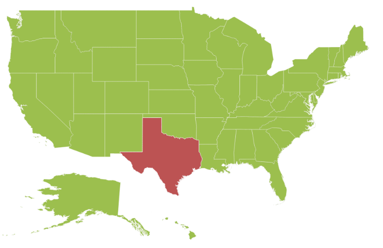
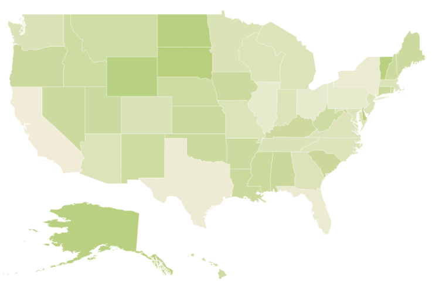
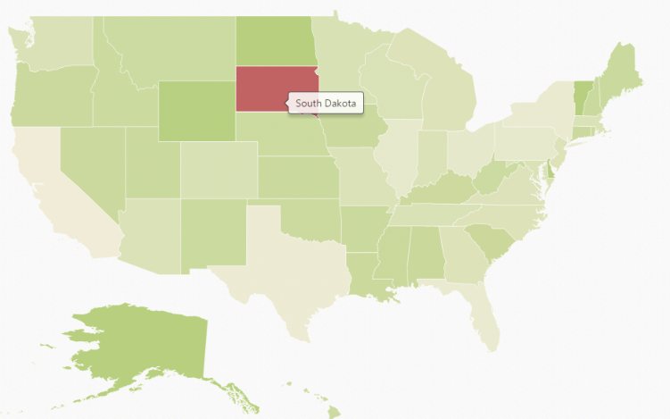

# Getting Started

This section explains briefly about how to create Maps in your application with ASP.NET MVC.

## Create your first Map in MVC

You can configure an EssentialASP.NETMVC Map with simple steps. In this example, you can learn how to configure USA population map with customized appearance and tooltip.

### Create a simple MVC Application 

To begin, create a new ASP.NET MVC project Razor application. For creating a MVC Project and adding necessary Dll’s and Scripts, refer [MVC-Getting Started](http://help.syncfusion.com/ug/js/Documents/gettingstartedwithmv.htm) Documentation.

#### Preparing Shape Data

The Shape Data collection describing geographical shape information can be obtained from [GEOJSON format shapes](http://www.syncfusion.com/uploads/user/uploads/Maps_GeoJSON.zip). 

In this example, USA shape is used as shape data by utilizing the “United States of America.json” file in the following folder structure obtained from downloaded Maps_GeoJSON folder.

..\ Maps_GeoJSON\All Countries with States

You can store the “United States of America.json” file in App_Data folder as “usa.json”. Then read the complete contents in “usa.json” file and assign to new MapData object in “MapController.cs”  in the following folder location,

~/Controller/MapController.cs



        public ActionResult Map()

        {

            ViewData["mapdata"] = GetUSMap();

            return View();

        }

       public object GetUSMap()

        {

            string usajson =                                                                                                                                                                                                                                                                                                                                                                                                                                                                                                                                                                                                                                      

System.IO.File.ReadAllText(Server.MapPath("~/App_Data/USA.json"));

            JavaScriptSerializer ser = new JavaScriptSerializer();

            ser.MaxJsonLength = int.MaxValue;

            return new MapData(usajson);

        }



### Prepare Data Source

The dataSource is populated with USA population data inside the controller relative to shape data. For better understanding, “MapController.cs” is populated with datas of USA Population in “MapController.cs”.



[MapController.cs]

        public ActionResult Map()

        {

            ViewData["mapdata"] = GetUSMap();

            ViewData["datasource"] = GetUSPopulationData();

            return View();

        }

       public object GetUSMap()

        {

            string usajson =                                                                                                                                                                                                                                                                                                                                                                                                                                                                                                                                                                                                                                      

System.IO.File.ReadAllText(Server.MapPath("~/App_Data/USA.json"));

            JavaScriptSerializer ser = new JavaScriptSerializer();

            ser.MaxJsonLength = int.MaxValue;

            return new MapData(usajson);

        }

       public List<CountyPopulationData> GetUSPopulationData()

        {

            List<CountyPopulationData> populationData = new List<CountyPopulationData>

            {

new CountyPopulationData(){ Name= "California", Population=38332521},

new CountyPopulationData(){ Name= "Texas", Population=26448193},

new CountyPopulationData(){ Name= "New York", Population=19651127},

new CountyPopulationData(){ Name= "Florida", Population=19552860},

new CountyPopulationData(){ Name= "Illinois", Population=12882135},

new CountyPopulationData(){ Name= "Pennsylvania", Population=12773801},

new CountyPopulationData(){ Name= "Ohio", Population=11570808},

new CountyPopulationData(){ Name= "Georgia", Population=9992167},

new CountyPopulationData(){ Name= "Michigan", Population=9895622},

new CountyPopulationData(){ Name= "North Carolina", Population=9848060},

new CountyPopulationData(){ Name= "New Jersey", Population=8899339},

new CountyPopulationData(){ Name= "Virginia", Population=8260405},

new CountyPopulationData(){ Name= "Washington", Population=6971406},

new CountyPopulationData(){ Name= "Massachusetts", Population=6692824},

new CountyPopulationData(){ Name= "Arizona", Population=6626624},

new CountyPopulationData(){ Name= "Indiana", Population=6570902},

new CountyPopulationData(){ Name= "Tennessee", Population=6495978},

new CountyPopulationData(){ Name= "Missouri", Population=6044171},

new CountyPopulationData(){ Name= "Maryland", Population=5928814},

new CountyPopulationData(){ Name= "Wisconsin", Population=5742713},

new CountyPopulationData(){ Name= "Minnesota", Population=5420380},

new CountyPopulationData(){ Name= "Colorado", Population=5268367},

new CountyPopulationData(){ Name= "Alabama", Population=4833722},

new CountyPopulationData(){ Name= "South Carolina", Population=4774839},

new CountyPopulationData(){ Name= "Louisiana", Population=4625470},

new CountyPopulationData(){ Name= "Kentucky", Population=4395295},

new CountyPopulationData(){ Name= "Oregon", Population=3930065},

new CountyPopulationData(){ Name= "Oklahoma", Population=3850568},

new CountyPopulationData(){ Name= "Puerto Rico", Population=3615086},

new CountyPopulationData(){ Name= "Connecticut", Population=3596080},

new CountyPopulationData(){ Name= "Iowa", Population=3090416},

new CountyPopulationData(){ Name= "Mississippi", Population=2991207},

new CountyPopulationData(){ Name= "Arkansas", Population=2959373},

new CountyPopulationData(){ Name= "Utah", Population=2900872},

new CountyPopulationData(){ Name= "Kansas", Population=2893957},

new CountyPopulationData(){ Name= "Nevada", Population=2790136},

new CountyPopulationData(){ Name= "New Mexico", Population=2085287},

new CountyPopulationData(){ Name= "Nebraska", Population=1868516},

new CountyPopulationData(){ Name= "West Virginia", Population=1854304},

new CountyPopulationData(){ Name= "Idaho", Population=1612136},

new CountyPopulationData(){ Name= "Hawaii", Population=1404054},

new CountyPopulationData(){ Name= "Maine", Population=1328302},

new CountyPopulationData(){ Name= "New Hampshire", Population=1323459},

new CountyPopulationData(){ Name= "Rhode Island", Population=1051511},

new CountyPopulationData(){ Name= "Montana", Population=1015165},

new CountyPopulationData(){ Name= "Delaware", Population=925749},

new CountyPopulationData(){ Name= "South Dakota", Population=844877},

new CountyPopulationData(){ Name= "Alaska", Population=735132},

new CountyPopulationData(){ Name= "North Dakota", Population=723393},

new CountyPopulationData(){ Name= "District of Columbia", Population=646449},

new CountyPopulationData(){ Name= "Vermont", Population=626630},

new CountyPopulationData(){ Name= "Wyoming", Population=582658}

            };

            return populationData;

        }

    public class CountyPopulationData

    {

        public string name;

        public string Name

        {

            get { return name; }

            set { name = value; }

        }

        public double population;

        public double Population

        {

            get { return population; }

            set { population = value; }

        }

    }



You can refer to shape data and datasource as illustrated in the following “Map.cshtml”,



[Map.cshtml]

@{       

        var mapData = ViewData["mapdata"];

        var dataSource = ViewData["datasource"];

   }



## Initialize Map

1. Create a 
 tag and set the height and width to determine the map size. 





2. Add the following code sample in “Map.cshtml” file, to create the Map control in the View page.



          
 

             @(Html.EJ().Map("container")

                    .Layers(lr =>

                    {

                     lr.ShapeData(mapData).Add();

                    })

                    )     

          



3. The Final Map.cshtml file appears as follows.



@{

        var mapData = ViewData["mapdata"];

        var datasource = ViewData["datasource"];

}

<html xmlns="http://www.w3.org/1999/xhtml">

<head> 

     

@using Syncfusion.JavaScript.DataVisualization.Models

</head>

<body>

             @(Html.EJ().Map("container")

                    .Layers(lr =>

                    {

                     lr.ShapeData(mapData).Add();

                    })

                    )     

    
   

    @(Html.EJ().ScriptManager())

</body>

</html>



The above code renders a map with default properties and shape input provided through data in layers.

## Data Binding in Map

The following properties in shape layers is used for binding datas in Maps control.

* DataSource
* ShapeDataPath
* ShapePropertyPath

### DataSource

The DataSource property accepts collection values as input. For example, you can provide the list of objects as input.

### Shape Data Path 

The ShapeDataPath property is used to refer the data ID in DataSource. For example, population MapData contains data ids ‘Name’ and ‘Population’. The ShapeDataPath and the ShapePropertyPath properties are related to each other (refer to ShapePropertyPath for more details).

### Shape Property Path

The ShapePropertyPath property is similar to the ShapeDataPath that refers the column name in the Data property of shape layers to identify the shape. When the values of the ShapeDataPath property in the DataSource property and the value of ShapePropertyPath in the Data property match, then the associated object from the DataSource is bound to the corresponding shape.



        @(Html.EJ().Map("container")            

                .Layers(lr =>

                {         

                        lr.ShapeData(mapData) 

                        .ShapeDataPath("name")

                        .ShapePropertyPath("name")

                        .DataSource(datasource)

                        .Add();           

                })      

                )



### Customize Map Appearance 

You can customize the shape’s color by using Fill, Stroke and StrokeThickness properties in ShapeSettings.



@(Html.EJ().Map("container")            

            .Layers(lr =>

                {

                     lr.ShapeData(mapData)              

                     .ShapeDataPath("name")

                       .ShapePropertyPath("name")

                       .DataSource(datasource)

                       .EnableSelection(false)

                       .EnableMouseHover(true)

                    .ShapeSettings(ss  =>

                    {

                       ss.Fill("#9CBF4E")

                            .StrokeThickness(0.5)

                            .Stroke("White")

                            .HighlightStroke ("White")                           

                            .HighlightColor("#BC5353")

                            .HighlightBorderWidth(1);			

                    })

                   .Add();         

                    })      

         ) 



### Customizing Map Appearance by Range

The Range color mapping is used to differentiate the shape’s fill based on its underlying value and color ranges. The From and To properties defines the value ranges and the GradientColors property defines the equivalent color ranges respective to their value ranges.

> Note: The EnableGradient property value should be true to apply gradient colors for maps.



@(Html.EJ().Map("container")

            .Layers(lr =>

                {                                          

                     lr.ShapeData(mapData)              

                       .ShapeDataPath("name")

                       .ShapePropertyPath("name")

                       .DataSource(datasource)

                       .ShowMapItems(false)

                       .EnableSelection(false)

                       .EnableMouseHover(true)

                    .ShapeSettings(ss  =>

                    {

                       ss.Fill("#9CBF4E")

                            .StrokeThickness(0.5)

                            .Stroke("White")

                            .HighlightStroke("White")                           

                            .HighlightColor("#BC5353")

                            .HighlightBorderWidth(1)	

                           .ValuePath("population")

                           .EnableGradient(true)

                           .RangeColorMappings(cm =>

                                    {

                                        cm.From(500000).To(1000000).GradientColors(new List<string> { "#9CBF4E", "#B8CE7B" }).Add();

                                        cm.From(1000001).To(5000000).GradientColors(new List<string> { "#B8CE7B", "#CBD89A" }).Add();

                                        cm.From(5000001).To(10000000).GradientColors(new List<string> { "#CBD89A", "#DEE2B9" }).Add();

                                        cm.From(10000001).To(40000000).GradientColors(new List<string> { "#DEE2B9", "#F1ECD8" }).Add();

                                    });									

                        })

                     .Add();         

                    })               

         ) 



The following screenshot illustrates a Map with gradient color property enable.

## Enable Tooltip

The tooltip is displayed only when ShowTooltip is set to _‘_True’ in the shape layers. By default, it takes the property of the bound object that is referred in the ValuePath and displays its content on hovering the corresponding shape. The TooltipTemplate property is used for customizing the template for tooltip.



        @(Html.EJ().Map("container")

            .Layers(lr =>

                {                                          

                                              // ...

                        .ShapeSettings(ss  =>

                        {

                                                     // ...

                            .ValuePath("name")

                            // ...

                        })

                        .ShowTooltip(true);

                    })           

         ) 



The following screenshot illustrates a map control displaying a Tooltip.

## Legend

A Legend can be made visible by setting the ShowLegend property in LegendSetting. 

Interactive Legend

The legends can be made interactive with an arrow mark indicating the exact range color in the legend, when the mouse hovers the corresponding shapes. You can enable this option by setting Mode property in LegendSettings value as _‘_Interactive’. The default value of Mode property is ‘Default’ to enable the normal legend.

Title for Interactive Legend

Use Title property to provide title for interactive legend.

Label for Interactive Legend

You can use LeftLabel and RightLabel property to provide left and right labels for interactive legend. 



@(Html.EJ().Map("container")

            .Layers(lr =>

                {                                          

                     lr.ShapeData(mapData)              

                       .ShapeDataPath("name")

                       .ShapePropertyPath("name")

                       .DataSource(datasource)

                       .ShowMapItems(false)

                       .EnableSelection(false)

                       .EnableMouseHover(true)

                    .ShapeSettings(ss  =>

                    {

                       ss.Fill("#9CBF4E")

                            .StrokeThickness(0.5)

                            .Stroke("White")

                            .HighlightStroke("White")                           

                            .HighlightColor("#BC5353")

                            .HighlightBorderWidth(1)	

                           .ValuePath("population")

                           .EnableGradient(true)

                           .RangeColorMappings(cm =>

                                    {

                                        cm.From(500000).To(1000000).GradientColors(new List<string> { "#9CBF4E", "#B8CE7B" }).Add();

                                        cm.From(1000001).To(5000000).GradientColors(new List<string> { "#B8CE7B", "#CBD89A" }).Add();

                                        cm.From(5000001).To(10000000).GradientColors(new List<string> { "#CBD89A", "#DEE2B9" }).Add();

                                        cm.From(10000001).To(40000000).GradientColors(new List<string> { "#DEE2B9", "#F1ECD8" }).Add();

                                    });									

                        })

                        .LegendSettings(ml =>

                        {

                           ml.ShowLegend(true)

                           .Height(15)

                           .Width(150)

                           .Position(Syncfusion.JavaScript.DataVisualization.

                             Models.DockPosition.Topleft)

                           .Type(Syncfusion.JavaScript.DataVisualization.

                             Models.LegendType.Layers)

                           .Mode(Syncfusion.JavaScript.DataVisualization.

                             Models.LegendMode.Interactive)

                           .Title("Population")

                           .LeftLabel("0.5 M")

                           .RightLabel("40 M");                        

                       })

                    .Add(); 

                    })           

         )



The following screenshot illustrates a map displaying an interactive legend.

The complete code sample can be found [here](http://www.syncfusion.com/uploads/user/directTrac/General/MapsMVCGettingStarted2077091750.zip).

