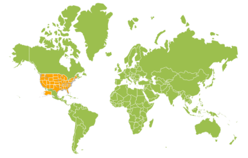

# Layers

Map is maintained through `Layers` and it can accommodate one or more layers.

## Multilayers

The Multilayer support allows you to load multiple shape files in a single container, enabling maps to display more information.

### Adding Multiple Layers in the Map 

The shape layers is the core layer of the map. The multiple layers can be added in the shape Layers as `SubShapeFileLayers` within the shape Layers.

## SubLayer

The subLayer is the collection of shape Layers. 

In this example, World Map shape is used as shape data by utilizing the `“WorldMap.json”` file in the following folder structure obtained from downloaded Maps_GeoJSON folder.

..\ Maps_GeoJSON\

Here “MapController.cs” is populated with datas of World Map in “MapController.cs”.

~/Controller/MapController.cs



	public ActionResult Map()

	{

		ViewData["world_map"] = GetWorldMap();

	}

	public object GetWorldMap ()

	{

		string worldmapjson = System.IO.File.ReadAllText(Server.MapPath("~/App_Data/WorldMap.json"));

		JavaScriptSerializer ser = new JavaScriptSerializer();

		ser.MaxJsonLength = int.MaxValue;

		return new MapData(worldmapjson);
	}



Refer both USA data and world map data as illustrated in the following “Map.cshtml”.



	@{       

    	var mapData = ViewData["mapdata"];

        var world_map = ViewData["world_map"];
  	
	} 

	@(Html.EJ().Map("maps")

	.Layers(lr =>

	{

		lr.ShapeData(world_map)

		.ShapeSettings(ss =>

		{

			ss.Fill("#9CBF4E")

			.StrokeThickness(0.5)

			.Stroke("White");                            

		})

		.SubLayer(ssl =>

		{     

			ssl.ShapeData(mapData)

			.ShapeSettings(ss =>

			{

				ss.Fill("orange")

				.StrokeThickness(1)

				.Stroke("White");                            

			})

			.Add();                     

		})

		.Add();

	})           

	)            



