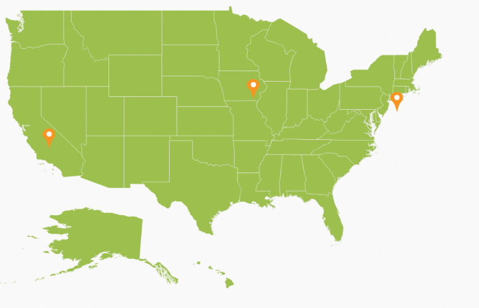
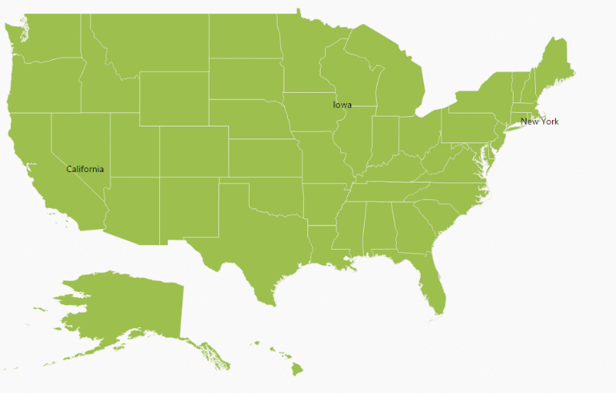
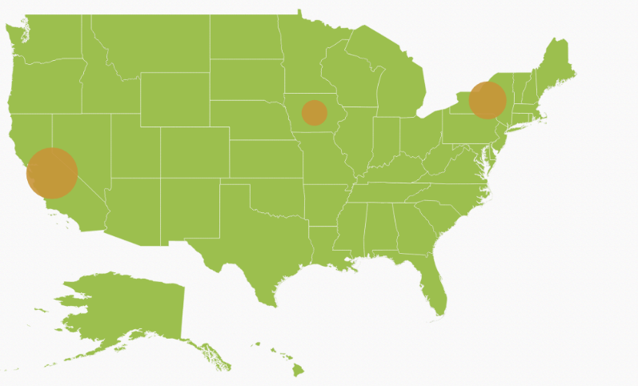
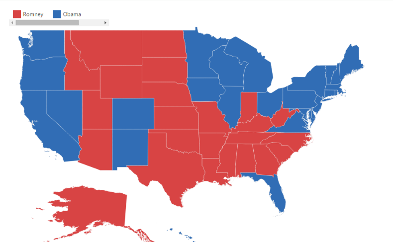
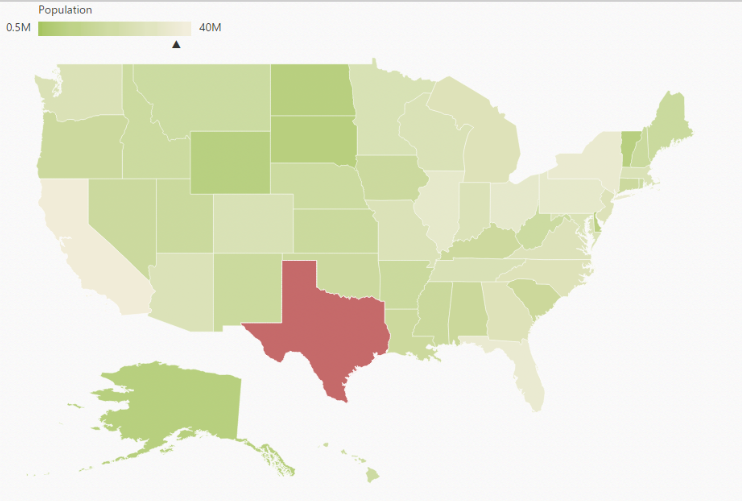
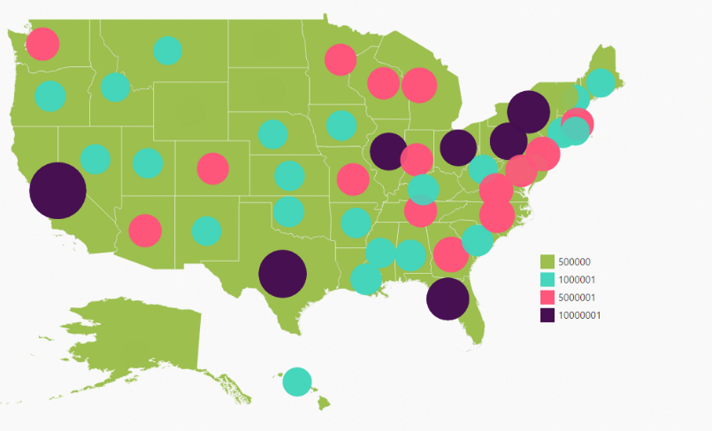

## Map Elements

Map control contains a set of map elements, including shapes, bubbles, markers, legend, labels and data items that can be visualized with customized appearance showing additional information on the map using databound datas.

Markers 

Markers are notes that is used to leave some message on the map. 

There are two ways to set marker for map.

1. Using markers and marker template
2. Adding marker objects to map.

Markers 

The Markers property has a list of objects that contains the data for Annotation. You can visualize these data by using MarkerTemplate property.



 [MVC]

[MapController.cs]

        public ActionResult Map()

        {

            // ...

            ViewData["Annotationdatasource"] = GetMarkers();

            return View();

        }

         // ...

       public List<MarkerData> GetMarkers()

        {

            List<MarkerData> markerData = new List<MarkerData>

            {

            new MarkerData {City = "California", Latitude = 37.0000, Longitude = -120.0000 },

            new MarkerData {City = "New York", Latitude = 40.7127, Longitude = -74.0059 },

            new MarkerData {City = "Iowa", Latitude = 42, Longitude = -93}

            };

            return electionResults;

        }

    public class MarkerData

    {

        private double latitude;

        public double Latitude

        {

            get { return latitude; }

            set { latitude = value; }

        }

        public double longitude;

        public double Longitude

        {

            get { return longitude; }

            set { longitude = value; }

        }

        private string city;

        public string City

        {

            get { return city; }

            set { city = value; }

        }

    } 





[CSHTML]

@(Html.EJ().Map("container")           

           .Layers(lr =>

                    {

                                                // ...                          

                        .Markers(markers)                        

                        .MarkerTemplate("template")                        

                    })

           ) 

[CSHTML]

    

        <svg height="100" width="100">

<circle cx="20" cy="20" r="10" stroke="black" stroke-width="1"

           fill="red" />

</svg>

    

      



{  | markdownify }
{:.image }

Adding Marker objects to map

Without Datasource, n number of markers can be added to shape layers with Markers property. Each marker object contains the following list of properties.

* Label - Text that displays some information about the annotation in text format.
* Latitude - Latitude point determine the Y-axis position of annotation.
* Longitude - Longitude point determine the X-axis position of annotation.



[MVC]

[CSHTML] 

@(Html.EJ().Map("container")            

            .Layers(lr =>

            {

                lr.EnableMouseHover(true)

                    .ShapeData(mapData)

                    .ShapeSettings(ss =>

                    {

                          ss.Fill("#9CBF4E")

                            .StrokeThickness(0.5)

                            .Stroke("White")

                            .HighlightStroke("White")

                            .HighlightColor("#BC5353")

                            .HighlightBorderWidth(1);

                    })

                    .Markers(an =>

                    {

                        an.Label("California")

                            .Latitude(37)

                            .Longitude(-120).Add();

                        an.Label("New York")

                            .Latitude(40.7127)

                            .Longitude(-74.0059).Add();

                        an.Label("Iowa")

                            .Latitude(42)

                            .Longitude(-93).Add();

                    })

                   .Add();

            })

      ) 



{  | markdownify }
{:.image }

Bubbles 

Bubbles in the Maps control represent the underlying data values of the map. Bubbles are scattered throughout the map shapes that contain bound values.

Bubbles are included when data binding and the BubbleSettings is set to the shape layers. 

Properties available in bubble setting

_Property table_

<table>
<tr>
<td>
Property</td><td>
Type</td><td>
Description</td></tr>
<tr>
<td>
MaxValue</td><td>
String</td><td>
Get or sets the maximum height and width of the bubble.</td></tr>
<tr>
<td>
MinValue</td><td>
String</td><td>
Gets or sets the minimum height and width of the bubble.</td></tr>
<tr>
<td>
ColorValuePath</td><td>
String</td><td>
Get or sets the field value that is to be fetched from data for each bubble used for determining the bubble color.</td></tr>
<tr>
<td>
ValuePath</td><td>
String</td><td>
Gets or sets the field value that is to be fetched from data for each bubble.</td></tr>
<tr>
<td>
ColorMappings</td><td>
Collection of RangeColorMapping</td><td>
Gets or sets the tree map colors.</td></tr>
<tr>
<td>
Color</td><td>
String</td><td>
Gets or sets the fill color for bubbles.</td></tr>
<tr>
<td>
ShowTooltip</td><td>
Boolean</td><td>
Enable or disable the tooltip for bubbles.</td></tr>
<tr>
<td>
TooltipTemplate</td><td>
String</td><td>
Gets or sets the tooltip template for bubbles.</td></tr>
</table>
Adding Bubbles to a Map

To add bubbles to a map, the bubble marker setting is added to the shape file layer. Create the Model and ViewModel as illustrated in the Data Binding topic and add the following code. Also set the MaxValue, MinValue, and ValuePath properties as illustrated in the following code sample.

> _Note: Tooltip and Color Mappings for bubble is to be set as similar to tooltip and color mappings set in layers and ShapeSettings. For more details, refer Tooltip and Color Mappings section._



[MVC]

[CSHTML]

@(Html.EJ().Map("container")            

            .Layers(lr =>

            {

                lr.EnableMouseHover(true)

                    .ShapeData(mapData)

                    .DataSource(population_data)

                    .ShapeSettings(ss =>

                    {

                        ss.Fill("#9CBF4E")

                            .StrokeThickness(0.5)

                            .Stroke("White");

                    })

                    .BubbleSettings(bs =>

                    {

                        bs.ValuePath("Population ")

                            .ShowBubble(true)

                            .MinValue(20)

                            .MaxValue(40)

                            .Color("#C99639");

                    })

                    .Add();

            })

            )



{  | markdownify }
{:.image }

Legend

A legend is a key used on a map, contains swatches of symbols with descriptions. It provides valuable information for interpreting what the map is displaying you, and can be represented in various colors, shapes or other identifiers based on the data. It gives a breakdown of what each symbol represents throughout the map.

Visibility of Legend

The Legends can be made visible by setting the ShowLegend property of legendSettings. 

Positioning of Legend

The legend can be positioned in two ways.

1. Absolute Position.
2. Dock Position.

Absolute Position

Based on the margin values of X and Y-axes, the Map legends can be positioned with the support of PositionX and PositionY properties available in LegendSettings. For positioning the legend based on margins corresponding to a map, Position value is set as _‘_None’.

Dock Position

The map legends can be positioned in following locations within the container.

1. TopLeft
2. TopCenter
3. TopRight
4. CenterLeft
5. Center
6. CenterRight
7. BottomLeft
8. BottomRight
9. BottomCenter
10. BottomRight
11. None

You can set this option by using Position property in LegendSettings.

Legend Size

The map legend size can be modified using Height and Width properties in LegendSettings.

Legend for Shapes

The Layer shape type legends can be generated for each color mappings in shape settings. 

> _Note: Here, Equal Color Mapping code sample for shapeSettings with color mappings is referred._



 [MVC]

[CSHTML]

@(Html.EJ().Map("container")

           .Layers(lr =>

                    {

                        // ...

                        lr.LegendSettings(ml =>

                        {

                            ml 

                            .ShowLegend(true)

                            .Height(20)

                            .Width(60)

                            .PositionX(80)

                           .PositionY(90);

                         })

                         // ...

                    })

           )



{  | markdownify }
{:.image }

Interactive Legend

The legends can be made interactive with an arrow mark indicating the exact range color in the legend when the mouse hovers over the corresponding shapes. You can enable this option by setting Mode property in LegendSettings value as “Interactive” and default value of Mode property is “Default” to enable the normal legend.

Title for Interactive Legend

You can provide the title for interactive legend by using Title property in LegendSettings.

Label for Interactive Legend

You can provide the left and right labels to interactive legend by using LeftLabel and RightLabel properties in LegendSettings. 

> _Note: Here, Range Color Mapping code snippet for shapeSettings with color mappings is referred._



[MVC]

[CSHTML]

@(Html.EJ().Map("container")

           .Layers(lr =>

                    {

                        // ...                                           

                     .LegendSettings(ml =>

                      {

                          ml

                           .ShowLegend(true)

                           .Height(15)

                           .Width(150) 

                             .Position(Syncfusion.JavaScript.DataVisualization.

Models.DockPosition.Topleft)

                           .Mode(Syncfusion.JavaScript.DataVisualization.

Models.LegendMode.Interactive)

                           .Title("Population")

                           .LeftLabel("0.5 M")

                           .RightLabel("40 M");

                       })                        

                       // ...

                    })

           )



{  | markdownify }
{:.image }

Bubble Legend

A bubble legend feature is used to provide the key (legend) for another map element bubble. You can activate the Bubble legend by setting the enum “Type” in LegendSettings as “Bubble” and this enables you to easily identify what value a particular bubble is representing.



 [MVC]

[CSHTML]

@(Html.EJ().Map("container")

           .Layers(lr =>

                    {

                        // ...                                           

                     .LegendSettings(ml =>

                      {

                          ml

                           .ShowLegend(true)

                           .Height(15)

                           .Width(150) 

                           .Type(Syncfusion.JavaScript.DataVisualization.

Models.LegendType.Bubbles)

                           .Title("Population");

                       })                        

                       .BubbleSettings( b1 =>

                        {

                            b1

                             .ShowBubble(true)

                             .ValuePath(population)

                             .MinValue(20),

                             .MaxValue(40)

                             .RangeColorMappings(cm =>

                                    {

                                                                                                                                                   cm.From(500000).To(1000000).GradientColors(new List<string> { "#9CBF4E", "#B8CE7B" }).Range(10688).Add();

                                        cm.From(1000001).To(5000000).GradientColors(new List<string> { "#B8CE7B", "#CBD89A" }).Range(19390).Add();

                                        cm.From(5000001).To(10000000).GradientColors(new List<string> { "#CBD89A", "#DEE2B9" }).Range(18718).Add();

                                        cm.From(10000001).To(40000000).GradientColors(new List<string> { "#DEE2B9", "#F1ECD8" }).Range(30716).Add();

                                    });                               

                        })

                       // ...

                    })

           ) 



{  | markdownify }
{:.image }

