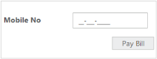
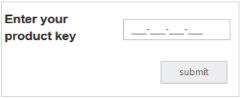

# Getting Started

This section explains you briefly on how to create a MaskEdit control in your ASP.NET MVC application.

## Create your first MaskEdit Widget in MVC

ASP.NET MVC MaskEdit control allows you to set the type and format of the input mask that is used in the textbox and also the number of place holders. Using the following guidelines, you can create MaskEdit control for a real-time payment application.

The following screenshot illustrates the functionality of a MaskEdit. Using MaskEdit control textbox, you can enter only the assigned text format and no other formats. The input mask prevents you from entering invalid characters into the control. In this application, MobileNumber textbox has a mask value.

{  | markdownify }
{:.image }

In the above screenshot, you can type only numbers and it does not allow text format.

Create a MaskEdit control

ASP.NET MVC MaskEdit control renders built-in features like text masking, number masking and flexible APIs. You can easily create the MaskEdit control using simple HTML helper class as follows:

1. Create an MVC Project and add necessary assemblies, styles and scripts to it. Refer [MVC-Getting Started](http://help.syncfusion.com/ug/js/Documents/gettingstartedwithmv.htm).
2. Add the following code to the corresponding view page to render MaskEdit.

&lt;div class="frame"&gt;

        &lt;div class="control"&gt;

            &lt;table class="editors"&gt;

                &lt;tbody&gt;

                    &lt;tr&gt;

                        &lt;td&gt;

                            &lt;label&gt;

                                Kilometers</label>

                        &lt;/td&gt;

                        &lt;td&gt;

                            @Html.EJ().NumericTextbox("numeric").Value("1000")

                        &lt;/td&gt;

                    &lt;/tr&gt;

                    &lt;tr&gt;

                        &lt;td&gt;

                            &lt;label&gt;

                                Service Tax</label>

                        &lt;/td&gt;

                        &lt;td&gt;

                            @Html.EJ().PercentageTextbox("percent").Value("100")

                        &lt;/td&gt;

                    &lt;/tr&gt;

                    &lt;tr&gt;

                        &lt;td&gt;

                            &lt;label&gt;

                                Fare</label>

                        &lt;/td&gt;

                        &lt;td&gt;

                            @Html.EJ().CurrencyTextbox("currency").Value("50")

                        &lt;/td&gt;

                    &lt;/tr&gt;

                    &lt;tr&gt;

                        &lt;td&gt;

                            &lt;label&gt;

                                Mobile No</label>

                        &lt;/td&gt;

                        &lt;td&gt;

 @*creating MaskEdit control*@                           @Html.EJ().MaskEdit("maskedit").MaskFormat("99-999-99999").InputMode(InputMode.Text) 

                        &lt;/td&gt;

                    &lt;/tr&gt;

                &lt;/tbody&gt;

            &lt;/table&gt;

            &lt;div class="paybill"&gt;

                @Html.EJ().Button("btn").Size(ButtonSize.Small).Text("PayBill")

            &lt;/div&gt;

        &lt;/div&gt;

    &lt;/div&gt;

3. Add the following styles to show MaskEdit and place it in a particular position.

    &lt;style&gt;

        .frame {

            width: 300px;

        }

        .editors {

            max-width: 400px;

        }

        .control .paybill {

            margin-left: 208px;

            margin-top: 15px;

        }

        .editors label {

            display: block;

            width: 130px;

        }

        .control {

            margin-top: 10px;

        }

        .ctrllabel {

            padding-bottom: 3px;

        }

    &lt;/style&gt;

Execute the above code example to render the following output.

{  | markdownify }
{:.image }

Set Mask value to Mobile Number textbox

In this section, you can learn how to set mask value for MobileNumber textbox. To achieve this, set the mask value in the MaskEdit control to the desired values.

@Html.EJ().MaskEdit("maskedit").MaskFormat("99-999-99999").InputMode(InputMode.Text)

Create a MaskEdit control for Product Key Validation

Create a MaskEdit

You can easily create the MaskEdit control using simple HTML helper class as follows.

1. Create a MVC Project and add necessary assemblies and scripts to it. 

Refer [MVC-Getting Started](http://help.syncfusion.com/ug/js/Documents/gettingstartedwithmv.htm).

2. Add the following code to the corresponding view page to render MaskEdit.

  &lt;div class="frame"&gt;

        &lt;div class="control"&gt;

            &lt;table class="editors"&gt;

                &lt;tbody&gt;

                    &lt;tr&gt;

                        &lt;td&gt;

                            &lt;label&gt;

                                Product Key</label>

                        &lt;/td&gt;

                        &lt;td&gt;

                         @Html.EJ().MaskEdit("maskedit").MaskFormat("aaaa-aaaa-aaaa-aaaa").InputMode(InputMode.Text) @*creating MaskEdit control for productkey validation*@                        &lt;/td&gt;

                    &lt;/tr&gt;

                &lt;/tbody&gt;

            &lt;/table&gt;

            &lt;div class="productkey"&gt;

                @Html.EJ().Button("btn").Size(ButtonSize.Small).Text("Submit")

            &lt;/div&gt;

        &lt;/div&gt;

    &lt;/div&gt;

3. Add the following styles to show the MaskEdit, and place it in a particular position.

    &lt;style&gt;

        .frame {

            width: 300px;

        }

        .editors {

            max-width: 400px;

        }

        .control .productkey {

            margin-left: 208px;

            margin-top: 15px;

        }

        .editors label {

            display: block;

            width: 130px;

        }

        .control {

            margin-top: 10px;

        }

        .ctrllabel {

            padding-bottom: 3px;

        }

    &lt;/style&gt;

4. Run the above code example to render the following output. 

{  | markdownify }
{:.image }

Set Mask value to Product key textbox

You can set mask value for Productkey textbox by setting the desired values to the MaskEdit control.

@Html.EJ().MaskEdit("maskedit").MaskFormat("aaaa-aaaa-aaaa-aaaa").InputMode(InputMode.Text)

