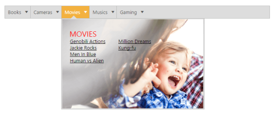

## Background Template

Menu control also provides support for template support. Normally Menu control can be created by using UL and LI tags in the preferred way. But in template supporting, you can customize the appearance of sub menu items rendering. 

Initialize the Template Menu as illustrated in the following code example. 

1. Add the following code in your View page.

[CSHTML]

// Add the following code in your CSHTML page.

@Html.EJ().Menu("template").Items(items =>

    {

        items.Add().Text("Books").Children(child =>

        {

            child.Add().ContentTemplate(@&lt;div class="temp temp1"&gt;

                    BOOKS

                    &lt;ul&gt;

                        &lt;li&gt;<a>New Releases</a>&lt;/li&gt;

                        &lt;li&gt;<a>Bestsellers</a>&lt;/li&gt;

                        &lt;li&gt;<a>Upcoming</a>&lt;/li&gt;

                        &lt;li&gt;<a>Box Sets</a>&lt;/li&gt;

                    &lt;/ul&gt;

                    &lt;ul&gt;

                        &lt;li&gt;<a>HTML Basics</a>&lt;/li&gt;

                        &lt;li&gt;<a>JavaScript</a>&lt;/li&gt;

                        &lt;li&gt;<a>JQuery</a>&lt;/li&gt;

                        &lt;li&gt;<a>PHP Basics</a>&lt;/li&gt;

                    &lt;/ul&gt;

                &lt;/div&gt;);

        });

        items.Add().Text("Cameras").Children(child =>

        {

            child.Add().ContentTemplate(@&lt;div class="temp temp2"&gt;

                    CAMERAS

                    &lt;ul&gt;

                        &lt;li&gt;<a>Point & Shoots</a>&lt;/li&gt;

                        &lt;li&gt;<a>Digital SLR</a>&lt;/li&gt;

                        &lt;li&gt;<a>Camcorders</a>&lt;/li&gt;

                        &lt;li&gt;<a>Bestsellers</a>&lt;/li&gt;

                    &lt;/ul&gt;

                    &lt;ul&gt;

                        &lt;li&gt;<a>Still Camera</a>&lt;/li&gt;

                        &lt;li&gt;<a>Digital Camera</a>&lt;/li&gt;

                        &lt;li&gt;<a>Video Camera</a>&lt;/li&gt;

                        &lt;li&gt;<a>Virtual Camera</a>&lt;/li&gt;

                    &lt;/ul&gt;

                &lt;/div&gt;);

        });

        items.Add().Text("Movies").Children(child =>

        {

            child.Add().ContentTemplate(@&lt;div class="temp temp3"&gt;

                    MOVIES

                    &lt;ul&gt;

                        &lt;li&gt;<a>Genobili Actions</a>&lt;/li&gt;

                        &lt;li&gt;<a>Jackie Rocks</a>&lt;/li&gt;

                        &lt;li&gt;<a>Men In Blue</a>&lt;/li&gt;

                        &lt;li&gt;<a>Human vs Alien</a>&lt;/li&gt;

                    &lt;/ul&gt;

                    &lt;ul&gt;

                        &lt;li&gt;<a>Million Dreams</a>&lt;/li&gt;

                        &lt;li&gt;<a>Kung-fu</a>&lt;/li&gt;

                    &lt;/ul&gt;

                &lt;/div&gt;);

        });

        items.Add().Text("Musics").Children(child =>

        {

            child.Add().ContentTemplate(@&lt;div class="temp temp4"&gt;

                    MUSICS

                    &lt;ul&gt;

                        &lt;li&gt;<a>New Releases</a>&lt;/li&gt;

                        &lt;li&gt;<a>Bestsellers</a>&lt;/li&gt;

                        &lt;li&gt;<a>Devotional</a>&lt;/li&gt;

                        &lt;li&gt;<a>Sufi & Ghazal</a>&lt;/li&gt;

                    &lt;/ul&gt;

                    &lt;ul&gt;

                        &lt;li&gt;<a>Pop songs</a>&lt;/li&gt;

                        &lt;li&gt;<a>Rock Music</a>&lt;/li&gt;

                    &lt;/ul&gt;

                &lt;/div&gt;);

        });

        items.Add().Text("Gaming").Children(child =>

        {

            child.Add().ContentTemplate(@&lt;div class="temp temp5"&gt;

                    GAMING

                    &lt;ul&gt;

                        &lt;li&gt;<a>Upcoming</a>&lt;/li&gt;

                        &lt;li&gt;<a>PC</a>&lt;/li&gt;

                        &lt;li&gt;<a>PS Vista</a>&lt;/li&gt;

                        &lt;li&gt;<a>PS3</a>&lt;/li&gt;

                        &lt;li&gt;<a>XBox</a>&lt;/li&gt;

                        &lt;li&gt;<a>Consoles</a>&lt;/li&gt;

                    &lt;/ul&gt;

                    &lt;ul&gt;

                        &lt;li&gt;<a>FIFA 2999</a>&lt;/li&gt;

                        &lt;li&gt;<a>NBA Actions</a>&lt;/li&gt;

                        &lt;li&gt;<a>Crick Champions</a>&lt;/li&gt;

                        &lt;li&gt;<a>Carom legend</a>&lt;/li&gt;

                    &lt;/ul&gt;

                &lt;/div&gt;);

        });

    })

2. Add the following code in your style section.

[CSS]

&lt;style type="text/css"&gt;

    .temp {

        height: 237px;

        width: 375px;

        font-family: segoe UI;

        cursor: default;

        background-size: 100% 100%;

    }

        .temp span {

            color: red;

            float: left;

            font-size: 20px;

            left: 20px;

            position: relative;

            top: 25px;

            width: 100px;

        }

        .temp ul {

            float: left;

            font-size: 14px;

            left: -79px;

            list-style-type: none;

            margin: 0;

            padding: 0;

            position: relative;

            top: 50px;

            width: 128px;

        }

            .temp ul li {

                font-size: 13px;

            }

                .temp ul li a {

                    text-decoration: underline;

                    cursor: pointer;

                    color: #000;

                }

    .temp1 {

        background-image: url("1.jpg");

    }

    .temp2 {

        background-image: url("2.jpg");

    }

    .temp3 {

        background-image: url("3.jpg");

    }

    .temp4 {

        background-image: url("4.jpg");

    }

    .e-menu.e-horizontal li > ul, .e-menu.e-horizontal li > ul > li:hover {

        background-color: #fff;

    }

    .e-menu.e-horizontal > li > ul:after {

        border-color: transparent transparent #fff;

    }

&lt;/style&gt;

Execute the above code to render the following output.                       

{  | markdownify }
{:.image }

_Figure_ _32__: Template_

