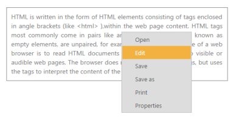

# Context Menu

A context menu is a type of menu in a graphical user interface (GUI) that appears when you perform right click operation. In this Menu control you can use a context menu by specifying the type of menu as ContextMenu. A context also provides support for nested level of menu items.

Before you use the context menu, provide the target area for it. 

In the following example, a context menu for the division containing text is created. In this, when you perform right click operation, the following menu appears with open, edit, etc.

1. Add the following code in your View page.


[CSHTML]

// Add the following code in your CSHTML page.

   

        HTML is written in the form of HTML elements consisting of tags enclosed in angle

        brackets (like <html> ),within the web page content. HTML tags most commonly

        come in pairs like and ,although some tags, known as empty elements, are unpaired,

        for example . The purpose of a web browser is to read HTML documents

        and compose them into visible or audible web pages. The browser does not display

        the HTML tags, but uses the tags to interpret the content of the page.

    

    @Html.EJ().Menu("docfile").Items(items =>

                   {

                       items.Add().Text("Open").Children(child =>

                       {

                           child.Add().Text("Open with notepad");

                           child.Add().Text("Open with notepad++");

                       });

                       items.Add().Text("Edit");

                       items.Add().Text("Save");

                       items.Add().Text("Save as");

                       items.Add().Text("Print");

                       items.Add().Text("Properties");

                   }).MenuType(MenuType.ContextMenu).OpenOnClick(true).ContextMenuTarget("#target")



2. Add the following code in your style section.

[CSS]



The following screen shot displays the output of the above code.

_Figure33: Context Menu_

You can hide and show the context menu using the following methods.

## HideContextMenu

Hides the context Menu control. Add the following script code in the sample in order to hide the context menu.


[Javascript]



## ShowContextMenu

Shows the context menu control. Add the following script code in the sample in order to show the context menu.


[Javascript]


