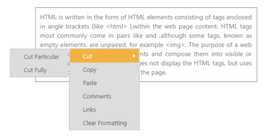

## Customizing the Submenu direction

You can customize the direction to open the sub menu items using SubMenuDirection property. SubMenuDirection accepts the type as string or enum and value as “Left” and “Right”. 

In the following example, the Sub menus opens in the Left side of the menu.

1. Add the following code in your View page.

[CSHTML]   

// Add the following code in your CSHTML page.

 &lt;div class="imgframe"&gt;

@Html.EJ().Menu("syncfusionProducts").Items(items =>

               {

                   items.Add().Id("Products").Text("Products").Children(child =>

                       {

                           child.Add().Text("ASP.NET");

                           child.Add().Text("ASP.NET MVC");

                           child.Add().Text("Mobile MVC");

                           child.Add().Text("Silverlight");

                           child.Add().Text("Windows Forms");

                           child.Add().Text("Windows Phone");

                           child.Add().Text("WinRT (XMAL)");

                           child.Add().Text("WPF");

                           child.Add().Text("Orubase Studio");

                           child.Add().Text("Metro Studio");

                           child.Add().Text("What's New").Children(child1 =>

                               {

                                   child1.Add().Text("ASP.NET");

                                   child1.Add().Text("WPF");

                                   child1.Add().Text("Silverlight");

                                   child1.Add().Text("Windows Forms");

                                   child1.Add().Text("Windows Phone");

                                   child1.Add().Text("ASP.NET MVC");

                                   child1.Add().Text("ASP.NET");

                               });

                       });

                   items.Add().Text("Support").Children(child =>

                       {

                           child.Add().Text("Direct-Trac Support");

                           child.Add().Text("Community Forums");

                           child.Add().Text("Knowledge Base");

                           child.Add().Text("Online Documentation");

                           child.Add().Text("Services").Children(child1 =>

                               {

                                   child1.Add().Text("Consulting");

                                   child1.Add().Text("Training");

                               });

                       });

                   items.Add().Id("Purchase").Text("Purchase");

                   items.Add().Id("Downloads").Text("Downloads").Children(child =>

                       {

                           child.Add().Text("Evaluation");

                           child.Add().Text("Free E-Books");

                           child.Add().Text("Metro Studio");

                           child.Add().Text("Latest Version");

                           child.Add().Text("Version History");

                       });

                   items.Add().Id("Resources").Text("Resources").Children(child =>

                      {

                          child.Add().Text("Technology Resource Portal").Children(child1 =>

                                      {

                                          child1.Add().Text("E-Books");

                                          child1.Add().Text("White Papers");

                                      });

                          child.Add().Text("Case Studies");

                          child.Add().Text("Bouchers & Datasheets");

                          child.Add().Text("FAQ");

                      });

                   items.Add().Id("Company").Text("Company").Children(child =>

                   {

                       child.Add().Text("About Us").Children(child1 =>

                           {

                               child1.Add().Text("More About Us");

                               child1.Add().Text("Management");

                               child1.Add().Text("News & Events");

                               child1.Add().Text("Customer Quotes");

                               child1.Add().Text("Customer Lists");

                               child1.Add().Text("Case Studies");

                               child1.Add().Text("Awards");

                               child1.Add().Text("Media Kit");

                           });

                       child.Add().Text("Company Blog");

                       child.Add().Text("Technical Blog");

                       child.Add().Text("Newsletter");

                       child.Add().Text("Partners").Children(child1 =>

                           {

                               child1.Add().Text("Technology Partners");

                               child1.Add().Text("Training Partners");

                               child1.Add().Text("Consulting Partners");

                           });

                       child.Add().Text("Locations").Children(child1 =>

                       {

                           child1.Add().Text("RDU");

                           child1.Add().Text("Chennai");

                       });

                       child.Add().Text("Contact Us");

                       child.Add().Text("Careers");

                   });

               }).Width("600").SubMenuDirection(Direction.Left)

&lt;/div&gt;

The output for the above code example is as follows.          

{  | markdownify }
{:.image }

_Figure_ _29__: Customizing Submenu Direction_

You can even achieve auto positioning for Context Menu. Use the following code sample for context menu in order to open the submenu items of context menu in left side.

1. Add the following code in your View page.

[CSHTML]     

// Add the following code in your CSHTML page.

&lt;div id="target" class="textarea"&gt;

        HTML is written in the form of HTML elements consisting of tags enclosed in angle

        brackets (like &lt;html&gt; ),within the web page content. HTML tags most commonly

        come in pairs like and ,although some tags, known as empty elements, are unpaired,

        for example &lt;img&gt;. The purpose of a web browser is to read HTML documents

        and compose them into visible or audible web pages. The browser does not display

        the HTML tags, but uses the tags to interpret the content of the page.

    &lt;/div&gt;

    @Html.EJ().Menu("docfile").Items(items =>

                   {

                       items.Add().Text("Cut").Children(child =>

                       {

                           child.Add().Text("Cut Particular");

                           child.Add().Text("Cut Fully");

                       });

                       items.Add().Text("Copy");

                       items.Add().Text("Paste");

                       items.Add().Text("Comments");

                       items.Add().Text("Links");

                       items.Add().Text("Clear Formatting");

                   }).MenuType(MenuType.ContextMenu).OpenOnClick(true).ContextMenuTarget("#target").SubMenuDirection(Direction.Left)

2. Add the following code in your style section.

[CSS]

&lt;style type="text/css"&gt;

    .textarea {

        border: 1px solid;

        padding: 10px;

        position: relative;

        text-align: justify;

        width: 463px;

        color: gray;

        margin: 0 auto;

    }

&lt;/style&gt;

The output for the above code example is as follows.

{  | markdownify }
{:.image }

_Figure_ _30__: Customizing Submenu direction in Context Menu_

