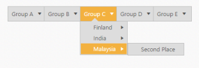
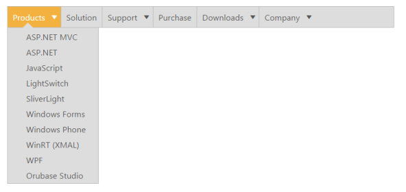

# Data binding

Data binding enables you to synchronize the elements with different sources of data. You can bind data using two ways, Local data and remote data. 

## Field Members

Field is a property that includes the object type. Fields are used to bind the data source and it includes following field members to make binding easier.

_List of Field members_

<table>
<tr>
<th>
Name</th><th>
Description</th></tr>
<tr>
<td>
DataSource</td><td>
Datasource receives Essential DataManager object and JSON object. </td></tr>
<tr>
<td>
Query</td><td>
It receives query to retrieve data from the table (query is same as SQL). Example:  ej.Query().from("Categories").select("CategoryID,CategoryName").take(3);</td></tr>
<tr>
<td>
TableName</td><td>
It receives table name to execute query on the corresponding table</td></tr>
<tr>
<td>
Id</td><td>
Specifies the id to menu items list</td></tr>
<tr>
<td>
ParentId</td><td>
Specifies the parent id of the table.</td></tr>
<tr>
<td>
Text</td><td>
Specifies the text of menu items list</td></tr>
<tr>
<td>
SpriteCssClass</td><td>
Specifies the sprite CSS class to “LI” item list</td></tr>
<tr>
<td>
LinkAttribute</td><td>
Specifies the link attribute to “A” tag in item list</td></tr>
<tr>
<td>
ImageAttribute</td><td>
Specifies the image attribute to “IMG” tag inside items list </td></tr>
<tr>
<td>
HtmlAttribute</td><td>
Specifies the HTML attributes to “LI” item list</td></tr>
<tr>
<td>
ImageUrl</td><td>
Specifies the image URL to “IMG” tag inside item list. </td></tr>
</table>

## Local data

To define the local data to the Menu control, map the user-defined JSON data names with its appropriate dataSource column names.

1. Add the following code in your view page to render menu with local data



// Add the following code in your CSHTML page.
@Html.EJ().Menu("menu").MenuFields(f => 
f.Datasource((IEnumerable<Check.Controllers.CheckController.MenuJson>)ViewBag.datasource)
.Id("id").Text("text").ParentId("parent"))
	   




using System;
using System.Collections.Generic;
using System.Linq;
using System.Web;
using System.Web.Mvc;
namespace Check.Controllers
{
    public class CheckController : Controller 
	{
		public class MenuJson    
		{   
			public string text { get; set; } 
			public int id { get; set; }  
			public string parent { get; set; }  
		}   
		List<MenuJson> menu = new List<MenuJson>();  
		public ActionResult DataBindingJson()    
		{          
			menu.Add(new MenuJson { id = 1, text = "Group A", parent = null }); 
			menu.Add(new MenuJson { id = 2, text = "Group B", parent = null });
            menu.Add(new MenuJson { id = 3, text = "Group C", parent = null });  
			menu.Add(new MenuJson { id = 4, text = "Group D", parent = null });  
			menu.Add(new MenuJson { id = 5, text = "Group E", parent = null });  
			menu.Add(new MenuJson { id = 11, parent = "1", text = "Algeria" });  
			menu.Add(new MenuJson { id = 12, parent = "1", text = "Armenia" });   
			menu.Add(new MenuJson { id = 13, parent = "1", text = "Bangladesh" }); 
			menu.Add(new MenuJson { id = 14, parent = "1", text = "Cuba" });      
			menu.Add(new MenuJson { id = 15, parent = "2", text = "Denmark" });   
			menu.Add(new MenuJson { id = 16, parent = "2", text = "Egypt" });     
			menu.Add(new MenuJson { id = 17, parent = "3", text = "Finland" });   
			menu.Add(new MenuJson { id = 18, parent = "3", text = "India" });     
			menu.Add(new MenuJson { id = 19, parent = "3", text = "Malaysia" });   
			menu.Add(new MenuJson { id = 20, parent = "4", text = "New Zealand" });
            menu.Add(new MenuJson { id = 21, parent = "4", text = "Norway" });      
			menu.Add(new MenuJson { id = 22, parent = "4", text = "Romania" });     
			menu.Add(new MenuJson { id = 23, parent = "5", text = "Singapore" });   
			menu.Add(new MenuJson { id = 24, parent = "5", text = "Thailand" });      
			menu.Add(new MenuJson { id = 25, parent = "5", text = "Ukraine" });     
			menu.Add(new MenuJson { id = 26, parent = "11", text = "First Place" }); 
			menu.Add(new MenuJson { id = 27, parent = "12", text = "Second Place" }); 
			menu.Add(new MenuJson { id = 28, parent = "13", text = "Third place" });     
			menu.Add(new MenuJson { id = 29, parent = "14", text = "Fourth Place" });  
			menu.Add(new MenuJson { id = 30, parent = "15", text = "First Place" });    
			menu.Add(new MenuJson { id = 31, parent = "16", text = "Second Place" }); 
			menu.Add(new MenuJson { id = 32, parent = "17", text = "Third Place" });     
			menu.Add(new MenuJson { id = 33, parent = "18", text = "First Place" });    
			menu.Add(new MenuJson { id = 34, parent = "19", text = "Second Place" });
			menu.Add(new MenuJson { id = 36, parent = "21", text = "Second Place" });   
			menu.Add(new MenuJson { id = 37, parent = "22", text = "Third place" });
			menu.Add(new MenuJson { id = 39, parent = "24", text = "First Place" });    
			menu.Add(new MenuJson { id = 40, parent = "25", text = "Second Place" });   
			ViewBag.datasource = menu;  
			return View();
		} 
	}
}



The following screenshot displays the output of the above code.

Local data of Menu
{:.caption}

## Remote data

The Menu control also provides support for Remote data binding. Here the remote data is placed in Web service and you can render the menu items from the web service using Service URL. The data is in JSON format. 

DataManager is used to manage relational data in JavaScript. DataManager uses two different classes, ej.DataManager for processing, and ej.Query for serving data. ej.DataManager communicates with data source and ej.Query generates data queries that are to be read by DataManager. To know more about DataManager and Query refer the following link location.

<http://help.syncfusion.com/aspnetmvc/menu/data-binding>

In the following example, [http://mvc.syncfusion.com/Services/Northwnd.svc/](http://mvc.syncfusion.com/Services/Northwnd.svc/) is used as the URL. This acts as web service that is located in the Syncfusion server. The web service with the name Northwnd.svc is used here.

1. Add the following code in your View page to render the menu with remote data



@Html.EJ().Menu("SyncfusionProducts").Width("600px").MenuFields(f => f.Datasource(d =>
d.URL("http://mvc.syncfusion.com/UGOdataServices/Northwnd.svc/")).Query("ej.Query().from('RootLevelItems')").Id("InfoID").Text("InfoText").Child(c => 
c.Datasource(cd => 
cd.URL("http://mvc.syncfusion.com/UGOdataServices/Northwnd.svc/"))  .TableName("SubItems").Id("SubItemID").ParentId("InfoID").Text("SubItetext").Child(cc => 
cc.Datasource(ccd => 
ccd.URL("http://mvc.syncfusion.com/UGOdataServices/Northwnd.svc/")).TableName("InnerItems").Id("InnerSubItemID").ParentId("SubItemID").Text("InnerSubItetext"))))



The following screenshot displays the output of the above code. 

Remote data of Menu
{:.caption}

