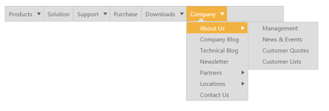
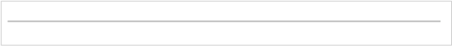
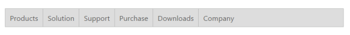
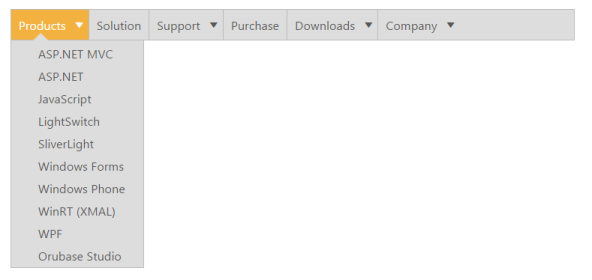

# Getting Started 

This section explains briefly about how to create a Menu control in your application with ASP.NET MVC 

## Create Syncfusion Menu in MVC

The Essential ASP.NET MVC Menu control supports displaying a Menu out of list items. The Menu is based on parent and child elements hierarchy, where the child items are rendered as the sub-menu items .The Menu control can also render with local and remote data source. The following section explains you on how to customize the Menu control for a website. 

The following screenshot illustrates the appearance of Syncfusion’s website Menu.

{{ '' | markdownify }}
{:.image }

The Menu items in the above screenshot allow you to navigate through multiple menus in a page and select an item. It has a hierarchical structure with sub menus. 

Create a Menu

Essential ASP.NET MVC Menu widget basically renders with built-in features like keyboard navigation, show and hides Menu items with animations and flexible API’s. Refer the following guidelines to render Menu control with Local data source value.

1. You can create a MVC Project and add the necessary Dll’s and scripts using the [MVC-Getting Started](http://help.syncfusion.com/ug/js/Documents/gettingstartedwithmv.htm) Documentation.
2. Add the below code in yoyr view page to add the nessary css and script files

[layout._cshtml]

<head>

<link href="http://cdn.syncfusion.com/13.1.0.21/js/web/flat-azure/ej.web.all.min.css" rel="stylesheet" />

    <!--Scripts-->

    

    

    

    

</head>

3. Add the following code example to the corresponding view page for Menu rendering.

[C#]

@Html.EJ().Menu("SyncfusionProducts")

4. Execute the above code to render Empty Menu bar.

{{ '' | markdownify }}
{:.image }

Configure Parent Menu items

Each Menu consists of a list of Menu items with list of sub level Menu item. Refer the following guidelines to initialize the root level elements of Menu control with Remote data source value. RootLevelItems data service is created to define the root level Menu items, sub items and InnerItems data services to initialize the sub level and inner sub levels and both can be referred from the following service location. In Menu Widgets mention the RootLevelItem Data Source in the Datasource property. Elements’s properties like Id, Text, URL, and Parent Id can be defined using our menu fields and it explained brifly under the concept and features of Menu control.

[http://mvc.syncfusion.com/UGOdataServices/Northwnd.svc/](http://mvc.syncfusion.com/UGOdataServices/Northwnd.svc/)

To navigate the clicked Menu item to a specific URL, define the navigation URL to each Menu item.

Initialize the Menu with data source value as follows. 

[view]

@Html.EJ().Menu("SyncfusionProducts").Width("600px").MenuFields(f => f.Datasource(d => d.URL("http://mvc.syncfusion.com/UGOdataServices/Northwnd.svc/")).Query("ej.Query().from('RootLevelItems')").Id("InfoID").Text("InfoText"))

Execute the above code to display the Root level Menu items.

{{ '' | markdownify }}
{:.image }

Initialize sub-level Menu items

Each Menu items consist of list of sub level Menu items. Refer the following guidelines to initialize the sub level items of Menu control. The ParentIdfield property maps root level Menu item to its sub level Menu item. In Menu Widgets mention the RootLevelItems and SubLevelItems Data Source in the Datasource property. The Child field property is used to define sub level Menu items of parent Menu item.							

The following code example explains the initialization of first level sub menu items of Menu control.

[View]

@Html.EJ().Menu("SyncfusionProducts").Width("600px").MenuFields(f => f.Datasource(d => d.URL("http://mvc.syncfusion.com/UGOdataServices/Northwnd.svc/")).Query("ej.Query().from('RootLevelItems')").Id("InfoID").Text("InfoText").Child(c => c.Datasource(cd => cd.URL("http://mvc.syncfusion.com/UGOdataServices/Northwnd.svc/")).TableName("SubItems").Id("SubItemID").ParentId("InfoID").Text("SubItemText")))

Execute the above code to render the following output.

{{ '' | markdownify }}
{:.image }

Define multiple level Menu items

You can render sub menu item to multiple level in Menu control. In Menu Widgets, mention the InnerItems Data Source in the Datasource property. The Child field property is used to define the sub level Menu item of parent Menu. Specify the ParentId value to render sub level Menu item for the Menu item. Each Level Menu item have Child field to define the child level Menu item. 

The following code example explains the initialization of multiple level sub menu items.

[View]

@Html.EJ().Menu("SyncfusionProducts").Width("600px").MenuFields(f => f.Datasource(d => d.URL("http://mvc.syncfusion.com/UGOdataServices/Northwnd.svc/")).Query("ej.Query().from('RootLevelItems')").Id("InfoID").Text("InfoText").Child(c => c.Datasource(cd => cd.URL("http://mvc.syncfusion.com/UGOdataServices/Northwnd.svc/")).TableName("SubItems").Id("SubItemID").ParentId("InfoID").Text("SubItemText").Child(cc => cc.Datasource(ccd => ccd.URL("http://mvc.syncfusion.com/UGOdataServices/Northwnd.svc/")).TableName("InnerItems").Id("InnerSubItemID").ParentId("SubItemID").Text("InnerSubItemText"))))

Execute the above code to render the multiple sub menus in a hierarchy

{{ '' | markdownify }}
{:.image }

