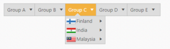
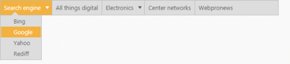
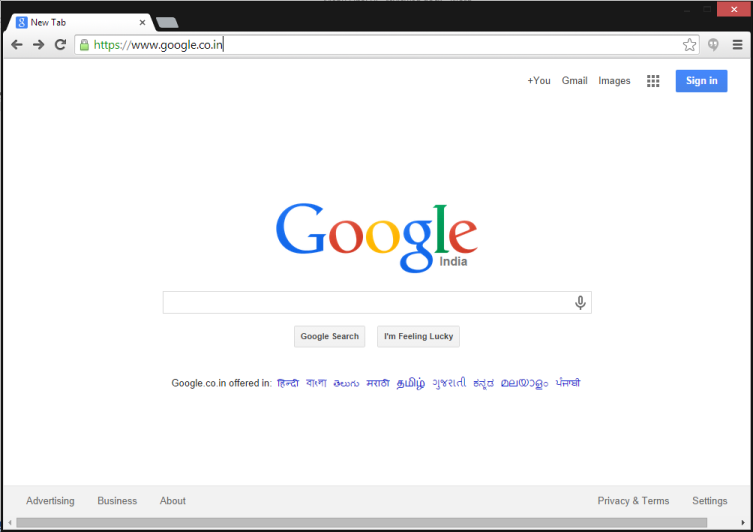

# Icons and navigation

Icons are the images that is displayed in the Menu control. To specify the menu with icons you can use SpriteCssClass property to display the icons. 

1. Add the following code in your View page.

   ~~~ cshtml
   
	// Add the following code in your CSHTML page 
	@Html.EJ().Menu("menu").MenuFields(f => 
	f.Datasource((IEnumerable<Check.Controllers.CheckController.icons>)ViewBag.datasource).Id("id").Text("text").ParentId("parent").SpriteCssClass("sprite"))

   ~~~
   			  

   ~~~ csharp
   
	// In the controller page add the code

	using System;using System.Collections.Generic;
	using System.Linq;using System.Web;
	using System.Web.Mvc;using Check.Models;
	namespace Check.Controllers
	{    
		public class CheckController : Controller
		{     
			public class icons 
			{  
				public string text { get; set; }
				public string sprite { get; set; }
				public int id { get; set; }
				public string parent { get; set; }
			}    
			List<icons> menu = new List<icons>(); 
			public ActionResult DataBindingJson() 
			{
				menu.Add(new icons { id = 1, text = "Group A", parent = null }); 
				menu.Add(new icons { id = 2, text = "Group B", parent = null }); 
				menu.Add(new icons { id = 3, text = "Group C", parent = null });
				menu.Add(new icons { id = 4, text = "Group D", parent = null });
				menu.Add(new icons { id = 5, text = "Group E", parent = null }); 
				menu.Add(new icons { id = 11, parent = "1", text = "Algeria", sprite = "flag-dz" });
				menu.Add(new icons { id = 12, parent = "1", text = "Armenia", sprite = "flag-am" });
				menu.Add(new icons { id = 13, parent = "1", text = "Bangladesh", sprite = "flag-bd" }); 
				menu.Add(new icons { id = 14, parent = "1", text = "Cuba", sprite = "flag-cu" });  
				menu.Add(new icons { id = 15, parent = "2", text = "Denmark", sprite = "flag-dk" }); 
				menu.Add(new icons { id = 16, parent = "2", text = "Egypt", sprite = "flag-eg" });  
				menu.Add(new icons { id = 17, parent = "3", text = "Finland", sprite = "flag-fi" });
				menu.Add(new icons { id = 18, parent = "3", text = "India", sprite = "flag-in" }); 
				menu.Add(new icons { id = 19, parent = "3", text = "Malaysia", sprite = "flag-my" });
				menu.Add(new icons { id = 20, parent = "4", text = "New Zealand", sprite = "flag-nz" });
				menu.Add(new icons { id = 21, parent = "4", text = "Norway", sprite = "flag-no" });
				menu.Add(new icons { id = 22, parent = "4", text = "Romania", sprite = "flag-ro" });
				menu.Add(new icons { id = 23, parent = "5", text = "Singapore", sprite = "flag-sg" });
				menu.Add(new icons { id = 24, parent = "5", text = "Thailand", sprite = "flag-th" }); 
				menu.Add(new icons { id = 25, parent = "5", text = "Ukraine", sprite = "flag-ua" }); 
				menu.Add(new icons { id = 26, parent = "11", text = "First Place" });  
				menu.Add(new icons { id = 27, parent = "12", text = "Second Place" }); 
				menu.Add(new icons { id = 28, parent = "13", text = "Third place" }); 
				menu.Add(new icons { id = 29, parent = "14", text = "Fourth Place" }); 
				menu.Add(new icons { id = 30, parent = "15", text = "First Place" });  
				menu.Add(new icons { id = 31, parent = "16", text = "Second Place" }); 
				menu.Add(new icons { id = 32, parent = "17", text = "Third Place" }); 
				menu.Add(new icons { id = 33, parent = "18", text = "First Place" }); 
				menu.Add(new icons { id = 34, parent = "19", text = "Second Place" }); 
				menu.Add(new icons { id = 35, parent = "20", text = "First Place" }); 
				menu.Add(new icons { id = 36, parent = "21", text = "Second Place" });
				menu.Add(new icons { id = 37, parent = "22", text = "Third place" }); 
				menu.Add(new icons { id = 38, parent = "23", text = "Third Place" }); 
				menu.Add(new icons { id = 39, parent = "24", text = "First Place" }); 
				menu.Add(new icons { id = 40, parent = "25", text = "Second Place" });
				ViewBag.datasource = menu; 
				return View();  
			} 
		}
	} 

   ~~~
   

2. Add the following code in your style section.

   ~~~ css

	

   ~~~
   

The following screenshot displays the output for the above code.                                                                                                       

Menu with Icons
{:.caption}

## Navigation

Navigation in Menu control is the default usage to navigate into the other web page. You can navigate to another page in menu item by providing link to the menu items. Navigation in Menu control can be achieved by placing “href” path to the anchor tag. Use the following code sample for navigating in Menu control.

1. Add the following code in your View page.

   ~~~ cshtml

	// Add the following code in your CSHTML page.

		

		@Html.EJ().Menu("link").Items(items =>

			{

				items.Add().Url("#").Id("search").Text("Search engine").Children(child =>

					{

						child.Add().Url("http://www.bing.com/").Text("Bing");

						child.Add().Url("https://www.google.co.in/").Text("Google");

						child.Add().Url("https://in.yahoo.com/").Text("Yahoo");

						child.Add().Url("http://www.rediff.com/").Text("Rediff");

					});

				items.Add().Url("http://allthingsd.com/").Text("All things digital");

				items.Add().Url("").Text("Electronics").Children(child =>

					{

						child.Add().Url("http://www.engadget.com/").Text("Engadget");

						child.Add().Url("http://www.electronista.com/").Text("Electronista");

						child.Add().Url("http://www.gearlog.com/").Text("Gearlog");

					});

				items.Add().Url("http://www.centernetworks.com/").Text("Center networks");

				items.Add().Url("http://www.webpronews.com/").Text("Web pronews");

			}).Width("500")

	

   ~~~
   

The following screenshot displays the output for the above code example.            

Navigation of Menu
{:.caption}

When you click on “Google” that is present under “Search engine”, it navigates to the link that you specified in the sample code. Then the output is as follows.

After navigating to a menu item
{:.caption}
