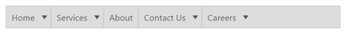
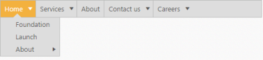

# Keyboard Navigation

The Menu control also provides support for keyboard navigation. In the Menu control, it is possible to control the entire menu control items by using the provided shortcut keys. 

The various keyboard shortcuts available within the Menu control are discussed in the following table, 

_Table2: List of keyboard shortcut keys_

<table>
<tr>
<th>
Keys</th><th>
Usage</th></tr>
<tr>
<td>
Esc</td><td>
Closes the opened Menu control.</td></tr>
<tr>
<td>
Enter</td><td>
Selects the focused item.</td></tr>
<tr>
<td>
Up/left/down/right arrow keys</td><td>
Navigates up or previous item.</td></tr>
<tr>
<td>
Down</td><td>
Navigates down or next item.</td></tr>
<tr>
<td>
Left</td><td>
Navigates to previous group.</td></tr>
<tr>
<td>
Right</td><td>
Navigates to next group.</td></tr>
</table>

1. Add the following code for Keyboard navigation in your Menu control.



[CSHTML]// Add the following code for Keyboard navigation in our Menu control.
    @Html.EJ().Menu("keyboard").Items(items =>        {            items.Add().Id("Home").Text("Home").Children(child =>                {                    child.Add().Text("Foundation");                    child.Add().Text("Launch");                    child.Add().Text("About").Children(child1 =>                    {                        child1.Add().Text("Company");                        child1.Add().Text("Location");                    });                });            items.Add().Text("Services").Children(child =>                {                    child.Add().Text("Consulting");                    child.Add().Text("Outsourcing");                });            items.Add().Text("About");            items.Add().Id("Contact").Text("Contact Us").Children(child =>                {                    child.Add().Text("Contact number");                    child.Add().Text("E-mail");                });            items.Add().Id("Careers").Text("Careers").Children(child =>                 {                     child.Add().Text("Position").Children(child1 =>                             {                                 child1.Add().Text("Developer");                                 child1.Add().Text("Manager");                             });                     child.Add().Text("Apply online");                 });        }).Width("500")    



[JavaScript]// Add the following code in your 



2. Add the following code in your style section.

[CSS]


Following screenshot displays the output of the above code. 

_Figure39: Accessibility_

When you press alt+j, the first item of the Menu control only gets focused as displayed in the following screenshot.

_Figure40: Keyboard Navigation_

Similarly you can access the Menu control using keyboard itself.

