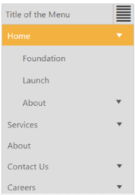
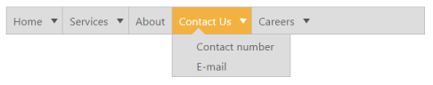
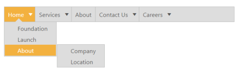

## Miscellaneous

Height

Specifies the height of the root menu. You can customize the height of the Menu control by using Height property. 

1. You can specify the height of the Menu control using helper as follows.

[CSHTML]

// You can specify the height of the Menu control in the CSHTML page as follows.

    @Html.EJ().Menu("menucontrol").Items(items =>

        {

            items.Add().Id("Home").Text("Home").Children(child =>

                {

                    child.Add().Text("Foundation");

                    child.Add().Text("Launch");

                    child.Add().Text("About").Children(child1 =>

                    {

                        child1.Add().Text("Company");

                        child1.Add().Text("Location");

                    });

                });

            items.Add().Text("Services").Children(child =>

                {

                    child.Add().Text("Consulting");

                    child.Add().Text("Outsourcing");

                });

            items.Add().Text("About");

            items.Add().Id("Contact").Text("Contact Us").Children(child =>

                {

                    child.Add().Text("Contact number");

                    child.Add().Text("E-mail");

                });

            items.Add().Id("Careers").Text("Careers").Children(child =>

                 {

                     child.Add().Text("Position").Children(child1 =>

                             {

                                 child1.Add().Text("Developer");

                                 child1.Add().Text("Manager");

                             });

                     child.Add().Text("Apply online");

                 });

        }).Height("50")

Width

Specifies the width of the main menu. You can customize the width of the Menu control by using Width property.

1. You can specify the width of the Menu control using helper as follows.

[CSHTML]

// You can specify the width of the Menu control in the CSHTML page as follows.

@Html.EJ().Menu("menucontrol").Items(items =>

        {

            items.Add().Id("Home").Text("Home").Children(child =>

                {

                    child.Add().Text("Foundation");

                    child.Add().Text("Launch");

                    child.Add().Text("About").Children(child1 =>

                    {

                        child1.Add().Text("Company");

                        child1.Add().Text("Location");

                    });

                });

            items.Add().Text("Services").Children(child =>

                {

                    child.Add().Text("Consulting");

                    child.Add().Text("Outsourcing");

                });

            items.Add().Text("About");

            items.Add().Id("Contact").Text("Contact Us").Children(child =>

                {

                    child.Add().Text("Contact number");

                    child.Add().Text("E-mail");

                });

            items.Add().Id("Careers").Text("Careers").Children(child =>

                 {

                     child.Add().Text("Position").Children(child1 =>

                             {

                                 child1.Add().Text("Developer");

                                 child1.Add().Text("Manager");

                             });

                     child.Add().Text("Apply online");

                 });

        }).Width("700")

Open on click

Specifies the sub menu items to be show or open only on click. It accepts the Boolean value. Its default value is false. If we set “OpenOnClick” property to true then the submenu items will open only on click. By default the submenu will open when we hover on menu items.

1. Add the following code in your view page to render the menu. 

[CSHTML]

// Add the following code in the CSHTML page. 

@Html.EJ().Menu("menucontrol").Items(items =>

        {

            items.Add().Id("Home").Text("Home").Children(child =>

                {

                    child.Add().Text("Foundation");

                    child.Add().Text("Launch");

                    child.Add().Text("About").Children(child1 =>

                    {

                        child1.Add().Text("Company");

                        child1.Add().Text("Location");

                    });

                });

            items.Add().Text("Services").Children(child =>

                {

                    child.Add().Text("Consulting");

                    child.Add().Text("Outsourcing");

                });

            items.Add().Text("About");

            items.Add().Id("Contact").Text("Contact Us").Children(child =>

                {

                    child.Add().Text("Contact number");

                    child.Add().Text("E-mail");

                });

            items.Add().Id("Careers").Text("Careers").Children(child =>

                 {

                     child.Add().Text("Position").Children(child1 =>

                             {

                                 child1.Add().Text("Developer");

                                 child1.Add().Text("Manager");

                             });

                     child.Add().Text("Apply online");

                 });

        }).Width("500").OpenOnClick(true)

Output screenshot for the above code example is as follows.

{{ '' | markdownify }}
{:.image }

_Figure_ _41__: Sub menu items to open on click_

Animation

Animation type is used to enable or disable the Animation when hover or click on menu items. Its value type is string. It accepts two values such as “none” and “default”. Support to disable the Animation Type when hover or click on menu items is none. Support to enable the Animation Type when hover or click on menu items is default. 

1. Add the following code in your view page to render the menu. 

[CSHTML]

// Add the following code in the CSHTML page. 

@Html.EJ().Menu("menucontrol").Items(items =>

        {

            items.Add().Id("Home").Text("Home").Children(child =>

                {

                    child.Add().Text("Foundation");

                    child.Add().Text("Launch");

                    child.Add().Text("About").Children(child1 =>

                    {

                        child1.Add().Text("Company");

                        child1.Add().Text("Location");

                    });

                });

            items.Add().Text("Services").Children(child =>

                {

                    child.Add().Text("Consulting");

                    child.Add().Text("Outsourcing");

                });

            items.Add().Text("About");

            items.Add().Id("Contact").Text("Contact Us").Children(child =>

                {

                    child.Add().Text("Contact number");

                    child.Add().Text("E-mail");

                });

            items.Add().Id("Careers").Text("Careers").Children(child =>

                 {

                     child.Add().Text("Position").Children(child1 =>

                             {

                                 child1.Add().Text("Developer");

                                 child1.Add().Text("Manager");

                             });

                     child.Add().Text("Apply online");

                 });

        }).Width("500").AnimationType(AnimationType.Default)

Output screenshot for the above code sample is as follows.

{{ '' | markdownify }}
{:.image }

_Figure_ _42__: Animation_

Title text

Specifies the title to the responsive menu. You can provide title to the Menu control by using TitleText property. 

1. You can specify the title of the Menu control using helper as follows.

[CSHTML]

// You can specify the title of the Menu control in the CSHTML page as follows.

    @Html.EJ().Menu("menucontrol").Items(items =>

        {

            items.Add().Id("Home").Text("Home").Children(child =>

                {

                    child.Add().Text("Foundation");

                    child.Add().Text("Launch");

                    child.Add().Text("About").Children(child1 =>

                    {

                        child1.Add().Text("Company");

                        child1.Add().Text("Location");

                    });

                });

            items.Add().Text("Services").Children(child =>

                {

                    child.Add().Text("Consulting");

                    child.Add().Text("Outsourcing");

                });

            items.Add().Text("About");

            items.Add().Id("Contact").Text("Contact Us").Children(child =>

                {

                    child.Add().Text("Contact number");

                    child.Add().Text("E-mail");

                });

            items.Add().Id("Careers").Text("Careers").Children(child =>

                 {

                     child.Add().Text("Position").Children(child1 =>

                             {

                                 child1.Add().Text("Developer");

                                 child1.Add().Text("Manager");

                             });

                     child.Add().Text("Apply online");

                 });

        }).Width("500").TitleText("Title of the Menu")

    

The following screenshot displays the output of the above code.

{{ '' | markdownify }}
{:.image }

_Figure_ _43__: Title text for Responsive Layout_

Show root level arrows

Specifies the main menu item arrows to display only when it contains child menu items. You can use “ShowRooltLevelArrows” property to display the arrows of main menu items only when it contains child menu items. This property accepts Boolean value. Its default value is true. 

1. Add the following code in your view page to render the menu with root level arrows

[CSHTML]

// Add the following code in the CSHTML page.

  @Html.EJ().Menu("menucontrol").Items(items =>

        {

            items.Add().Id("Home").Text("Home").Children(child =>

                {

                    child.Add().Text("Foundation");

                    child.Add().Text("Launch");

                    child.Add().Text("About").Children(child1 =>

                    {

                        child1.Add().Text("Company");

                        child1.Add().Text("Location");

                    });

                });

            items.Add().Text("Services").Children(child =>

                {

                    child.Add().Text("Consulting");

                    child.Add().Text("Outsourcing");

                });

            items.Add().Text("About");

            items.Add().Id("Contact").Text("Contact Us").Children(child =>

                {

                    child.Add().Text("Contact number");

                    child.Add().Text("E-mail");

                });

            items.Add().Id("Careers").Text("Careers").Children(child =>

                 {

                     child.Add().Text("Position").Children(child1 =>

                             {

                                 child1.Add().Text("Developer");

                                 child1.Add().Text("Manager");

                             });

                     child.Add().Text("Apply online");

                 });

        }).Width("500").ShowRooltLevelArrows(false)

    

The following screenshot displays the output of the above code.

{{ '' | markdownify }}
{:.image }

_Figure_ _44__: Show root level arrows_

Show sub level arrows

Specifies the sub menu items arrows to display only when it contains child menu items. You can use “ShowSubLevelArrows” property to show the arrows of sub menu items only when it contains child menu items. This property accepts Boolean value. Its default value is true. 

1. Add the following code in your view page to render the menu with sub level arrows

[CSHTML]

// Add the following code in the CSHTML page.

@Html.EJ().Menu("menucontrol").Items(items =>

        {

            items.Add().Id("Home").Text("Home").Children(child =>

                {

                    child.Add().Text("Foundation");

                    child.Add().Text("Launch");

                    child.Add().Text("About").Children(child1 =>

                    {

                        child1.Add().Text("Company");

                        child1.Add().Text("Location");

                    });

                });

            items.Add().Text("Services").Children(child =>

                {

                    child.Add().Text("Consulting");

                    child.Add().Text("Outsourcing");

                });

            items.Add().Text("About");

            items.Add().Id("Contact").Text("Contact Us").Children(child =>

                {

                    child.Add().Text("Contact number");

                    child.Add().Text("E-mail");

                });

            items.Add().Id("Careers").Text("Careers").Children(child =>

                 {

                     child.Add().Text("Position").Children(child1 =>

                             {

                                 child1.Add().Text("Developer");

                                 child1.Add().Text("Manager");

                             });

                     child.Add().Text("Apply online");

                 });

        }).Width("500").ShowSubLevelArrows(false)

    

The following screenshot displays the output of the above code.

{{ '' | markdownify }}
{:.image }

_Figure_ _45__: Show sub level arrows_

