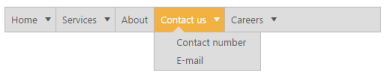
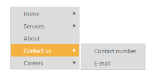

## Orientation

It gets or sets the direction in which the Menu control renders and specifies the orientation of the normal menu.  According to the orientation property the Menu control renders in horizontal or vertical.

Horizontal Menu

Horizontal orientation displays the menu items horizontally and it is the default orientation behavior of Menu control. 

The following steps explains you the details on rendering the Menu control. 

1. Add the below code in your view page to render the horizontal menu

[CSHTML]    

// In the CSHTML page, add the following code to configure Menu control.

@Html.EJ().Menu("menucontrol").Items(items =>

        {

            items.Add().Id("Home").Text("Home").Children(child =>

                {

                    child.Add().Text("Foundation");

                    child.Add().Text("Launch");

                    child.Add().Text("About").Children(child1 =>

                    {

                        child1.Add().Text("Company");

                        child1.Add().Text("Location");

                    });

                });

            items.Add().Text("Services").Children(child =>

                {

                    child.Add().Text("Consulting");

                    child.Add().Text("Outsourcing");

                });

            items.Add().Text("About");

            items.Add().Id("Contact").Text("Contact Us").Children(child =>

                {

                    child.Add().Text("Contact number");

                    child.Add().Text("E-mail");

                });

            items.Add().Id("Careers").Text("Careers").Children(child =>

                 {

                     child.Add().Text("Position").Children(child1 =>

                             {

                                 child1.Add().Text("Developer");

                                 child1.Add().Text("Manager");

                             });

                     child.Add().Text("Apply online");

                 });

        }).Width("500")

The following screenshot displays the output of the above code.        

{{ '' | markdownify }}
{:.image }

_Figure_ _16__: Horizontal Menu_

Vertical Menu

You can also render Menu control in vertical direction using orientation.To set the vertical orientation of Menu control, replace the following script in the above sample code example.

1. Add the following code in your view page to render vertical menu

[CSHTML]

// Add the following code in the CSHTML page.

    @Html.EJ().Menu("menucontrol").Items(items =>

        {

            items.Add().Id("Home").Text("Home").Children(child =>

                {

                    child.Add().Text("Foundation");

                    child.Add().Text("Launch");

                    child.Add().Text("About").Children(child1 =>

                    {

                        child1.Add().Text("Company");

                        child1.Add().Text("Location");

                    });

                });

            items.Add().Text("Services").Children(child =>

                {

                    child.Add().Text("Consulting");

                    child.Add().Text("Outsourcing");

                });

            items.Add().Text("About");

            items.Add().Id("Contact").Text("Contact Us").Children(child =>

                {

                    child.Add().Text("Contact number");

                    child.Add().Text("E-mail");

                });

            items.Add().Id("Careers").Text("Careers").Children(child =>

                 {

                     child.Add().Text("Position").Children(child1 =>

                             {

                                 child1.Add().Text("Developer");

                                 child1.Add().Text("Manager");

                             });

                     child.Add().Text("Apply online");

                 });

        }).Width("200").Orientation(Orientation.Vertical)

The following screen shot displays the output of the above code.                       

{{ '' | markdownify }}
{:.image }

_Figure_ _17__: Vertical Menu_

