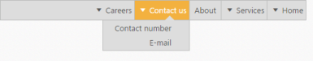

# RTL Support

The EnableRTL option allows the Menu control to display it in the right to left direction. By default, this option is set to “false” in the Menu control.

1. The following code depicts you on how to enable the rtl property of the Menu control.



// The following code example depicts how to enable the rtl property of the Menu control.

    @Html.EJ().Menu("menuControl").Items(items =>

        {

            items.Add().Id("Home").Text("Home").Children(child =>

                {

                    child.Add().Text("Foundation");

                    child.Add().Text("Launch");

                    child.Add().Text("About").Children(child1 =>

                    {

                        child1.Add().Text("Company");

                        child1.Add().Text("Location");

                    });

                });

            items.Add().Text("Services").Children(child =>

                {

                    child.Add().Text("Consulting");

                    child.Add().Text("Outsourcing");

                });

            items.Add().Text("About");

            items.Add().Id("Contact").Text("Contact Us").Children(child =>

                {

                    child.Add().Text("Contact number");

                    child.Add().Text("E-mail");

                });

            items.Add().Id("Careers").Text("Careers").Children(child =>

                 {

                     child.Add().Text("Position").Children(child1 =>

                             {

                                 child1.Add().Text("Developer");

                                 child1.Add().Text("Manager");

                             });

                     child.Add().Text("Apply online");

                 });

        }).Width("500").EnableRTL(true)    



Following screenshot displays the output for the above code.

RTL Support
{:.caption}
