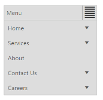

# Responsive Layout

Responsive Layout is aimed at crafting sites to provide an optimal viewing experience—easy reading and navigation with a minimum of resizing, panning, and scrolling—across a wide range of devices (from mobile phones to desktop computer monitors). In order to get responsive layout, you can add ej.responsive.css file in this sample. CDN link for the responsive css file is as follows.

[http://cdn.syncfusion.com/13.1.0.21/js/web/responsive-css/ej.responsive.css](http://cdn.syncfusion.com/13.1.0.21/js/web/responsive-css/ej.responsive.css)

> Note: Refer to the ej.responsive.css file after the ej.widgets.all.min.css file

Add the above css link in the code sample.         

1. Add the following code in your View page.



[CSHTML]   

// Add the following code in your CSHTML page.

    @Html.EJ().Menu("menucontrol").Items(items =>

        {

            items.Add().Id("Home").Text("Home").Children(child =>

                {

                    child.Add().Text("Foundation");

                    child.Add().Text("Launch");

                    child.Add().Text("About").Children(child1 =>

                    {

                        child1.Add().Text("Company");

                        child1.Add().Text("Location");

                    });

                });

            items.Add().Text("Services").Children(child =>

                {

                    child.Add().Text("Consulting");

                    child.Add().Text("Outsourcing");

                });

            items.Add().Text("About");

            items.Add().Id("Contact").Text("Contact Us").Children(child =>

                {

                    child.Add().Text("Contact number");

                    child.Add().Text("E-mail");

                });

            items.Add().Id("Careers").Text("Careers").Children(child =>

                 {

                     child.Add().Text("Position").Children(child1 =>

                             {

                                 child1.Add().Text("Developer");

                                 child1.Add().Text("Manager");

                             });

                     child.Add().Text("Apply online");

                 });

        }).Width("200")



The following screenshot displays the output for the above code. 

_Figure38: Menu with responsive layout_

