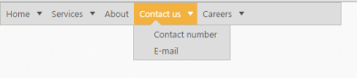

## Separators

Menu can also contain separators that are horizontal bars between menu items. You cannot select a separator. Separators are somewhat similar to [borders](http://docs.oracle.com/javase/tutorial/uiswing/components/border.html), except that they are genuine components and, as such, are drawn inside a control, rather than around the edges of the Menu control. EnableSeparator is the property that is used to display the separators in the Menu control. It accepts the Boolean type value. Its default value is true. 

1. Add the following code in your view page.

[CSHTML]

// Add the following code in the CSHTML page.

&lt;div class="imgframe"&gt;

    @Html.EJ().Menu("menucontrol").Items(items =>

        {

            items.Add().Id("Home").Text("Home").Children(child =>

                {

                    child.Add().Text("Foundation");

                    child.Add().Text("Launch");

                    child.Add().Text("About").Children(child1 =>

                    {

                        child1.Add().Text("Company");

                        child1.Add().Text("Location");

                    });

                });

            items.Add().Text("Services").Children(child =>

                {

                    child.Add().Text("Consulting");

                    child.Add().Text("Outsourcing");

                });

            items.Add().Text("About");

            items.Add().Id("Contact").Text("Contact Us").Children(child =>

                {

                    child.Add().Text("Contact number");

                    child.Add().Text("E-mail");

                });

            items.Add().Id("Careers").Text("Careers").Children(child =>

                 {

                     child.Add().Text("Position").Children(child1 =>

                             {

                                 child1.Add().Text("Developer");

                                 child1.Add().Text("Manager");

                             });

                     child.Add().Text("Apply online");

                 });

        }).Width("500").EnableSeparator(true)    &lt;/div&gt;

The following screenshot displays the output for the above code sample.

{  | markdownify }
{:.image }

_Figure_ _36__: Menu with Separators_

2. Add the following codein your view page to display the Menu control without separator by setting EnableSeparator as false.

[CSHTML]

&lt;div class="imgframe"&gt;

@Html.EJ().Menu("menucontrol").Items(items =>

        {

            items.Add().Id("Home").Text("Home").Children(child =>

                {

                    child.Add().Text("Foundation");

                    child.Add().Text("Launch");

                    child.Add().Text("About").Children(child1 =>

                    {

                        child1.Add().Text("Company");

                        child1.Add().Text("Location");

                    });

                });

            items.Add().Text("Services").Children(child =>

                {

                    child.Add().Text("Consulting");

                    child.Add().Text("Outsourcing");

                });

            items.Add().Text("About");

            items.Add().Id("Contact").Text("Contact Us").Children(child =>

                {

                    child.Add().Text("Contact number");

                    child.Add().Text("E-mail");

                });

            items.Add().Id("Careers").Text("Careers").Children(child =>

                 {

                     child.Add().Text("Position").Children(child1 =>

                             {

                                 child1.Add().Text("Developer");

                                 child1.Add().Text("Manager");

                             });

                     child.Add().Text("Apply online");

                 });

        }).Width("500").EnableSeparator(false)

    &lt;/div&gt;

The following screenshot displays the output for the above code. 

{  | markdownify }
{:.image }

_Figure_ _37__: Menu without Separators_

