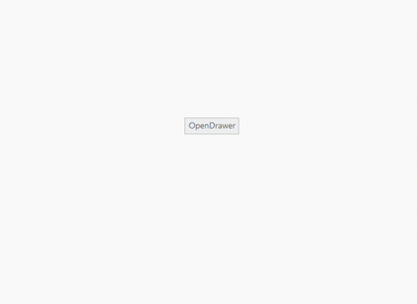
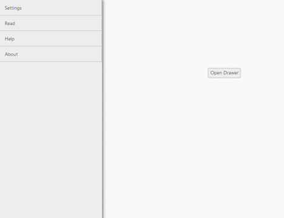

# Animations

You can set the transition type of the Navigation Drawer by using type property. The possible transition types are slide and overlay.

* Slide - both navigation panel and content page slides towards left/right direction to view the navigation panel items.
* Overlay - Only the navigation panel slides over the content page to view the navigation panel items. That is, part of the content page is hidden under navigation panel.

> Note: Transition slide type works only with fixed position.

The default value is Overlay.



@{

    @Html.EJ().Button("drawerTarget").Text("Open Drawer")

    @Html.EJ().NavigationDrawer("navpane").Type(NavigationDrawerType.Slide).TargetId("drawerTarget").Position(NavigationDrawerPosition.Fixed).ContentTemplate(@

        @Html.EJ().ListView("list").Width(300).Items(items =>

         {

             items.Add().Text("Home");

             items.Add().Text("Profile");

             items.Add().Text("Photos");

             items.Add().Text("Location");

         })

    
)

}

    



The following screenshot illustrates the output.

