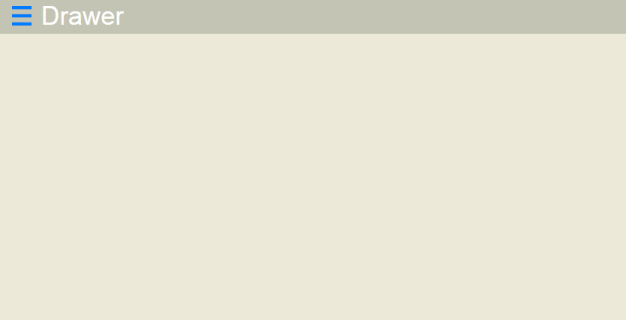
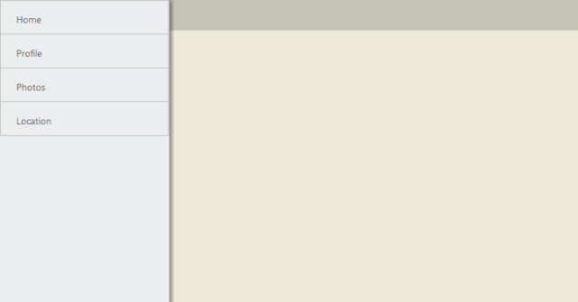
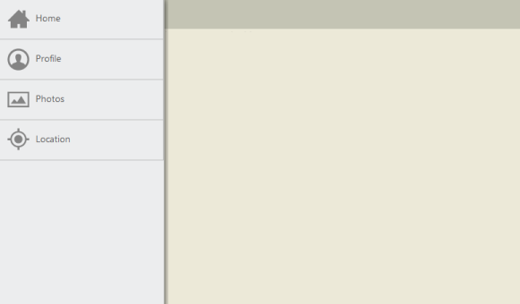
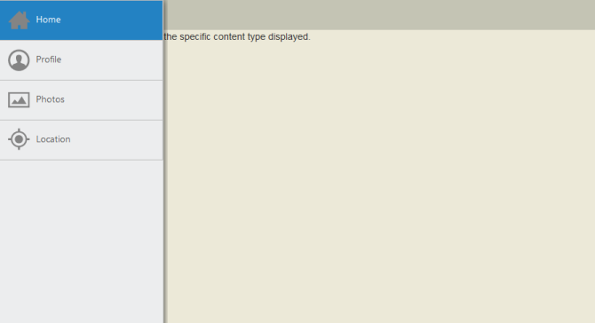

# Getting Started

## Create your first Navigation Drawer control in MVC

In this section, you can learn how to create a simple navigation drawer.

### Create Navigation Drawer Widget

The following steps guide you in adding a Navigation Drawer control for a web application that displays a list of items such as home, profile, photos and location where you can navigate to desired page by clicking on the option available in the drawer. 

You can create an MVC Project and add the necessary assemblies, styles and scripts to it.  Refer to the [MVC-Getting Started.](http://help.syncfusion.com/aspnetmvc/navigationdrawer/getting-started)

To add a Navigation Drawer control, call NavigationDrawer helper. You can display the navigational item as a list by using ListView. This is achieved by creating the ListView inside the content template. You can set the text for list items by using Text property. You can paste the following code in corresponding view page.



@Html.EJ().NavigationDrawer("navpane").Width(300).Position(NavigationDrawerPosition.Fixed).ContentTemplate(@

@Html.EJ().ListView("list").ShowHeader(false).Width(300).Items(items =>

	 {

		 items.Add().Text("Home");

		 items.Add().Text("Profile");

		 items.Add().Text("Photos");

		 items.Add().Text("Location");

	 });

)



Create the target element as follows to display the drawer by clicking target icon.



     
 Drawer



To set the target icon image from sprite and to position the target icon properly use the following code example.





Set the TargetId property as follows.



@Html.EJ().NavigationDrawer("navpane").Width(300).Position(NavigationDrawerPosition.Fixed).TargetId("target").ContentTemplate(@

@Html.EJ().ListView("list").ShowHeader(false).Width(300).Items(items =>

	 {

		 items.Add().Text("Home");

		 items.Add().Text("Profile");

		 items.Add().Text("Photos");

		 items.Add().Text("Location");

	 });

)



Run the application to render the following output. 

You can display the drawer either by clicking on the target icon or by swiping from left on the page. Refer to the following screenshot.

You can set the images for Navigation Drawer by using the ImageClass property as follows.    



@Html.EJ().NavigationDrawer("navpane").Width(300).Position(NavigationDrawerPosition.Fixed).TargetId("target").ContentTemplate(@

@Html.EJ().ListView("list").ShowHeader(false).Width(300).Items(items =>

 {

	 items.Add().Text("Home").ImageClass("icon-home");

	 items.Add().Text("Profile").ImageClass("icon-profile");

	 items.Add().Text("Photos").ImageClass("icon-photos");

	 items.Add().Text("Location").ImageClass("icon-location");

 });

)



You can define the image classes specified for the list items as follows.





Run the application to render the following output. 

Create corresponding content elements for each options in the navigation list as follows.



<!-- Home Page Content-->

  The Home screen allows you to choose the specific content type displayed.

<!-- Profile Page Content-->

   The Profile page content is displayed.

<!-- Photos Page Content-->

    The Photos page content is displayed.

<!-- Location Page Content-->

     The Location page content is displayed.



You can load the desired content for the navigation items by updating the content through MouseDown handler of ListView. You can define the handler and pass the method name with MouseDown attribute through listViewSettings. Also to know which item’s content is being loaded in the page, make the list selection to persist in the drawer by setting persistSelection as true. Refer to the following code example.



@Html.EJ().NavigationDrawer("navpane").Width(300).Position(NavigationDrawerPosition.Fixed).TargetId("target").ContentTemplate(@

@Html.EJ().ListView("list").ShowHeader(false).ClientSideEvents(click => click.MouseDown("slideMenuClick")).PersistSelection(true).Width(300).Items(items =>

 {

	 items.Add().Text("Home").ImageClass("icon-home");

	 items.Add().Text("Profile").ImageClass("icon-profile");

	 items.Add().Text("Photos").ImageClass("icon-photos");

	 items.Add().Text("Location").ImageClass("icon-location");

 });

)



In the mouse down handler, you can hide the other content and display the respective selected item’s content.





Run the application to render the following output. 

