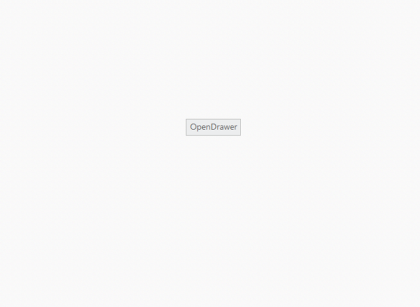
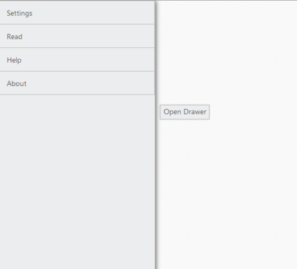

# TargetId

This property is used to define the target Id for Navigation Drawer. The drawer opens while you click on the specified target element.



@{

    @Html.EJ().Button("drawerTarget").Text("Open Drawer")

    @Html.EJ().NavigationDrawer("navpane").Position(NavigationDrawerPosition.Fixed).TargetId("drawerTarget").ContentTemplate(@

        @Html.EJ().ListView("list").Width(300).Items(items =>

         {

             items.Add().Text("Home");

             items.Add().Text("Profile");

             items.Add().Text("Photos");

             items.Add().Text("Location");

         })

    
)

}



The following screenshots illustrates the output.

