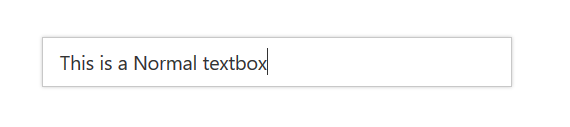

# How To

## Use Normal Textboxes as Syncfusion textboxes

In an application or a web page, you may use normal textboxes along with other Syncfusion components, since there is no separate EJHelpers for textboxes.

So, you may want to make a normal textbox to look like Syncfusion textbox in order to achieve uniform look and appearance in your web page.

This can be achieved by adding **“e-textbox”** class to the HTML helpers.

By adding this class, the textbox will have standard look and appearance as other components for all the themes supported by Syncfusion.



@Html.TextBox("textbox", "This is a normal Textbox", new { @class = "e-textbox"})



Textbox will be rendered as shown below

Normal textbox as Syncfusion textbox
{:.caption}
