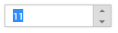

## Keyboard Interaction

With the keyboard navigation enabled in the NumericTextBox control, it is possible to control the actions with the provided shortcut keys. Almost all the NumericTextBox functionality that are done through mouse can be controlled with shortcut keys.

The various keyboard shortcuts available within the NumericTextBox control are discussed in the following table. 

_Keyboard Shortcuts_

<table>
<tr>
<td>
Shortcut Key</td><td>
Description</td></tr>
<tr>
<td>
{{ '[Access key](http://en.wikipedia.org/wiki/Access_key)' | markdownify }} + j</td><td>
Focuses the control</td></tr>
<tr>
<td>
Up</td><td>
Increments the value</td></tr>
<tr>
<td>
Down</td><td>
Decrements the value</td></tr>
<tr>
<td>
Tab</td><td>
Focus the next element</td></tr>
</table>
Configuring Keyboard Navigation

The following steps explain the implementation of keyboard interaction in NumericTextBox.

In the View page add NumericTextBox helper. Set the accesskey property to the NumericTextBox for focusing the control while key is pressed. We need to use ‘HtmlAttributes’ property to add the”accesskey” attribute to the Editor elements. ‘HtmlAttributes’ property is used to add HTML attributes like, id, class etc.. to the components. We need to use IDictionary<string,object> to specify the HTML attributes.

[_cshtml]

@{IDictionary<string, object> numericAttribute = new Dictionary<string, object>();

  numericAttribute.Add("accesskey", "j");

}

@Html.EJ().NumericTextbox("numeric").Name("numeric").Value("11").HtmlAttributes(numericAttribute)

Run the above example and press [Access key](http://en.wikipedia.org/wiki/Access_key) + j key to focus the NumericTextBox widget. Perform provided functionality by using keyboard shortcuts.

{{ '' | markdownify }}
{:.image }

