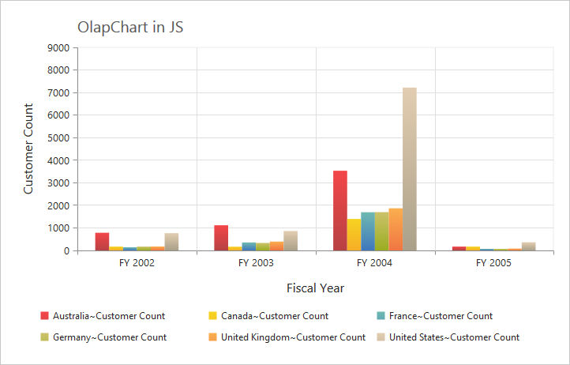

#Appearance

##Built-in Themes

Following are the build-in themes available in the OlapChart.

* flatlight
* flatdark
* gradientlight
* gradientdark
* azure
* azuredark
* lime
* limedark
* saffron
* saffrondark
* gradient-azure
* gradient-azuredark
* gradient-lime
* gradient-limedark
* gradient-saffron
* gradient-saffrondark

By using the `Theme` property, you can set the desired theme in OlapChart. By default, "Flat Light" theme is applied to OlapChart.



//Using gradient theme
@Html.EJ().Olap().OlapChart("OlapChart1").Theme(Syncfusion.JavaScript.DataVisualization.ChartTheme.GradientLight).Url(Url.Content("~/wcf/OlapChartService.svc")).Size(size => size.Height("460px").Width("950px"))



##OlapChart - Area Customization

###Border Customization
To customize the OlapChart border, use `Border` property in OlapChart.



//Customize the chart border and opacity
@Html.EJ().Olap().OlapChart("OlapChart1").Border(border => border.Color("#FF0000").Width(5)).Url(Url.Content("~/wcf/OlapChartService.svc")).Size(size => size.Height("460px").Width("950px"))



###Background Customization
The OlapChart control background can be customized by using the `Background` property in the Chart area.



//Setting background for Chart area
@Html.EJ().Olap().OlapChart("OlapChart1").ChartArea(area => area.Background("skyblue")).Url(Url.Content("~/wcf/OlapChartService.svc")).Size(size => size.Height("460px").Width("950px"))



###Grid Bands Customization
By using the `AlternateGridBand` property of the axis, you can provide different color for grid rows and columns formed by the grid lines in the Chart area. The properties `odd` and `even` are used to customize the grid bands at odd and even positions respectively.



//Customizing horizontal grid bands at even position
@Html.EJ().Olap().OlapChart("OlapChart1").PrimaryYAxis(primaryYAxis => primaryYAxis.AlternateGridBand(gridband => gridband.Even(even => even.Fill("#A7A9AB").Opacity(0.1)))).Url(Url.Content("~/wcf/OlapChartService.svc")).Size(size => size.Height("460px").Width("950px"))



###Animation
You can enable animation by using the `EnableAnimation` property under `CommonSeriesOptions` of the OlapChart control. This animates the Chart series on two occasions - when the Chart is loaded for the first time and when you change the series type by using the `Type` property.



//Enabling animation in series
@Html.EJ().Olap().OlapChart("OlapChart1").Url(Url.Content("~/wcf/OlapChartService.svc")).CommonSeriesOptions(comm => { comm.EnableAnimation(true); }).Size(size => size.Height("460px").Width("100%"))


