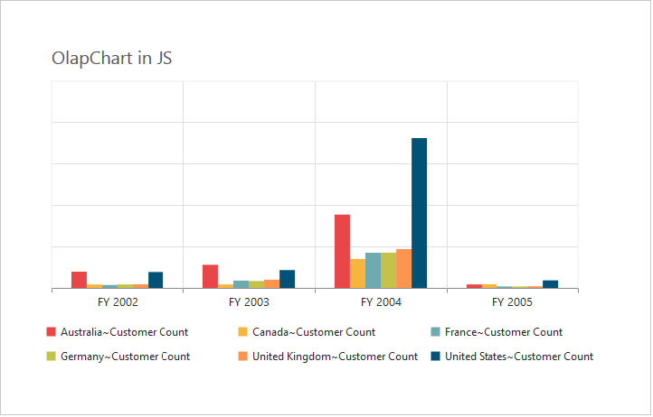
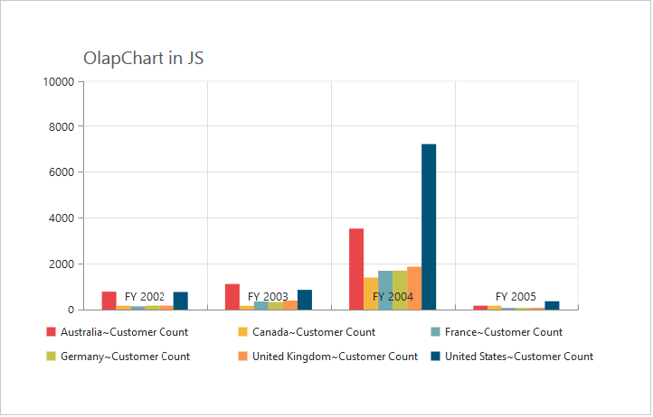
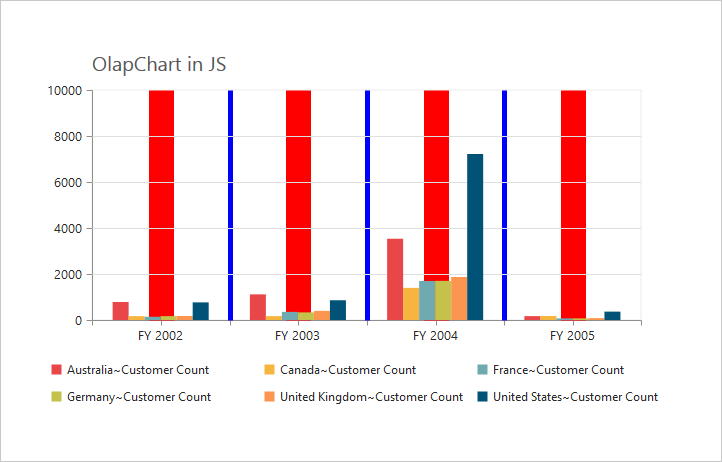
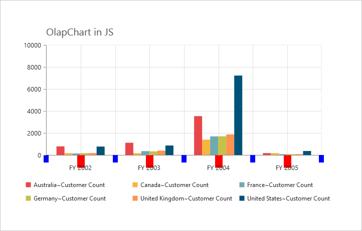
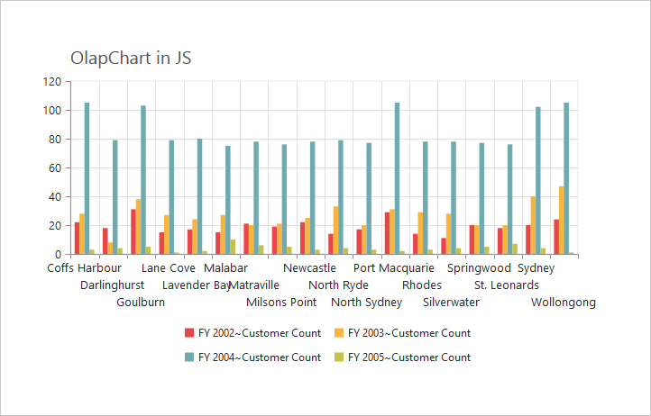

#Axes 

##Label Format

###Format Numeric labels
By using the `LabelFormat` property, you can format the numeric labels. Numeric values can be formatted with n (number with decimal points), c (currency) and p (percentage) commands.



//Applying currency format to axis labels
@Html.EJ().Olap().OlapChart("OlapChart1").PrimaryYAxis(primaryY => primaryY.LabelFormat("c")).Url(Url.Content("~/wcf/OlapChartService.svc")).Size(size => size.Height("460px").Width("950px"))



Following table describes the result on applying some commonly used label formats on numeric values.

<table>
<tr>
<th>
Label Value</th><th>
Label Format Property Value</th><th>
Result</th><th>
Description</th>
</tr>
<tr><td>
1000</td><td>
n1</td><td>    
1000.0</td><td>
The Number is rounded to 1 decimal place</td>
</tr>
<tr><td>
1000</td><td>
n2</td><td>    
1000.00</td><td>
The Number is rounded to 2 decimal place</td>
</tr>
<tr><td>
1000</td><td>
n3</td><td>    
1000.000</td><td>
The Number is rounded to 3 decimal place</td>
</tr>
<tr><td>
0.01</td><td>
p1</td><td>    
1.0%</td><td>
The Number is converted to percentage with 1 decimal place</td>
</tr>
<tr><td>
0.01</td><td>
p2</td><td>    
1.00%</td><td>
The Number is converted to percentage with 2 decimal place</td>
</tr>
<tr><td>
0.01</td><td>
p3</td><td>    
1.000%</td><td>
The Number is converted to percentage with 3 decimal place</td>
</tr>
<tr><td>
1000</td><td>
c1</td><td>    
$1,000.0</td><td>
The Currency symbol is appended to number and number is rounded to 1 decimal place</td>
</tr>
<tr><td>
1000</td><td>
c2</td><td>    
$1,000.00</td><td>
The Currency symbol is appended to number and number is rounded to 2 decimal place</td>
</tr>
</table>

###Label Format Customization 
By using the `LabelFormat` property of `PrimaryYAxis`, you can add the category labels with prefix and/or suffix. 



//Adding prefix and suffix to axis labels
@Html.EJ().Olap().OlapChart("OlapChart1").PrimaryYAxis(primaryY => primaryY.LabelFormat("${value}K")).Url(Url.Content("~/wcf/OlapChartService.svc")).Size(size => size.Height("460px").Width("950px"))



##Common Axis Features

###Axis Visibility
Axis visibility can be set by using the `Visible` property of the respective axis. The default value of the `Visible` property is true.



//Disabling visibility of Y-axis
@Html.EJ().Olap().OlapChart("OlapChart1").PrimaryYAxis(primaryY => primaryY.Visible(false)).Url(Url.Content("~/wcf/OlapChartService.svc")).Size(size => size.Height("460px").Width("950px"))



###Label Customization
By using the `Font` property of the axis, we can customize the labels – font family, color, opacity, size and font-weight.



//Customizing label appearance
@Html.EJ().Olap().OlapChart("OlapChart1").PrimaryXAxis(primaryX => primaryX.Font(font=> font.Size("14px").FontWeight(ChartFontWeight.Bold).FontStyle(ChartFontStyle.Italic).Color("blue"))).Url(Url.Content("~/wcf/OlapChartService.svc")).Size(size => size.Height("460px").Width("950px"))



###Label and Tick Positioning
Axis labels and ticks can be positioned inside or outside the Chart area by using the `LabelPosition` and `TickLinesPosition` properties. The labels and ticks are positioned outside the Chart area, by default.



//Customizing label and tick positions
 @Html.EJ().Olap().OlapChart("OlapChart1").PrimaryXAxis(primaryX => primaryX.AxisLabelPosition(AxislabelPosition.Inside).TickLinesPosition(TickLinesPosition.Inside)).Url(Url.Content("~/wcf/OlapChartService.svc")).Size(size => size.Height("460px").Width("950px"))



###Grid Lines Customization
By using the `MajorGridLines` and `MinorGridLines` properties of the axis, you can customize the width, color, visibility and opacity of the grid lines. The minor grid lines are not visible by default.



//Customizing grid lines
@Html.EJ().Olap().OlapChart("OlapChart1").PrimaryXAxis(primaryX => primaryX. MajorGridLines(mr => mr.Width(5).Color("Red").Visible(true)).MinorGridLines(mg => mg.Width(5).Color("Green").Visible(true))    .MinorTicksPerInterval(1)).Url(Url.Content("~/wcf/OlapChartService.svc")).Size(size => size.Height("460px").Width("950px"))



###Tick Line Customization
By using the `MajorTickLines` and `MinorTickLines` properties of the axis, you can customize the width, color, visibility, size and opacity of the tick lines. The minor tick lines are not visible by default.



//Customizing tick lines
@Html.EJ().Olap().OlapChart("OlapChart1").PrimaryXAxis(primaryX => primaryX. MajorTickLines(mr => mr.Width(5).Color("Red").Visible(true)).MinorTickLines(mg => mg.Width(5).Color("Green").Visible(true))    .MinorTicksPerInterval(1)).Url(Url.Content("~/wcf/OlapChartService.svc")).Size(size => size.Height("460px").Width("950px"))



###Inversing Axis
Axis can be inversed by using the `IsInversed` property of the axis. By default, the value of the `IsInversed` property is false.



//Inversing the X and Y-axis
@Html.EJ().Olap().OlapChart("OlapChart1").PrimaryXAxis(primaryX => primaryX.IsInversed(true)).PrimaryYAxis(primaryY => primaryY.IsInversed(true)).Url(Url.Content("~/wcf/OlapChartService.svc")).Size(size => size.Height("460px").Width("950px"))



###Placing Axes at Opposite Side
The `OpposedPosition` property of Chart axis can be used to place the axis at the opposite direction from its default position. By default, the value of `OpposedPosition` property is false.



//Placing axis at the opposite side of its normal position
@Html.EJ().Olap().OlapChart("OlapChart1").PrimaryXAxis(primaryX => primaryX.OpposedPosition(true)).PrimaryYAxis(primaryY => primaryY.OpposedPosition(true)).Url(Url.Content("~/wcf/OlapChartService.svc")).Size(size => size.Height("460px").Width("950px"))



###Smart Axis Labels
When the axis labels overlap with each other based on the Chart dimensions and label size, you can use `LabelIntersection` property of the axis to avoid overlapping. The default value of the `LabelIntersection` property is none. The other options available are rotate45, rotate90, trim, multiplerows, wrap and hide. 



// Avoid overlapping of x-axis labels
@Html.EJ().Olap().OlapChart("OlapChart1").PrimaryXAxis(primaryX => primaryX. LabelIntersectAction(LabelIntersectAction.MultipleRows)).Url(Url.Content("~/wcf/OlapChartService.svc")).Size(size => size.Height("460px").Width("950px"))



