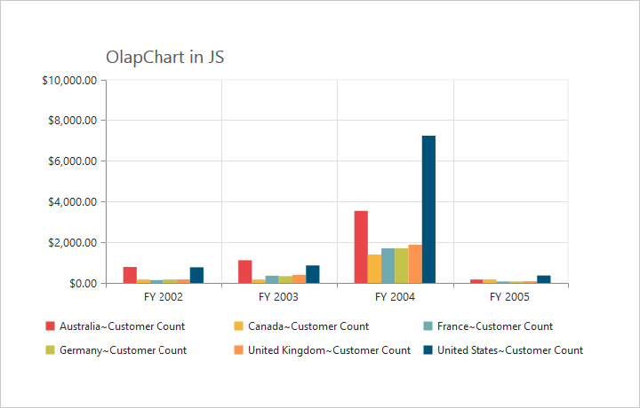
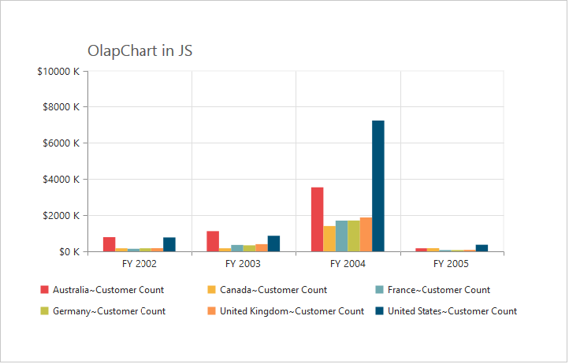

# Chart Axes 

OlapChart typically have two axes that are used to measure and categorize data: a vertical (y) axis and a horizontal (x) axis. By default horizontal (x) axis and vertical (y) axis is added to the Chart with axis labels, gridlines, and tick lines. You can also customize this axis explicitly by adding axis title or removing gridlines, tick lines that are added to the axis by default.



@Html.EJ().Olap().OlapChart("OlapChart1").Url("../wcf/OlapChartService.svc").PrimaryXAxis(primaryXAxis =>
primaryXAxis.MajorTickLines(MajorTickLines => MajorTickLines.Visible(false))).PrimaryYAxis(primaryYAxis => 
primaryYAxis.MajorTickLines(MajorTickLines => MajorTickLines.Visible(false))) 



## Axis Title Customization

Primary axis title font appearance is further customized with the help of the following code example.



@Html.EJ().Olap().OlapChart("OlapChart1").Url("../wcf/OlapChartService.svc").CommonSeriesOptions(comm =>
comm.Type(SeriesType.Column)).PrimaryXAxis(primaryXAxis =>primaryXAxis.Title(title=>title.Text("Primary X title customization")
.Font(font=>font.Color("red").FontFamily("Segoe UI").FontStyle(ChartFontStyle.Italic).Size("18px").Opacity(1)
.FontWeight(ChartFontWeight.Lighter)))).PrimaryYAxis(primaryYAxis =>primaryYAxis.Title(title=>title\
.Text("Primary Y title customization").Font(font=>font.Color("red")
.FontFamily("Segoe UI").FontStyle(ChartFontStyle.Italic).Size("18px").Opacity(1)
.FontWeight(ChartFontWeight.Lighter))))



## Axis Line

Axis line is drawn in Chart to represent the end of the axis in ChartArea. It is customized with the help of following code example.



@Html.EJ().Olap().OlapChart("OlapChart1").Url("../wcf/OlapChartService.svc").PrimaryXAxis(primaryXAxis => 
primaryXAxis.AxisLine(AxisLine => AxisLine.Visible(true)).AxisLine(AxisLine => 
AxisLine.Offset(1)).AxisLine(AxisLine =>AxisLine.Width(3.5)))



## Position Opposed

Position of the primary X and Y axis is set to the top with the help opposedPosition property.


@Html.EJ().Olap().OlapChart("OlapChart1").Url("../wcf/OlapChartService.svc").PrimaryXAxis(PrimaryXAxis=>
PrimaryXAxis.OpposedPosition(true)).PrimaryYAxis(PrimaryXAxis=>PrimaryXAxis.OpposedPosition(true))



## Appearance Customization 

Background, border color and outer width of the Chart Area is customized with the help of following properties.

Background – sets the background color for Chart Area.

Color – sets the color for the border.

Width – sets the width for the border.



@Html.EJ().Olap().OlapChart("OlapChart1").Url("../wcf/OlapChartService.svc").Title(title => 
title.Text("OLAP Chart in Essential Studio")).ChartArea(chartArea=>chartArea.Border(border=>border.Color("red"))
.Border(border =>border.Width(4)).Background("aqua"))



