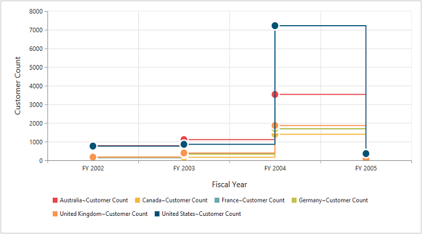

## Chart Types

Essential OLAP Chart MVC supports 13 different types of chart as follows:

* Column 
* Stacking Column
* Bar
* Stacking Bar
* Area
* Step Area
* Spline Area
* Stacking Area
* Pie
* Pyramid
* Line
* Step Line
* Spline
### Column Chart

Column Chart is the most commonly used chart types. It uses vertical bars (called columns) to display different values of one or more items. Points from adjacent series are drawn as bars next to each other. It is used to compare the frequency, count, total or average of data in different categories. It is ideal to show the variations in the value of an item over a period of time.

[MVC]

@Html.EJ().Olap().OlapChart("OlapChart1").Url("../wcf/OlapChartService.svc").CommonSeriesOptions(comm => { comm.Type(SeriesType.Column); }).Legend(legend => legend.Visible(true).RowCount(3))

The following screenshot displays a Column Chart.

{  | markdownify }
{:.image }

### Stacking Column Chart

Stacking Column Chart is similar to column charts except the “Y-values”. These “Y-values” stack on top of each other in a specified series order. This helps to visualize the relationship of parts to the whole chart.

[MVC]

@Html.EJ().Olap().OlapChart("OlapChart1").Url("../wcf/OlapChartService.svc").CommonSeriesOptions(comm => { comm.Type(SeriesType.StackingColumn); }).Legend(legend => legend.Visible(true).RowCount(3))

The following screenshot displays the stacking Column Chart.

{  | markdownify }
{:.image }

### Bar Chart

The Bar Chart is the simplest and most versatile chart of statistical diagrams. It displays horizontal bars for each point in the series and points from adjacent series. Bar Charts are drawn as bars next to each other. Bar charts are used to compare values across categories, for displaying the variations in the value of an item over time or for comparing the values of several items at a single point in time.

[MVC]

@Html.EJ().Olap().OlapChart("OlapChart1").Url("../wcf/OlapChartService.svc").CommonSeriesOptions(comm => { comm.Type(SeriesType.Bar); }).Legend(legend => legend.Visible(true).RowCount(3))

The following screenshot displays a Bar Chart.

{  | markdownify }
{:.image }

### Stacking Bar Chart

Stacking BarChart is a Regularbarchart with the X-values stacked on top of each other in the specified series order.

[MVC]

@Html.EJ().Olap().OlapChart("OlapChart1").Url("../wcf/OlapChartService.svc").CommonSeriesOptions(comm => { comm.Type(SeriesType.StackingBar); }).Legend(legend => legend.Visible(true).RowCount(2))

The following screenshot displays the Stacking Bar Chart.

{  | markdownify }
{:.image }

### Pie Chart

A Pie chart is used to summarize a set of categorical data or displaying different values of a given variable (e.g., percentage distribution). This type of chart is a circle divided into a series of segments. Each segment represents a particular category.

[MVC]

@Html.EJ().Olap().OlapChart("OlapChart1").Url("../wcf/OlapChartService.svc").CommonSeriesOptions(comm => { comm.Type(SeriesType.Pie); }).Legend(legend => legend.Visible(true).RowCount(3))

The following screenshot displays a Pie Chart.

{  | markdownify }
{:.image }

### Pyramid Chart

The Pyramid Chart type displays the data in the form of a triangle. It helps you to visualize data in a hierarchical structure without any axes.

[MVC]

@Html.EJ().Olap().OlapChart("OlapChart1").Url("../wcf/OlapChartService.svc").CommonSeriesOptions(comm => { comm.Type(SeriesType.Pyramid); }).Legend(legend => legend.Visible(true).RowCount(3))

The following screen shot displays the Pyramid Chart.

{  | markdownify }
{:.image }

### Line Chart

The Line Chart joins the data points on a plot using straight lines that show trends in data at equal intervals.

[MVC]

@Html.EJ().Olap().OlapChart("OlapChart1").Url("../wcf/OlapChartService.svc").CommonSeriesOptions(comm => { comm.Type(SeriesType.Line); }).Legend(legend => legend.Visible(true).RowCount(3))

The following screenshot displays the Line Chart.

{  | markdownify }
{:.image }

### Step Line Chart

Step LineChart uses horizontal and vertical lines to connect the data points resulting in a step like progression. 

[MVC]

@Html.EJ().Olap().OlapChart("OlapChart1").Url("../wcf/OlapChartService.svc").CommonSeriesOptions(comm => { comm.Type(SeriesType.StepLine); }).Legend(legend => legend.Visible(true).RowCount(3))

The following screenshot displays the Step Line Chart.

{  | markdownify }
{:.image }

### Spline Chart

The spline chart is similar to line charts except it connects different data points using curve lines instead of straight lines.

[MVC]

@Html.EJ().Olap().OlapChart("OlapChart1").Url("../wcf/OlapChartService.svc").CommonSeriesOptions(comm => { comm.Type(SeriesType.Spline); }).Legend(legend => legend.Visible(true).RowCount(3))

The following screenshot displays the Spline Chart.

{  | markdownify }
{:.image }

### Area Chart

Area Chart emphasizes the degree of change of values over a period of time. Instead of rendering data as discreet bars or columns, an area chart renders it in a continuous ebb-and-flow pattern as defined against the y-axis.

[MVC]

@Html.EJ().Olap().OlapChart("OlapChart1").Url("../wcf/OlapChartService.svc").CommonSeriesOptions(comm => { comm.Type(SeriesType.Area); }).Legend(legend => legend.Visible(true).RowCount(3))

The following screenshot displays the Area Chart.

{  | markdownify }
{:.image }

### Step Area Chart

Step Area chart is similar to the regular area chart except for a straight line tracing the shortest path between the data points. The values are connected by continuous vertical and horizontal lines forming a step like progression.

[MVC]

@Html.EJ().Olap().OlapChart("OlapChart1").Url("../wcf/OlapChartService.svc").CommonSeriesOptions(comm => { comm.Type(SeriesType.StepArea); }).Legend(legend => legend.Visible(true).RowCount(3))

The following screenshot displays a Step Area Chart.

{  | markdownify }
{:.image }

### Spline Area Chart

Spline Area chart is similar to Area Chart with the difference in which the data points of a series are connected. It connects each series of points by a smooth spline curve.

[MVC]

@Html.EJ().Olap().OlapChart("OlapChart1").Url("../wcf/OlapChartService.svc").CommonSeriesOptions(comm => { comm.Type(SeriesType. SplineArea); }).Legend(legend => legend.Visible(true).RowCount(3))

The following Screenshot displays a Spline Area Chart.

{  | markdownify }
{:.image }

### Stacking Area Chart

Stacking Area chart is similar to regular area chart except the “Y-values”. These “Y-values” stack on top of each other in the specified series order. This helps to visualize the relationship of parts to the whole data.

[MVC]

@Html.EJ().Olap().OlapChart("OlapChart1").Url("../wcf/OlapChartService.svc").CommonSeriesOptions(comm => { comm.Type(SeriesType.StackingArea); }).Legend(legend => legend.Visible(true).RowCount(3)) 

The following screenshot displays a Stacking Area Chart.

{  | markdownify }
{:.image }

